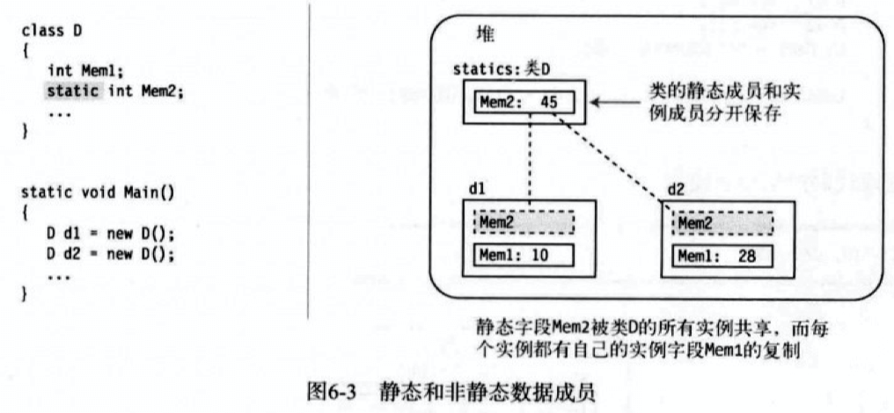

# C#

## 基本常识

### 面向对象的特性

封装

继承：a ⊧ b，b 继承 a，则 b 可以拥有 a 中的 public,protect 方法和成员变量，也可以用 a 里的变量接收 b 对象。

多态

基本格式：

~~~c#
using System; //space type

namespace simple //sign space name

{
    class Program //name a class
    {
        static void Main()  //name a function call main static:静态字段，静态的，不变的，在某个类中只有一个，不会因实例化对象的不同而不同。
        {
            int a = 1;
            long b = 1000000;
            byte c = 12;
          	string d = @"lala
          	lalali"; //使用 @ 字符不会识别字符串中的换行符，可以直接换行
            string path = @"c:\x\x.doc";
            Console.WriteLine("Hi,there."); //用 @ 可以不用 \ 转义
          	// \n 换行符
          	Console.WriteLine($"int:{a} \nlong:{b} \nbyte:{c}");                    	
        }
    }
}
~~~

- 每个C#程序必须有一个类带有Main方法。

- 语句以分号结束

  - **块**

    - 块由成对大括号包围的0条或多条语句序列，在语法上相当于一条语句
    - 语法上只需要一条语句，如果需要执行的动作无法用一条简单的语句表达时，考虑用块
    - 有些特定程序结构只能使用块，不能用简单语句替代块
    - <u>块后不跟分号</u>

  - **Console**

    - Write方法：把一个文本字符串发送到控制台窗口(可以有1个以上的参数，参数用逗号分隔，**第一个参数必须总是字符串**——称为格式字符串，格式字符串可以包含替代标记)

    - WriteLine方法：和Write一样，但会在每个输出字符串后添加一个换行符(可以有1个以上的参数，参数用逗号分隔，第一个参数必须总是字符串——格式字符串，格式字符串可以包含替代标记)

    - ~~~c#
      Console.WriteLine("Two sample integers are {0} and {1}.",3,6);
      > Two sample integers are 3 and 6.
      ~~~

    - 标记不能试图引用超出替换值列表长度以外位置的值。如果引用了，不会编译错误，但会运行错误

    - **对齐说明符**：{0，10} 表示对齐，正数表示右对齐，负数表示左对齐，整数表示字段使用字符的最少数量，0为索引值，表示列表中的第0项，10表示在10个字符的字段中右对齐，如果值超过10，会报错

    - ~~~c#
      Console.WriteLine("{1,10}",500,600);
      >       600 //从第10个字符开始往左显示值，即600前面有7个空格
      ~~~

    - **格式字段**：指定数字应该以哪种形式表示，应该被当做货币、十进制数字、十六进制数字还是定点符号

      - 格式字段有三部分：

        - 冒号后必须跟着格式说明符，中间不能有空格

        - 格式说明符是一个字符，支持大小写

        - 精度说明符可选，由1~2位数字组成，它的实际意义取决于格式说明符

        - ~~~c#
          Console.WriteLine("{0:F4}",12.345678); 
          /* 
          0:索引
          F:格式说明符
          4：4位小数的定点数
          */
          > 12.3457
          ~~~

        - 标准数字格式说明符

          - | 名字和字符               | 意义                                                         |
            | ------------------------ | ------------------------------------------------------------ |
            | 货币 C,c                 | 货币符号，货币符号取决于程序所在PC的区域设置<br />精度说明符：小数位数<br />eg:Console.WriteLine("{0:C}”,12.5);<br />输出：$12.5 |
            | 十进制数 D,d             | 十进制数字字符串，可以有负数，只能和整数类型配合<br />精度说明符：输出字符串中的最少位数。如果实际数字的位数更少，则在左边以0填充 |
            | 定点F,f                  | 带有小数点的十进制数字字符串，可以有负数<br />精度说明符：小数的位数<br />eg:Console.WriteLine("{0:F4}”,12.34356789);<br />输出：12.3457 |
            | 常规G,g                  | 在没有指定说明符的情况下，会根据值转换为定点或科学记数法表示的紧凑形式<br />精度说明符：根据值<br />eg:Console.WriteLine("{0,G4}”,12.345678);<br />输出：12.35 |
            | 十六进制数X,x,区分大小写 | 十六进制数数字的字符串。十六进制数字A~F会匹配说明符的大小写形式。<br />精度说明符：输出字符串中的最少位数。如果实际的位数更少，则在左边以0填充<br />eg:Console.WriteLine("{0:x}”,180026);<br />输出：2bf3a |
            | 数字N,n                  | 和定点表示法相似，但在每三个数字的一组中间有逗号或空格分隔符。从小数点开始往左数。使用逗号还是空格分隔符取决于程序所在的PC的区域设置<br />精度说明符：小数的位数<br />eg:Console.WriteLine("{0:N2}",12345678.54321);<br />输出：12，345，678.54 |
            | 百分比P,p                | 表示百分比的字符串。数字会乘以100<br />精度说明符：小数的位数<br />eg:Console.WriteLine("{0:P2}",0.1221897);<br />输出：12.22% |
            | 往返过程R,r              | 保证输出字符串后如果使用Parse方法将字符串转化成数字，那么该值和原始值一样。<br />精度说明符：忽略<br />eg:Console.WriteLine("{0:e4}”,1234.21897);<br />输出：1234.21897 |
            | 科学记数法E,e,区分大小写 | 具有尾数和指数的科学记数法。指数前面加字母E。E的大小写和说明符一致<br />精度说明符：小数的位数<br />eg:Console.WriteLine("{0:e4}”,12.3456789);<br />输出：1.2346e+001 |
          
          

- 注释不可以嵌套

  - | 类型           | 开始结束  | 描述                                       |
    | -------------- | --------- | ------------------------------------------ |
    | 单行注释       | //        | 从开始标记到该行行尾的文本被编译器忽略     |
    | 带分隔符的注释 | /*     */ | 从开始标记到结束标记之间的文本被编译器忽略 |
    | 文档注释       | ///       | 注释文档                                   |

    

## 类型

C#程序是一组类型声明。

### 类型

类型是一种用来创建数据结构的模板。模板本身不是数据结构。

类型包含数据成员和函数成员。

类型的元素：

- 名称
- 数据结构
- 行为和约束条件

### 预定义类型

13种简单类型和3种非简单类型。

所有预定义类型名称都是小写。

| 简单类型          | 名称                           | 说明                                                         | 默认值 |
| ----------------- | ------------------------------ | ------------------------------------------------------------ | ------ |
| 非数值类型        | bool                           | 布尔，true false                                             | false  |
| 非数值类型        | char                           | Unicode字符，和 string 的区别是 char 只能放一个字符，例如“a”，不可以放“aa”，string 可以放字符串 | \x0000 |
| 数值类型-整数类型 | 8-Bit:<br />sbyte<br />byte    |                                                              | 0      |
| 数值类型-整数类型 | 16-Bit:<br />short<br />ushort |                                                              | 0      |
| 数值类型-整数类型 | 32-Bit:<br />int<br />uint     |                                                              |        |
| 数值类型-整数类型 | 64-Bit:<br />long<br />ulong   |                                                              | 0      |
| 数值类型-浮点类型 | decimal                        | 小数，精度为28位                                             | 0m     |
| 数值类型-浮点类型 | float                          | 单精度浮点数                                                 | 0.0f   |
| 数值类型-浮点类型 | double                         | 双精度浮点数                                                 | 0.0d   |

| 非简单类型 | 说明                             |
| ---------- | -------------------------------- |
| object     | 所有其他类型的基类，包括简单类型 |
| string     | 0个或多个Unicode字符组成的序列   |
| dyamic     | 在使用动态语言编写的程序集时使用 |

### 用户定义类型

- 类类型：class
- 结构类型：struct
- 数组类型：array
- 枚举类型：enum
- 委托类型：delegate
- 接口类型：interface

### 栈和堆

程序运行时，它的数据必须存储在内存中。运行中的程序使用两个内存区域来存储数据：栈和堆。

- **栈**
  - 栈存储的数据类型：
    - 某些类型变量的值
    - 程序当前的执行环境
    - 传递给方法的参数
- **堆**
  - 堆的内存能够以任意顺序存入和移除。

## 变量

### 变量种类：4种变量

| 变量名称 | 说明                                                         |
| -------- | ------------------------------------------------------------ |
| 本地变量 | 临时保存数据                                                 |
| 字段     | 保存和类型或类型实例相关的数据                               |
| 参数     | 用于从一个方法到另一个方法传递数据的临时变量                 |
| 数组元素 | 同类数据构成的有序集合的一个成员，可以为本地变量，也可以为类型的成员 |

### 变量声明

变量使用前必须声明，一个声明至少需要一个类型和一个名称，声明完成两件事：

1. 给变量命名，并为它关联一种类型
2. 让编译器为它分配一块内存

### 多变量声明

可以把多个变量声明在一条单独的声明语句中：

1. 多变量声明中的变量必须类型相同
2. 变量名必须用逗号分隔，可以在变量名后包含初始化语句

~~~c#
int var3=7,var4,var5=3;
double var6,var7=6.52;
~~~

## 静态类型和dynamic关键字

### 静态类型

在编译时确定且不能在运行时修改的，叫静态类型。

### 动态类型

变量的类型直到运行时才会被解析，dynamic代表一个特定的、实际的C#类型。

编译时，编译器不会对dynamic类型的变量进行类型检查，但运行时会检查。

## 类

### 概念

运行中的程序是一组相互作用的对象的集合。

类是一种能存储数据并执行代码的数据结构，包含：

1. 数据成员：存储与类或类的实例相关的数据，数据成员通常模拟该类所表示的现实世界事物的特性
2. 函数成员：执行，模拟类所表示的现实世界事物的功能和操作

| 数据成员-存储数据 | 函数成员-执行代码 |
| ----------------- | ----------------- |
| √字段             | √方法             |
| 常量              | √属性             |
| √类型             | √构造函数         |
|                   | 析构函数          |
|                   | √运算符           |
|                   | 索引器            |
|                   | √事件             |

√：可声明为static类型

### 声明类

类的声明定义新类的特征和成员。类的声明包括：

- 类的名称
- 类的成员
- 类的特征

~~~c#
class MyExcellentClass //类声明
{
	[特性] [修饰符] 核心声明
}
~~~

- 修饰符
  - 如果有修饰符，必须放在核心声明之前
  - 如果有多个修饰符，可以是任意顺序
- 特性
  - 如果有特性，必须放在修饰符和核心声明之前
  - 如果有多个特性，可以是任意顺序

### 类成员

- **字段（数据成员）**

  - 它可以是任何类型

  - 可以被写入、读取

~~~c#
int Identifier;  //int:类型  Identifier:字段名
~~~

  - 字段初始化值必须是编译时可确定的，如果没有初始化语句，字段的值会被编译器设为默认值，由字段类型决定默认值。

- **方法（函数成员）**

  - 是具有名称的可执行代码块。

  - 方法的组成：

    - 返回类型，**如果一个方法不返回值，返回类型被指定为void**
    - 名称：方法的名称
    - 参数列表：至少由一对空的圆括号组成，如果有参数，将被列在圆括号中间
    - 方法体：由一对大括号组成，大括号内包含执行代码

  ~~~c#
  class SimpleClass
  
  {
  
      void PrintNums()
  
      {
            Console.WriteLine("1");
  
          Console.WriteLine("2");
  
      }
  
  }
  ~~~

  - C#没有全局函数声明在类型声明的外部。

### 访问修饰符

访问修饰符是成员声明的可选部分，指明程序的其他部分如何访问成员。访问修饰符放在简单声明形式之前。

5种成员访问控制：

- 私有的（private）
  - 私有成员只能从声明它的类的内部访问，其他的类不能看见或访问它们
- 公有的（public）
- 受保护的（protected）
- 内部的（internal）
- 受保护内部的（protected internal）

### 实例类成员

- 实例可理解为某个字段类型起别名，每个别名可以赋予不同的值，不会互相影响。

- `static`为静态字段，静态字段能赋予不同的值，也就是说只有有一个值

  

  ```c#
  using System;
   
  class D
  {
      int Mem1;
      static int Mem2;
  
      public void SetVars(int v1, int v2)
      {
          Mem1 = v1; Mem2 = v2;
      }
      
      public void Display(string str)
      {
          Console.WriteLine("{0}: Mem1 = {1}, Mem2 = {2}",str,Mem1,Mem2);
      }
  }
  
  
  class P
  {
      static void Main()
      {
          D d1 = new D(), d2 = new D();
          d1.SetVars(2,4);
          d1.Display("d1"); //输出 d1: Mem1 = 2, Mem2 = 4
          d2.SetVars(3,6); 
          d2.Display("d2"); //输出 d2: Mem1 = 3, Mem2 = 6
          d1.Display("d1"); //输出 d1: Mem1 = 2, Mem2 = 6
      }
  }
  ```

- 从类的外部访问静态成员必须使用类名

  ```c#
  using System;
  
  class D
  {
    int Mem1;
    static public int Mem2;
  }
  
  class P
  {
    static void Main()
    {
      D.Mem2 = 5; //使用类名给静态字段赋值
      Console.WriteLine("Mem2 = {0}",D.Mem2); //输出 Mem2 = 5
    }
  }
  ```


### 实例构造函数

实例构造函数是一个特殊的方法。

- 构造函数用于初始化类实例的状态
- 如果希望能从类的外部创建类的实例，需要将构造函数声明为 public 。
- 构造函数的名称和类名相同
- 构造函数不能有返回值

```c#
class Class1  
{
  int Id;  //定义一个int字段
  string Name;  //定义一个string字段
  
  public Class1()  //构造函数0，（）不带参数
  {
    Id = 28;
    Name = "Nemo";
  }
  public Class1(int val)  //构造函数1，（）带int参数
  {
    Id = val;
    Name = "Nemo";
  }
  public Class1(String name,int d)  //构造函数2，（）带string和int参数
  {
    Name = name;
    Id = d;
  }
  public void SoundOff()
  {
    Console.WriteLine("Name{0},Id{1}",Name,Id);
  }
}

class Program
{
  static void Main()
  {
    Class1 a = new Class1(),   //调用构造函数0，注意逗号
    			 b = new Class1(7),  //调用构造函数1，注意逗号
    			 c = new Class1("Bill",64);  //调用构造函数2
    
    a.SoundOff();  //Name Nemo, Id 28  显示原设置的值
    b.SoundOff();  //Name Nemo, Id 7   显示调用时（）里的值，调用中没有值用设置里的值替代
    c.SoundOff();  //Name Bill, Id 64  显示调用时（）里的值
  }
}
```


## 方法

方法是一块具有名称的代码，可以使用方法的名称从别的地方执行代码，也可以把数据传入方法并接收数据输出。

方法的组成部分：

- 方法头：指定方法的特征
	- 方法是否返回参数，如返回，返回什么类型
	- 方法的名称
	- 哪种类型的数据可以传递给方法或从方法返回，以及应如何处理这些数据
- 方法体：包含可执行的语句序列

~~~c#
Int MyMethod ( int part1, string part2 )   //方法头  int:返回类型。MyMethod：方法名称   （int ）：参数列表
{                       //方法体
		语句1
		语句2
}
~~~

### 方法体

方法体是一个块，是大括号括起来的语句序列，块可以包含以下项目：

- 本地变量
- 控制流结构
- 方法调用
- 内嵌的块

### 本地变量

本地变量的存在性和生存期仅限于创建他的块和内嵌的块。

- 从声明它的那一点开始存在
- 在块完成执行时结束存在

### var 关键字

var 关键字表示任何可以初始化语句的类型，不是特定类型变量的符号。

- 只能用于本地变量，不能用于字段
- 只能在变量声明中包含初始化时使用
- 一旦编译器推断出变量类型，他就是固定且不能更改的

### 本地常量

本地常量一旦被初始化，值就不能改变了，本地常量必须声明在块的内部。

- 常量在声明时必须初始化
- 常量在声明后不能改变
- C#没有全局常量
- 常量不能声明为 static

```c#
class MyClass
{
  const int IntVal = 100;  //定义int类型常量，值为100 const:常量关键字
}
```

### 属性

和字段很像，是指定的一组两个匹配的、称为访问器的方法。与字段相比有以下特征：

- 它有类型
- 它可以被赋值和读取
- 不为数据存储分配内存
- 可以只读或只写，字段不行
- 执行代码
- `set` ：为属性赋值
  - 拥有一个单独的、隐式的值参，名称为 value ，与属性的类型相同
  - 拥有一个返回类型 void
  - 只有 set 访问器的属性称为<u>只写属性</u>。只写属性是一种安全的，把一项数据从类的外部传入类的方法
- `get`：从属性获取值
  - 没有参数
  - 拥有一个与属性类型相同的返回类型
  - 只有 get 访问器的属性称为<u>只读属性</u>。只属性是一种安全的，把一项数据从类或类的实例中传出的方法

```c#
int MyValue //int:属性类型   MyValue:属性名
{
  set //隐式参数名称为 value 
  {
    方法语句 //总是void返回类型
  }
  get
  {
    方法语句
    return SomeInt; //总是返回属性类型的值
  }
}
```


### 控制流

控制流是程序从头到尾的执行流程。

- 选择语句：可以选择哪条语句或语句块来执行
	- if 
	- if... else if ...else：对只有一个层次深度的简单类型使用switch/case，但对于更复杂的比较和多个嵌套层次，使用经典的if/else构造。
	- switch：只能写一个条件,switch/case语句通常速度更快，深度为1级，但当您开始进入2个或更多级别时，switch/case语句开始占用的时间是嵌套if/else语句的2-3倍。
- 迭代语句：在一个语句块上循环或迭代
	- for ：在循环次数确定时使用
	- while：在循环次数不确定时使用
	- Do
	- Foreach
- 跳转语句：从代码块或方法体内部的一个地方跳转到另一个地方
	- break 跳出当前循环
	
	- continue 到当前循环的底部，满足 continue 的条件会被跳过，继续执行循环，类似玩牌中的“pass”，当满足 continue 条件的情况都会 pass
	
	  ```c#
	  int a = 1;
	              while (true)
	              {
	                  a++;
	                  if (a < 3)
	                  {
	                      continue; // 1,2 would be pass
	                  }
	                  if (a == 10)
	                  {
	                      break; // 10 would be pass
	                  }                
	                  Console.WriteLine("result is " + a); // 3,4,5,6,7,8,9   
	  ```
	
	  
	
	- return 返回调用方法继续执行

### 方法调用

可以从方法体的内部调用其他方法。

```c#
class MyClass
{
	void PrintDateAndTime()     //声明方法
  {
    DateTime dt = DateTime.Now;  //获取当前日期和时间
    Console.WriteLine("{0}",dt); //输出dt的第一个字符串
  }
  
  static void Main()    //声明方法
  {
    MyClass mc = new MyClass();   //调用方法
    mc.PrintDateAndTime();  //输出类的方法
  }
}
```


### 返回值

方法可以向调用代码返回一个值。

- 要返回值，方法必须在方法名前面声明一个返回类型
- 如果方法不返回值，它必须声明void返回类型

```c#
int GetHour()   {...}    //int:返回类型
void DisplayHour()  {...}   //void:不返回值
```

声明了返回类型的方法必须使用下面形式的返回语句从方法中返回一个值。返回语句包括关键字**return**及后面的表达式。每一条贯穿方法的路径都必须以一条这种形式的**return**语句结束。

```c#
class MyClass
{
  public int GetHour()     //int:返回类型
  {
    DateTime dt = DateTime.Now;     //获取当前日期和时间
    int hour = dt.Hour;    //获取小时数

    return hour;   //返回一个int
  }
}

class Program
{
  static void Main()
  {
    MyClass mc = new MyClass();
    Console.WriteLine("Hour:{0}",mc.GetHour());
  }
}
```


### 返回语句和 void 方法

- 可以在任何时候使用下面形式的返回语句退出方法，不带参数：`return`
- 这种形式的返回语句只能用于用void声明的方法

```c#
class MyClass
{
  void TimeUpdate()
  {
    DateTime dt = DateTime.Now;
    	if (dt.Hour < 12)
        return;
    Console.WriteLine("It's afternoon!");
  }
  
  static void Main()
  {
    MyClass mc =  new MyClass();
    mc.TimeUpdate();
  }
}
```

### 参数

| 参数类型 | 修饰符 | 是否在声明时使用 | 是否在调用时使用 | 执行                                 |
| -------- | ------ | ---------------- | ---------------- | ------------------------------------ |
| 值       | 无     |                  |                  | 系统把实参的值复制到形参             |
| 引用     | ref    | 是               | 是               | 形参是实参的别名                     |
| 输出     | out    | 是               | 是               | 仅包含一个返回的值。形参是实参的别名 |
| 数组     | params | 是               | 否               | 允许传递可变数目的实参到方法         |


- 形参

  - 形参是本地变量，它声明在方法的参数列表中，而不是在方法体中。

    ```c#
    public void PrintSum(int x,float y)  //int x,float y:形参声明
    ```

  - 形参是变量，所以它们有类型和名称，并能被写入和读取

  - 参数在方法体的外面定义，并在方法开始之前初始化

  - 参数列表中可以有任意数目的形参声明，声明必须用逗号隔开

- 实参

  - 用于初始化形参的表达式或变量称作实参（actural parameter，有时也称argument)

  - 实参位于方法调用的参数列表中

  - 每一个实参必须与对应形参的类型匹配，或是编译器必须能够把实参隐式转换为那个类型

    ```c#
    PrintSum(5,someInt);  //5:表达式 someInt:int类型变量
    ```


### 值参数

值参数，指通过将实参的值复制到形参的方式把数据传递给方法。

值参数的实参不一定是变量，它可以是任何能计算成相应数据类型的表达式。

在把变量用作实参之前，变量必须被赋值。

```c#
class MyClass
{
  public int Val = 20;
}

class Program
{
  static void MyMethod( MyClass f1, int f2)
  {
    f1.Val = f1.Val + 5;
    f2 = f2 + 5;
    Console.WriteLine("f1.Val:{0},f2:{1}",f1.Val, f2);
  }
  
  static void Main()
  {
    MyClass a1 = new MyClass();
    int a2 = 10;
    
    MyMethod(a1, a2);
    Console.WriteLine("f1.Val:{0},f2:{1}",a1.Val,a2);
  }
}
```

### 引用参数

- 使用引用参数时，必须在方法的**声明**和**调用**中都使用 ref 修饰符。
- 实参必须是变量，在用作实参前必须被赋值。

```c#
class MyClass
{
  public int Val = 20;
}

class Program
{
  static void MyMethod(ref MyClass f1,ref int f2) //声明方法
  {
    f1.Val = f1.Val + 5;
    f2 = f2 + 5;
    Console.WriteLine("f1.Val:{0},f2:{1}",f1.Val,f2);
  }
  
  static void Main()
  {
    MyClass a1 = new MyClass();
    in a2 = 10;
    MyMethod(ref a1,ref a2);    //调用方法
    Console.WriteLine("f1.Val:{0},f2:{1}",f1.Val,f2);
  }
}
```

### 输出参数

- 必须在声明和调用中都使用修饰符，输出参数的修饰符是 out
- 实参必须是变量，不能是其他类型的表达式
-  在方法内部，输出参数在能够被读取之前必须被赋值，所以参数的初始值是无用 的，也没必要在方法调用前为实参赋值
- 在方法返回之前，方法内部贯穿的任何可能路径都必须为所有输出参数进行一次赋值

```c#
class MyClass
{
    public int Val = 20;
}

class Program
{
    static void MyMethod(out MyClass f1, out int f2)
    {
        f1 = new MyClass();
        f1.Val = 25;
        f2 = 15;
    }
    
    static void Main()
    {
        MyClass a1 = null;
        int a2;
        MyMethod(out a1, out a2);
    }
}
```

### 参数数组

参数数组允许零个或多个实参对应一个特殊的形参。

- 在数据类型前使用params修饰符
  - 值参数的声明和调用都不带修饰符
  - 引用参数和输出参数在两个地方都**需要**修饰符
  - params在声明中需要修饰符
  - params在调用中**不允许**有修饰符
- 在数据类型后放置一组空的方括号 [ ]
- 数组是一组整齐的相同类型的数据项
- 数组使用一个数字索引进行访问
- 数组是一个引用类型

```c#
void ListInts( params int[] inVals ) // params:修饰符 int[]：int型参数数组 inVals:参数名称
```

- 构造一个数组

  ```c#
  int[] hps = new int[10];  // 创建一个有10个元素的数组
  int [] hps = new int[4]{1,2,3,6}; // 创建一个有4个元素的数组并赋值
  ```
```c#
// 遍历数组
for(int i = 0; i < 4; i++) // 需要先知道数组长度
  {
    print(hps[i]);
  }
```

  ```c#
  for(int i = 0; i < hps.length; i++) // 用数组的长度来遍历，不需要事先知道数组长度
  {
    print(hps[i]);
  }
  ```

## 枚举

枚举是一组命名整型常量。枚举列表中的每个符号代表一个整数值，一个比它前面的符号大的整数值。默认情况下，第一个枚举符号的值是 0。

枚举字段可以是汉字，英文，**但不能是数字**。

如果给枚举值赋值，下一个值会+1.

```c#
enum RoleType  //写在类的外面，可以直接调用
{
	man = 4,
	woman,
	child
}

public class test : MonoBehaviour
{
	void Start()
  {
    int rw = (int)Roletype.woman;
    print(rw); // 输出 5，为 4(man) +1 
  }
}
```

### 把枚举单独做成库--未完成

```c#
using UnityEngine;
using System.Collections;

public enum HeroType
{
  Soldier,
  Master,
  Assissan,
  Tank
}

public class HeroType:MonoBehaviour
{
  
}
```


## Switch/if 语句

效率比较：分支少时，if 比 switch 效率高，反之 switch 效率高。

switch 只能判断单个值，不能判断范围，如果条件为范围，不能用 switch 。

```c#
switch(表达式/变量)
{
  case 值1:语句块1;
    break;
  case 值2:语句块2;
    break;
  default:语句块3;
    break;
}
```

```c#
if(条件)
{
  语句1；
}
else
{
  语句2；
}
```

## 数学运算符

### ++/--

```c#
int z = 20;
z++; //z=21
int y = z; //y = new z = 21
int x = z++; //x = new z = 21 and z = z + new z = 22
int t = ++z; // t = new z = 22+1 =23 and z = 23
Console.WriteLine(z + ":" + y + ":" + x); //22:21:21
```

### 监控用户输入 , 转换为相应类型

```c#
string str = Console.ReadLine(); //用 ReadLine 来监控用户输入
int num = Convert.ToInt32(str); // 用 Convert 转换用户输入
Console.WriteLine(num); 
```

判断用户输入的是否为某个类型,是,输出结果,不是,提示

```c#
using System;
namespace C_Sharp_test
{
    class MainClass
    {
        public static void Main()
        {
            string str = Console.ReadLine(); //接收用户字符
            int number; //定义一个整数类型接收字符          

            if (int.TryParse(str, out number)) //如果输入的字符串是整数，则转换为整数
            {
                Console.WriteLine(number); //输出整数
            }
          	if (int)
            else
            {
                Console.WriteLine("not number"); //提示不是整数
            }
        }
    }
}
```


```c#
// 根据用户输入的字符判断是什么字符，只能输入一个字符
public static void Main()
        {
            char c = (char)Console.Read();
            if (char.IsDigit(c)) Console.WriteLine("这个是数字");
            else if (char.IsLower(c)) Console.WriteLine("这个是小写字母");
            else if (char.IsUpper(c)) Console.WriteLine("这个是大写字母");
            else Console.WriteLine("这个不是一个字母");

        }
```


```c#
// 判断用户输入的字符
string str = Console.ReadLine();
char[] c = str.ToCharArray(); // 用一个数组来放输入的字符
for (int i = 0; i < str.Length; i++)
{
  if (char.IsNumber(c[i])) // 是否是个数字符号; 范围包括 0..9, 还有 ASCII 码中的 178、179、185、188、189、190 等
	{
  	Console.WriteLine(c[i] + " is number");
  }
  else if (char.IsDigit(c[i])) // 是否是个十进制数字; 范围 0..9
	{
  	Console.WriteLine(c[i] + " is number");
  }
  else if (char.IsLetter(c[i]) && char.IsUpper(c[i]))
  {
  	Console.WriteLine(c[i] + " is capital letter");
  }
  else if (char.IsLetter(c[i]) && char.IsLower(c[i]))
  {
  	Console.WriteLine(c[i] + " is small letter ");
  }
  else if (char.IsLetterOrDigit(c[i]))
  {
  	Console.WriteLine(c[i] + " is a letter or a number ");
  }
  else if (char.IsPunctuation(c[i]))
  {
  	Console.WriteLine(c[i] + " is a punctuation "); //是否是标点符号
  }
  else if (char.IsWhiteSpace(c[i]))
  {
  	Console.WriteLine(c[i] + " is a white space "); //是否是空格字符
  }
  else if (char.IsWhiteSpace(c[i]))
  {
  	Console.WriteLine(c[i] + " is a white space "); //是否是空格字符
  }
  else if (c[i] >= 0x4e00 && c[i] <= 0x9fbb)
	{
   Console.WriteLine(c[i] + " is Chinese characters"); //用UNICODE编码判断是否为汉字
   }
  else
  {
    Console.WriteLine(c[i] + " is not a letter ");
  }
    
    
```


### 比大小

需要引用 System.Linq

```c#
using System;
using System.Linq;

namespace C_Sharp_test
{
    class MainClass
    {
        public static void Main()
        {
            int a = Convert.ToInt32(Console.ReadLine());
            int b = Convert.ToInt32(Console.ReadLine());
            int c = Convert.ToInt32(Console.ReadLine());
            int d = Convert.ToInt32(Console.ReadLine());

            int[] array = new int[] { a, b, c, d };
            Console.WriteLine("Min:{0}", array.Min());
        }
    }
}
```

### 乘方/开方、e的次方、对数log、正弦sin、余弦cos、正切tan、绝对值abs、PI、E

```c#
double num = Convert.ToDouble(a);

//平方 Math.Pow(double 底数,double 几次方)
Console.WriteLine(a + "的平方是 " + Math.Pow(a,2));

//平方根 Math.Sqrt(double 数字)
Console.WriteLine(a + "的平方根是 " + Math.Sqrt(a));

/* 
Math.log(double x) 以 e 为底
Math.log(double x, double 底数) 以 底数 为底
Math.log10(double x) 以 10 为底
Math.log2(double x) 以 2 为底
*/

// 求正弦 Math.Sin(double x)
Console.WriteLine(a + "的正弦是" + Math.Sin(a));
// 求余弦 Math.Cos(double x)

// e,固定值
public const double E = 2.7182818284590451;

// pi,固定值
public const double PI = 3.1415926535897931;

// 绝对值 Math.Abs(decimal/double/float/int/long/sbyte/short)
// e 的次方 Math.Exp(double x)
```

### 排序

给输入的数字排序：针对一种类型

```c#
string input = Console.ReaLine(); //存储用户输入的字符
string[] splitString = input.Split(" "); //定义一个数组，按空格把用户的输入分组存入
int[] numArray = new int[splitString.Length]; //新建一个数组用于记录 splitString 中数据的位置，把 splitString 中数据的编号存到一个整数数组中，每个字符占一个位置，同时 numArray 中的字符的值都为0

for (int i = 0; i < numArray.Length; i++)
{
  	int temp = Convert.ToInt32(splitString[i]); //把 string 类型的 splitString 中的字符转为 int 类型
  	numArray[i] = temp; //存到上面定义的长度为 splitString 的长度的 int 数组中
}

Array.Sort(numArray); //排序

for (int i = 0; i< numArray.Length; i++)
{
  Console.Write(numArray[i] + " "); //遍历数组，把数组中的数据用空格分开输出
}
```

**冒泡排序**：性能相比 Array 要低，因为是用户定制的循环方式，机器要再转义一次。

冒泡排序指，从0位开始，把前一位的值和后一位值依次比较，遇大后移，直到循环比较结束。

例如一个数组序列为 a b c d e f ，第一轮循环为：

- a:b --> a>b --> b a c d e f

- a:c --> a<c --> b a c d e f
- c:d -->c>d --> b a d c e f
- c:e --> c<e --> b a d c e f
- e:f --> e>f --> b a d c f e

最大为 e,开始第二轮循环，直到所有数字交换完位置。

```c#
string input = Console.ReadLine();
            string[] str = input.Split(' ');
            int[] numArray = new int[str.Length];


            for (int j = 1; j < str.Length - 1; j++) //为了限制内层 for 循环的次数
            {

                for (int i = 0; i < numArray.Length - 1-j+1; i++)
                {
                    if (numArray[i + 1] < numArray[i]) //如果后一位小于前一位，要把大数向后放
                    {
                        int temp = numArray[i]; //先把前一位放到暂时的容器中
                        numArray[i] = numArray[i + 1];//把后一位放到前一位
                        numArray[i + 1] = temp;//从暂的容器中取出前一位放到后一位上
                    }
                }
            }
            for (int i = 0; i < numArray.Length; i++)
            {
                Console.Write(str[i] + " "); //按最后的排序把 str 中的字段输出
            }
```

### 在一个有序列表中插入值并保持排序

```c#
int[] num = { 4, 8, 12, 17, 30 };
            int x = Convert.ToInt32(Console.ReadLine());
            int index = 0; //给 num 计数
            int[] newNum = new int[num.Length + 1];

            bool isInsert = false ;

            for (int i = 0; i < newNum.Length; i++) // i 给 newNum 计数
            {
              	if (i == num.Length && isInsert == false) //当输入的数字比 num 中的最大数字大时，把 x 放到 newNum 的最后一位，结束循环。程序从上自下执行，此条件必须放在第一个
                {
                    newNum[i] = x;
                    break;
                }              
                if (x <= num[index] && isInsert == false) //当第一个满足条件的值插入后，停止这个 if 语句，使用一个布尔值作为开关来控制
                {
                    newNum[i] = x;
                    isInsert = true;
                }
                else
                {
                    newNum[i] = num[index];
                    index++;
                }
            }

            for (int i = 0; i < newNum.Length; i++)
            {
                Console.Write(newNum[i] + " ");
            }
```


## 结构体

结构体的实例化需要先实例化结构体，再给结构体的内部变量赋值。

结构体中可以包含枚举类型。

```c#
enum Direction
{
  West,
  North,
  East,
  South
}

struct Position
{
	public float b, c, d;
  public Direction dir; //包含枚举类型
}

Position enemy1;
enemy1.b = 22;
enemy1.dir = Direction.East;
```

## 切分

### 类型

- split：根据条件切分，`Split(' ')`，括号里是条件，可以是空格，逗号或任何符号
- 


