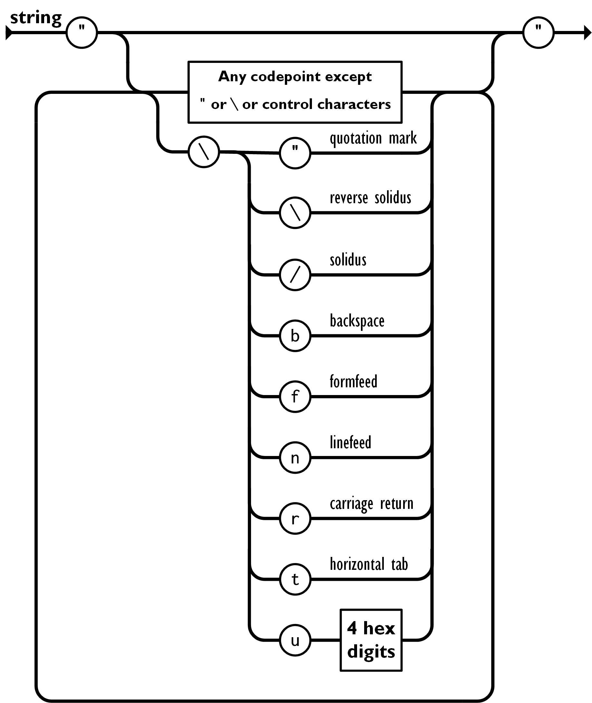
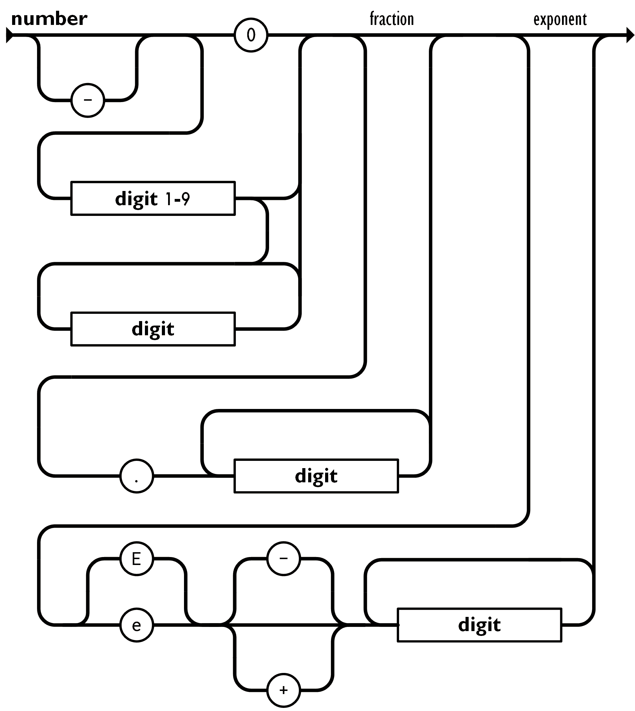

# c#

## static

不使用 static 的默认为 auto。

- **auto**：由程序自动控制变量的生命周期，通常是变量在被触发时被分配，结束时释放
- **static**：按程序的生命周期来分配释放变量，在程序初始化时被分配，程序退出时释放，按程序的生命周期来分配释放变量，而不是变量自己的生命周期。即**在程序运行期间一直占用内存空间。**

如果一个类经常被调用，就写成静态类，相反就不要写成静态类，以节省内存。

## params

参数数组，使用这个关键字你可以直接在调用时传入数组的值，而不需要在调用是重新构造一个数组再传入。

```c#
// 构造一个 int 类型的参数数组
public static void UserParams(params int[] list)
{
  for (int i = 0; i< list.Lengh; i++)
  {
    Console.Write(list[i] + " "); //输出在一行中
  }
  Console.WriteLine(); //把该方法的结果输出在新一行中
}

// 构造一个不限类型的数组 (object类型）
public static void UserParam2(params object[] list)
{
  for (int i = 0; i< list.Length; i++)
  {
    Console.Write(list[i] + " ");
  }
  Console.WriteLine();
}

// 调用方法
static void Main()
{
  UserParams(1,3,4,6);
  UserParams2(1,"2","we","为什么")；
}
```


## 调试

### 断点调试

在要打断点的行头点击，即可打断点，运行时，会在打断点的地方停下来。

### 异常处理

使用 try catch finally 语句来处理异常.

try用于预测可能出现的异常。捕获异常并对异常进行处理，就在catch中实现。不管异常发生与否，都会执行finally里面的语句。

```c#
static void Main()
        {
            while (true)
            {
                try //用于检测异常，当 try 中的语句发生异常时，用 catch 捕捉
                {
                    int num1 = Convert.ToInt32(Console.ReadLine()); 
                    break; //如果输入的是正确的形式, 即 try 语句正确执行, 用 break 跳出 while 循环；如果 try 报错，会进入 catch 块
                }
                catch
                {
                    Console.WriteLine("should be a number, please try again.");
                }

            }
        }
```


## 属性

可以给字段设置带处理的值，即在属性中处理字段，并输出结果给字段。这让字段的设置更灵活。

- 只读属性：只有 get ，没有 set
- 只写属性：只有 set ，没有 get（很少出现）
- value关键字：用户定义由 set 访问器分配的值

```c#
class TimePeriod
    {
        private double hours; //设置一个字段接收实参的值
        public double Hours
        {
            get { return hours; } // get 返回属性值
            set // set 分配新值
            {
                if (value > 0 && value < 24)
                {
                    hours = value;
                    Console.WriteLine($"Time is hours: {hours}");
                }
                else
                {
                    hours = value;
                    Console.WriteLine($"{hours} must be between 0 and 24.");
                }
            }
        }
    }
    class baku
    {
        static void Main()
        {
            TimePeriod t = new TimePeriod(); //构造
            t.Hours = 11; //调用 TimePeriod 类中的 Hours字段，给 hours 赋值
        }
    }
```

### C# 7.O get set 的变化

可以作为 expression-bodied 成员实现，不使用 return.

```c#
class SaleItem
    {
        string _name;
        decimal _cost;

        public SaleItem(string name,decimal cost)
        {
            _name = name;
            _cost = cost;
        }

        public string Name
        {
            get => _name;
            set => _name = value;
        }

        public decimal Price
        {
            get => _cost;
            set => _cost = value;
        }
    }


    class Program
    {
        static void Main()
        {
            SaleItem item = new SaleItem("Shoes",19.95m);
            Console.WriteLine($"{item.Name}: sells for {item.Price:c2}");
        }
    }
```

### 自动实现的属性(如果字段中没有逻辑，可以简化)

```c#
public class SaleItem
{
   public string Name 
   { get; set; }

   public decimal Price
   { get; set; }
}

class Program
{
   static void Main()
   {
      var item = new SaleItem{ Name = "Shoes", Price = 19.95m };
      Console.WriteLine($"{item.Name}: sells for {item.Price:C2}");
   }
}
```


## 派生类构造方法

派生类调用基类的方法

```c#
// 派生类中，用 base 来调用基类的构造方法
// 如果不用 :base，默认会调用基类中的无参构造方法
public DerivedClass():base()
```


## 接口

使用 interface 关键字定义接口。

类与类之间叫**继承**，类与接口之间叫**实现**。

**接口类似于只有抽象成员的抽象基类。实现接口的任何类或结构都必须实现其所有成员。**

- 接口名称必须是有效的c#标识符名称，接口名称以大写字母 I 开头。
- 接口无法直接进行实例化
- 接口之间也可继承，继承接口和继承方法一样

- 接口可包含方法、属性、事件、索引器或这四种成员类型的任意组合。

- 接口不能包含常量、字段、运算符、实例构造函数、终结器或类型。 接口成员会自动成为公共成员，不能包含任何访问修饰符。不能是静态成员。
- 若要实现接口成员，实现类的对应成员必须是公共、非静态，并且具有与接口成员相同的名称和签名。
- 一个类或结构可以实现多个接口。一个类可以继承一个基类，还可实现一个或多个接口。

```c#
// 基类
class BaseClass
{
  public BCMethod()
  {
    
  }
}

// 定义接口
interface Ifly
{
  void Fly();
  void MethodA();
}

//继承接口
interface Ib:Ifly
{
  void MethodC();
}

// 实现接口
public class MyClass:Ib,BaseClass
{
  public void Fly() //实现接口必须把接口内的所有成员实现，这个方法属于 IFly 接口
  {
    
  }
  public void MethodA() //这个方法属于 IFly 接口
  {
    
  }
  
  public void MethodC() //这个方法属于 Ib 接口(如果一个接口属于另一个基类接口，实现该接口时，必须也实现其基类接口)
  {
    
  }
}
```


## 继承的一个例子

```c#
public class A
    {
        public virtual void Fun1(int i)
        {
            Console.WriteLine(i);
        }

        public void Fun2(A a)
        {
            a.Fun1(1);
            Fun1(5);
        }

    }
    public class B : A
    {
        public override void Fun1(int i)
        {
            base.Fun1(i + 1);
        }

        public static void Main()
        {
            B b = new B();
            A a = new A();

            a.Fun2(b); 
            /*a 调用 class A 中的Fun2,传参b
            即为 Fun2(b){b.Fun1(1); Fun1(5);}   
            b.Fun1() = A.Fun1(i+1) = 2 
            Fun1(5) = A.Fun2(){Fun1(5)} = 5 */
            b.Fun2(a); 
          	/*b 调用基类class A 中的Fun2,传参a
          	即为 Fun2(a){a.Fun1(1);Fun1(5);}
          	a.Fun1() = 1 
          	Fun1(5) = (override)b.Fun1(i+1) = 6 */
        }
    }
```


## 列表

### 数组和列表的区别

- 数组必须有初始大小或具体值
  - 指定大小： `int[] a = new int[10];`
  - 指定初始值：`int[] a = new int[]{1,2,3};`
  - 指定初始值，系统自动推断大小：` int[] a = {1,2,3};`
- ArrayList 类，是System.Collections下的类，大小是按存储的数据动态扩充和收缩。
  - **不建议使用ArrayList进行开发，建议使用泛型`List<T>`。**
  - ArrayList把数据当做Object处理，允许插入不同类型的数据，在使用中如果不清楚具体值的数据类型，会报类型不匹配，需要转化使用（装箱拆箱）**即ArrayList是不严谨的。**
  - 初始化时不需要指定大小： `ArrayList list = new ArrayList();
  - 新增数据： `list.Add(“abc”);`
  - 修改数据：`list[2]=345;`
  - 移除数据： `list.RemoveAt(0);`
  - 插入数据：`list.Insert(0,”hello world”);`
- `List<T>`类
  - `list<T>`类初始化时必须指定一个类型，int string 或自定class
  - 避免了 ArrayList 会出现的类型不匹配的报错

```c#
// 创建列表的2种方式，使用泛型 List<T>
List<int> scoreList = new List<int>();
var scoreList = new List<int>();
// 插入数据的方式
scoreList.Add(12);
// 读取列表数据
Console.WriteLine(scoreList[0]);
// 读取列表的数据个数
Console.WriteLine(scoreList.Count);
//读取列表的容量大小,容量大小默认为4，不够用时以倍数扩容，8，16，32; 可用 list.Capacity(10)来指定容量大小，扩容按指定容量大小2倍扩容，20，40，80
Console.WriteLine(scoreList.Capacity);
//移除指定位置元素
scoreList.RemoveAt(0);
//取得一个元素在列表中的索引位置，如果位置不存在，返回-1
scoreList.IndexOf(20);
scoreList.LastIndexOf(2); //从后向前搜索
//排序
scoreList.Sort();
```


## 泛型类

关键字 `<T>`，定义时只需要用 T 代表类型，在构造时需要指定 T 的类型

```c#
public class GenericList<T>
{
    public void Add(T input) { }
}
class TestGenericList
{
    private class ExampleClass { }
    static void Main()
    {
        // Declare a list of type int.
        GenericList<int> list1 = new GenericList<int>();
        list1.Add(1);

        // Declare a list of type string.
        GenericList<string> list2 = new GenericList<string>();
        list2.Add("");

        // Declare a list of type ExampleClass.
        GenericList<ExampleClass> list3 = new GenericList<ExampleClass>();
        list3.Add(new ExampleClass());
    }
}
```


## 一些零碎的点

### String

注意 char 和 string 的符号，单引号和双引号

```c#
string s  = "www.helloworld.com";
string newS = s.Replace('.','-'); //char 要用 ' '
string newS = s.Replace(".","---") //string 要用 " "
```

### String和StringBuilder类型

对String对象每个操作都会创建一个新的字符串。

StringBuilder是可变类型，指为对象维护一个缓冲区以容纳字符串的扩展，如果空间可用，会把新数据追加到缓冲区，否则会分配一个新的更大缓冲区。将通常比 String 类提供更好的性能。

使用 String 类型的建议：

- 字符串更改数量很小
- 固定数量的字符串串联操作
- 对字符串执行大量搜索操作（StringBuilder缺少搜索方法）

使用 StringBuilder 类型的建议：

- 对字符串进行未知数量的更改
- 希望对字符串进行大量更改时

### [特性] Obsolete 方法弃用提示

```c#
/*在方法上加obsolete关键字可以标记该方法被弃用,标记弃用的方法仍可调用
如不允许再次调用，在()中加上判断 true ,加上后，调用时程序会报错 */
[Obsolete("this method is obsolete, pls use NewMethod.",true)]
static void OldMethod(){}
```

### [特性] Conditional 控制方法的调用

```c#
/*Conditional关键字控制方法的调用
在文件头用宏（一些组织在一起的命令作为一个单独命令完成一个特定任务）定义一个规则 */
#define IsTest

using System;
namespace MySpace
{
  class Program
  {
    [Conditional("IsTest")]
    static void Method1(){}
    
    static void Main()
    {
      Method1(); //系统调用时会检查宏是否有对应关键字，如有，则运行该方法，没有则不运行
    }
  }
}

```

### [特性] DebuggerStepThrough 在调试时跳过该方法

```c#
//在方法头加上 DebuggerStepThrough 标签，debug step时可跳过该方法
[DebuggerStepThrough]
static void Method1(){}
```

### 创建自己的特性类(自定义标签)

```c#
//特性类是一个类，一般命名以Attribute结尾，且继承自System.Attribute,特性不需要继承，可以设计为封闭的 sealed
[AttributeUsage(AttributeTargets.Class)] //在特性类上方加标签说明特性可以用在什么类型的元素上，class或mathod或其他
sealed class MyTestAttribute:System.Attribute
{
  public string Description{get;set;}
}

```


## 正则表达式

要在项目中引用`System.Text.RegularExpressions;`命名空间

关键字 `Regex`

```c#
string st = Console.ReadLine(); //接收用户输入的字符串
string pattern = @"^\d*$"; //用正则表达式定义验证规则，此例为"输入只能是数字",用@让 \保持原意，不要转义，此处加@表示 \d 的原意，字符串中的"\"的原意是转义符，如果不用@，会把 \ 和 d 分开看
bool isMatcth =  Regex.IsMatch(st, pattern); //判断是否匹配，输出 bool

Console.WriteLine(isMatcth ? "It's true." : "Just allow number.");
```


```c#
// 检测用户的输入是否合法
using System.Text.RegularExpressions;

while (true)
{
  string st = Console.ReadLine();
  string pattern = @"^\d*$";
  bool isMatcth = Regex.IsMatch(st, pattern);
  if (isMatcth == true)
  {
    Console.WriteLine("is true");
    break;
  }
  else
  {
    Console.WriteLine("is false,please try again");
  }
}
```


```c#
while (true)
{
  string st = Console.ReadLine();
  string pattern = @"^\d*$";
  string patternSearch = @"\d|[a-z]";
  string patternSplit = "[,;.]";
  // 用 match 来找出用户输入字符串里合法字符,使用 Matches 来输入一个匹配 patternSearch 规则的list,类型为 Match
  MatchCollection coll = Regex.Matches(st, patternSearch);
  // 定义一个字符串数组把按 patternSplit 的规则切分好的数据存入
  string[] stSplit = Regex.Split(st, patternSplit); 
  foreach (Match match in coll)
  {
  		Console.Write(match + " "); //把符合条件的字符输出
  } 
  
  foreach(var str in stSplit)
	{
		Console.Write(str + " "); //把切分的字符输出
	}
  
  break;
}
```


## 委托和 Lambda

关键字 `delegate`，委托用于将**方法**作为参数传递给其他方法。**定义一个委托相当于定义一个新类。**

一旦声明了委托类型，委托对象必须使用 **new** 关键字来创建，且与一个特定的**方法**有关。

定义委托：`delegate 返回值 方法名（参数）;`

```c#
//定义委托,如果被委托的方法中指定了输入参数，委托中也有要同类型参数
public delegate void PrintString(string str);

//定义一个方法
public static void WriteToScreen(string str) //需要和委托一样有一个输入参数
{
  Console.WriteLine($"The string is {str}");
}
public static void Write(string str) //需要和委托一样有一个输入参数
{
  Console.WriteLine($"The write is {str}");
}

static void Main()
{
  string x = "you";
  //把方法做为值赋给委托
  PrintString pst = new PrintString(WriteToScreen);
  PrintString pst = WriteToScreen; //上一行的简化方式，直接把方法赋值给委托的变量
  PrintString pst1 = Write;
  
  pst(x); //output:The string is you
  pst1(x); // output:The write is you
}
```

### Action委托(没有返回值)

Action委托是系统内置的委托类型。

- Action 委托只能指向一个没有参数，**没有返回值**的方法。
- `Action<T>`封装一个方法，该方法只有一个参数 T 且没有返回值。
- `Action<int,int string>`   可以有多个参数，最多支持16个，委托和被委托的参数类型及个数要对应。

```c#
static void PrintString()
{
  Console.WriteLine("hello");
}

stratic void StringValue(string x)
{
  console.WriteLine($"this is  {x} Action.");
}

static void Main()
{
  string y = "you";
  Action a = PrintString;
  Action<string> action = StringValue;
  a(); // output:hello
  action(y); // output:this is a you Action
}
```

### Func委托（必须有返回值）

Func委托要求指向的方法**必须有返回值**，可以传递0个到16个参数类型，和1个返回类型。

```c#
static int Test1()
{
  ruturn 1;
}

public static string Test2(int x)
{
  string y = "hi";
  string z = x.ToString();
  return y + " " + z; //返回值是string类型
}
Func<int> a = Test1; // 返回类型为 int
Console.WriteLine()
Func<int,string> b = Test2; //< >中有多个值时，最后一个表示返回类型，前面所有都表示参数类型,必须和指向的方法一一对应。相当于 Func<in int, out string>
Console.WriteLine(Text2(2)); // output:hi 2
```

### 多播委托

委托多个对象。

```c#
//用+=来连接多个委托
static void Test1(){Console.WriteLine("Test1")};
static void Test2(){Console.WriteLine("Test2")};
static void Main(){
  Action a = Test1;
		a += Test2; //means a = Test1 + Test2
  	a -= Test1; //means a = Test2
	a(); // output:Test1 Test2
}
```

### 匿名方法

在创建委托时创建一个没有名字的方法。

```c#
Func<int,int,int> a = delegate(int arg1,int arg2)
{
  return arg1 + arg2;
}
```

### Lambda

lambda表达式是用来简化匿名方法的。

lambda表达式不需要声明参数类型。

当参数只有一个时，可以不写小括号，当方法体只有一句时可以不写大括号。

```c#
Func<int,int,int> a = (arg1,arg2) => {return arg1 + arg2;};
Func<int,int> a = arg1 => a+1; //23表示返回值，即return = a+1
```

### 事件

事件基于委托，为委托提供了一个发布/订阅机制，可以说是特殊的委托。

**事件不能在类的外部触发，只能在类的内部调用。**

格式：`public event 委托类型 事件名` 

- 动作触发者发布消息

```c#
Class Teacher
{
  			//基本属性
  			private string name;
        private string course;
				//构造方法
        public Teacher(string name,string course)
        {
            this.name = name;
            this.course = course;
        }
				//定义动作
        public void WhoseCourse()
        {
            Console.WriteLine($"{name}'s class is {course}");
          	//调用事件 TeacherCourse
            if (TeacherCourse != null) TeacherCourse();
        }
				//定义事件（广播），发布信息,使用 event 关键字让action委托只能在类的内部触发，避免外部调用，减少误调用而出错
        public event Action TeacherCourse;
}
```

- 接收者订阅（注册）消息

```c#
public class student
    {
        private string name;
        private string sex;
				// 把Teacher类做为参数传入
        public student(string name,string sex,Teacher teacher)
        {
            this.name = name;
            this.sex = sex;
          	//把ChooseCourse事件传给teacher里的event委托(订阅消息)
            teacher.TeacherCourse += ChooseCourse;
        }

        public void ChooseCourse()
        {
            Console.WriteLine($"{name} choose ({sex}).");
        }
    }
```

- 实例化

```c#
class Program
    {
        static void Main()
        {
            Teacher teacher1 = new Teacher("Marry", "Math");
            Teacher teacher2 = new Teacher("Emma", "Music");
            student student1 = new student("Tom", "boy", teacher1);
            student student2 = new student("Lily", "girl", teacher2);
            //调用Teacher中的动作，此时会把Student里的动作也调用上
          	teacher1.WhoseCourse();
            teacher2.WhoseCourse();
        }
```


## 排序的拓展方法（适用于任何类型的排序）

以给雇员薪水排序为例。

```c#
namespace C_Sharp_test
{
    class Employee //定义一个自定义类，包含雇员的名字和薪水
    {
        public string Name { get; set; }
        public int Salary { get; set; }

        public Employee(string name, int salary) //构造方法
        {
            this.Name = name;
            this.Salary = salary;
        }
				//定义一个布尔方法
        public static bool Compare(Employee e1, Employee e2)
        {
            if (e1.Salary > e2.Salary) return true;
            return false;
        }
				//重写该类中的ToString方法，把输出值更换为想要的输出值
        public override string ToString()
        {
            return Name + ":" + Salary;
        }
    }

    class Program
    {
      	/* 定义一个通用的比较方法（泛型）
      	返回值未知<T>，属性：
      	in:一个名为 dataArray 的未知类型T的数组
      	out:一个名为 compareMethod 的 Func<T,T,bool> 委托 */
        static void CommonSort<T>(T[] dataArray, Func<T, T, bool> compareMethod)
        {
          	//冒泡排序方法，参考 basic1 中的冒泡排序法
            bool swapped = true;
            do
            {
                swapped = false;
                for (int i = 0; i < dataArray.Length - 1; i++)
                {
                   	/* 
                   	if条件中默认为true，此处原方法为比较int类型中的字符
                   	dataArray[i + 1] < dataArray[i] = true
                   	用Func<T,T,bool>委托，输入两个未知类型的值T,返回 bool = true 给 if
                   	*/
                    if (compareMethod(dataArray[i], dataArray[i + 1]))
                    {
                        T temp = dataArray[i]; //原来的int temp --> T temp 未知类型的值
                        dataArray[i] = dataArray[i + 1];
                        dataArray[i + 1] = temp;
                        swapped = true;
                    }
                }
            }
            while (swapped);
        }

        static void Main()
        {
            //用Employee类实例化一个新的数组，数组中每个值名称为 Employee ,类型为 function ,值为方法中的赋值
            Employee[] employees = new Employee[]
            {
              	//实例化Employee方法
                new Employee("baku",612),
                new Employee("saku",132),
                new Employee("taku", 212),
            };
						/*实例化泛型比较方法，返回值<Employee>
						传入参数为实例化数组 employees
						返回参数为 Employee 类中 Compare 方法的 bool 值 */
            CommonSort<Employee>(employees, Employee.Compare);
            foreach(Employee em in employees)
            {
                /*遍历数组，返回 Employee 方法所在的类名（Employee），因为方法定义的返回值为 Employee 类
              	ToString为系统内置方法，ToString默认返回值为（return base.ToString）,即所属 class 的类型。
              	把ToString方法重写为想要的输出值：
              	return Name + ":" + Salary;
              	WriteLine会默认调用ToString方法，输入字符串，所以直接wirteline em即可
              	也可以调用ToString方法 Console.WriteLine(em.ToString()); */
                Console.WriteLine(em);
            }
        }
    }
}
```

## LINQ查询

.NET 中的集成查询技术。

操作步骤：

1. 获取数据源
2. 创建查询
3. 执行查询

```c#
//获取数据源list, m 代表数据源列表中的对象
var IntList = new List<int>() { 1, 2, 3, 56, 22 };
var res = from m in IntList 
  				where m >8 //查询条件,没有查询条件可不写这句
  				select m; //把符合条件的对象返回
//输出
foreach (int i in res){Console.WriteLine(i);}
```

### 查询复杂list对象

```c#
//建立对象类
class Student
{
  public int Id{get;set;}
  public string Name{get;set;}
  public int Age{get;set;}
  public int FavoriteCourse{get;set;}
  //把对象转为字符串
  public override string ToString()
  {
    return string.Format($"ID:{Id},Name:{Name},Age:{Age},FavoriteCourse:{FavoriteCourse}");
  }
}

class Teacher
{
  public int Id{get;set;}
  public string Name{get;set;}
  public int Course{get;set;}
  //把对象转为字符串
  public override string ToString()
  {
    return string.Format($"ID:{Id},Name:{Name},Course:{Course}");
  }
}
```

单表查询

```c#
//初始化列表对象
class Program
{
  private static void Main()
  {
    var StudentList = new List<Student>()
    {
      new student() { Id = 1, Name = "e", Age = 1 ,FavoriteCourse = "Math"},
      new student() { Id = 2, Name = "a", Age = 2 ,FavoriteCourse = "Music"},
    };
    var TeacherList = new List<Teacher>()
    {
      new teacher() { Id = 1, Name = "e", Age = 1 , Course = "Math" },
      new teacher() { Id = 2, Name = "a", Age = 2 , Course = "Music" },
    };
    
    //查询
    var res = from m in StudentList
      				where m.Id == 1
      				select m;
    
    //输出查询结果
    foreach (var i in res)
    {
      Console.WriteLine(i);
    }
  }
}
```

对单表结果按条件分组 group by

```c#
var res = from m in StudentList
  				group m in m.FavoriteCourse into newGroup //按FavoriteCourse分组
  				orderby newGroup.Key //newGroup.key=m.favoritecourse
  				select new {fvcourse = newGroup.key,count = newGroup.Count()};

//输出查询结果
foreach (var temp in res)
{
  Console.WriteLine(temp);
}
```

用 .any判断是否包含元素或存在元素满足指定条件

用 .all判断序列是否完全满足指定条件

```c#
//是否存在满足条件的元素
bool res = StudentList.Any(m => m.Id == 1);
//是否序列所有元素都满足条件
bool res = StudentList.All(m => m.Id == 1);
Console.Write(res); //output:True
```


多表查询（联合查询）

联合查询会把第一个序列和第二个序列中所有元素合并成一个序列

```c#
var res = from s in StudentList
  				from t in TeacherList
  				where s.FavoriteCourse == t.Course
  				orderby s.Age descending  //排序关键字 orderby,倒序 descending
  				//orderby s.Age,t.Age 多字段排序
  				select new {student = m, teacher = k};

foreach(var human in res)
{
  Console.WriteLine(human);
}
```

另一种联合方法 join in，把结果分类

```c#
var res = from s in StudentList
  				join t in TeacherList
  				on s.FavoriteCourse equals t.Course
  				into groups //把结果放到一个组中
  				orderby groups.Count() //按统计排序
  				select new {student = m, count = groups.Count()};
```

## 文件操作

### 文件属性读取操作

```c#
FileInfo fileInfo = new FileInfo("filename.txt");
if (fileInfo.Exists == false){fileInfo.Create();}
```

### 文件夹属性读取操作

```c#
DirectoryInfo dirInfo = new DirectoryInfo("directoryname");
```

### 文件内容读写

```c#
//读取文本文件
string[] strArray = File.ReadLines("fileName.txt");
//适合读取二进制文件
FileStream stream = new FileStream("file.txt",FileMode.Open);
//最常用于读取文本文件的方式,不需要声明文件的编码，此命令会自动处理
StreamReader str = new StreamReader("filename.txt");
StreamReader str = new StreamReader("filename.txt",Encoding.UTF8);

//写入文本文件
StreamWriter writer = new StreamWriter("filename.txt");//如果不存在此文件会自动新建,如果存在会覆盖同名文件

//输出读取结果方法1
While(true)
{
  string str = str.ReadLine(); //读取一行字符串
  if (str == null) break;
  Console.WriteLine(str);
}
//输出读取结果方法2
string str = str.ReadToEnd();
Console.Write(str);
str.Close();

//输出StreamWriter的写入结果
while(true)
{
  string message = Console.ReadLine();
  if (messsage == "q") break; //设置退出写入的命令键
  writer.WriterLine(message);
}
writer.Close();

```

## XML  JSON

### XML 

- xml 必须要有开头结尾符
- 标签可以加属性，属性名和属性值都可自定义

```xml
<skills>
    <skill>
        <id>1</id>
      	<!--属性名为 lang ，值为 eng-->
        <name lang="eng">sky</name> 
        <damage>123</damage>
    </skill>

    <skill>
        <id>2</id>
        <name lang="eng">ground</name>
        <damage>12</damage>
    </skill>
</skills>
```

读取

```c#
class Skill
{
  public int Id{get;set;}
  public string Name{get;set;}
  public string Lang{get;set;}
  public int Damage{get;set;}
}

class Program
{
  static void Main()
  {
    //位于 System.Xml 类下
    XmlDocument xmlDoc = new XmlDocument();
    xmlDoc.Load("skillinfo.txt");
  }
}
```

### json







```json
//json文件-array 
[
{"id":2,"name":"aa","damage":123},
{"id":3,"name":"bb","damage":13},
{"id":4,"name":"cc","damage":12}
]
```


```c#
//json文件-object
{
  "Name":"baku",
  "Level":99,
  "Age":14,
  "SkillList":
  [
    {"id":2,"name":"aa","damage":123},
    {"id":3,"name":"bb","damage":13},
    {"id":4,"name":"cc","damage":12}
	]
}
```


```c#
using System.IO;
using LitJson;
//右键项目-管理NuGet包-LitJson,添加包
//JsonData 代表一个数组或一个对象,读取外部文件时，需要把外部文件的[属性]中[生成-复制到输出目录]选择为[如较新则复制]，不然文件无法被找到
JsonData jsonData = JsonMapper.ToObject(File.ReadAllText("json.txt"));

foreach (JsonData temp in jsonData)
{
  //通过key值查找value
  JsonData idvalue = temp["id"];
  JsonData namevalue = temp["name"];
  
  //把JsonData类型转换为相应可输出类型
  int id = Int32.Parse(idvalue.ToString());
  string name = namevalue.ToString();
  
  //输出结果
  Console.WriteLine($"{id}:{name}");
}
```

把json数据用一个类来管理

```c#
class Skill
{
  public int id;
  public string name;
  public string damage;
  
  public override string ToString()
  {
    return string.Format($"id:{id},name:{name},damage:{damage}");
  }
}

class Program
{
  public static void Main()
  {
    //建一个列表存放json转化出来的数据
    List<Skill> skills = new List<Skill>();
    //把Skill类中的对象实例化
    Skill skill = new Skill();
    
    //解析json文件
    JsonData jsonData =  JsonMapper.ToObject(File.ReadAllText("json.txt"));
    
    //遍历json文件中的数据，转化为可读类型字段
    foreach (Jsondata temp in jsonData)
    {
      JsonData idValue = temp["id"]; //通过key得到value
      JsonData nameValue = temp["name"];
      
      skill.id = Int32.Parse(idValue.ToString()); //把json值转成可读类型
      skill.name = nameValue.ToString();
      skills.Add(skill); //把数据添加到列表中    
    }
    
    foreach (var temp in skills)
    {
      Console.WriteLine(temp); //输出skills列表中的数据
    }
  }
}
```

用泛型解析json

```c#
class Skill
{
  public int id;
  public string name;
  public int damage;
  
  public override string ToString()
  {
    return string.Format($"id:{id},name:{name},damage:{damage}");
  }
}

//Object对象中嵌套list
class SkillObject 
{
  public string Name{get;set;}
  public int Level{get;set;}
  public int Age{get;set;}
  public List<Skill> SkillList{get;set;}
  
  public override string ToString()
  {
    return string.Format($"name:{Name},leve:{Level},age:{Age},skillList:{SkillList}");
  }
}

class MainClass
{
  public static void Main()
  {
    //解析数组-使用这种方法需要Class Skill中的字段和json中的值完全一致
    Skill[] skillArray = JsonMapper.ToObject<Skill[]>(File.ReadAllText("json.txt"));
    //解析list-可以用list的方式代替泛型中的数组
    List<Skill> skillList = JsonMapper.ToObject<List<Skill>>(File.ReadAllText("json.txt"));
    //解析Object
    SkillObject so = JsonMapper.ToObject<SkillObject>(File.ReadAllText("json.txt"));
    
    //输出list里的元素
    foreach(var temp in skillArray)
    {
      Console.WriteLine(temp);
    }
    
    //输出object里list的元素
    foreach (var temp in so.SkillList)
    {
      Console.WriteLine(temp);
    }
  }
}
```


## OLDB操作数据库及excel

使用插件把excel转成json

[参考](https://github.com/koalaylj/xlsx2json)

