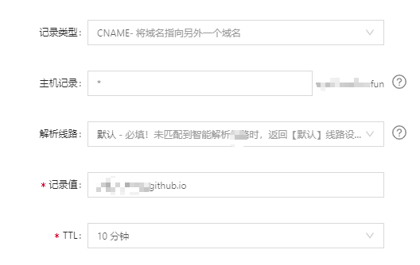
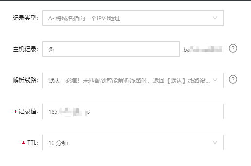

#  Git

* TOC
{:toc}

## 更新git pages

```ruby
bundle update github-pages
```


## 修改git推送方式

[参考](https://git-scm.com/book/zh/v2/%E6%9C%8D%E5%8A%A1%E5%99%A8%E4%B8%8A%E7%9A%84-Git-%E7%94%9F%E6%88%90-SSH-%E5%85%AC%E9%92%A5)

[查询github IP](https://www.ipaddress.com/)

[git官方说明](https://help.github.com/cn/github/authenticating-to-github/connecting-to-github-with-ssh)

[github page绑定个人域名](https://blog.csdn.net/qq_41684621/article/details/103230888)

[绑定多个二级域名](https://github.com/IcedSoul/wiki/wiki/使用Github-Pages绑定多个二级域名)

1. 检查现有的推送方式

   ```yaml
   git remote -v
   ```

2. 从http改为ssh

   ```yaml
   git remote set-url origin git@github.com:username/xx.git
   ```

3. 从ssh改为http

   ```yaml
   git remote set-url origin https://github.com/username/xx.git
   ```

4. 查看现在的ssh

   ```yaml
   cd ~/.ssh
   ls
   ```

5. 生成ssh密钥并显示(加 -o 可以比默认格式更能抗暴力破解)

   ```yaml
   ssh-keygen -o
   cat ~/.ssh/id_rsa.pub
   ```

6. 复制并在github上粘贴.

## 切换 git 本地账号

1. 查看配置

```yaml
git config --global --list
git config --list
```

2. 切换账号

```yaml
git config --global user.name "name"
git config --global user.email "email"
```

## 多账户

[参考](https://juejin.im/post/5dfcb9ebf265da33e82bc5b0)

[多git账户免密码登录完全配置](https://www.jianshu.com/p/9720e237c834)

1. 查看当前用户`git config user.name`  `git config user.email`
2. 生成SSH Key，指定文件名，避免覆盖原有文件，注意下列代码中的`id_rsa.another`

id_rsa: 私钥

id_rsa.pub: 公钥

```yaml
ssh-keygen -t rsa -f ~/.ssh/id_rsa_another -C <Git注册邮箱>
# -t 用来指定加密算法为 rsa；
# -C 后面是个注释信息，并不一定要和你 Git 账户的邮箱或者 Git 账户名保持一致，只是常常是和你账户邮箱保持一致，这样设置，就能知道这个公钥被绑定在哪个 Git 账户上了。
```

3. 配置config文件，如果存在，直接打开

```yaml
touch ~/.ssh/config
# 或者
open ~/.ssh
```

4. 修改config文件相关信息，注意Host 和Hostname要写主机名
5. **更换代理软件后(clash/shadowsocks), 要修改`localhost`的端口号,不然无法推送接收.**

```yaml
# localhost端口号要和当前使用的代理端口号一致
ProxyCommand nc -x localhost:7891 %h %p
Host github.com
	HostName github.com
    IdentityFile ~/.ssh/id_rsa
    User 8ku

Host github8ku
	HostName github.com
    IdentityFile ~/.ssh/id_rsa_another
    User another
```

5. 测试

```yaml
ssh -vT git@github.com
#Hi xxx! You've successfully authenticated, but GitHub does not provide shell access.

ssh -T github8ku
```

6. 更改仓库对应的账户

```yaml
#移除全局账户
git config --global --unset user.name && git config --global --unset user.email
#到每个仓库根目录, 单独给每个仓库配置账户
git remote remove origin && git remote add origin github.com:8ku/note_other.git
git remote remove origin && git remote add origin github8ku:bakumatata/something.git
#到每个仓库根目录, 给每个仓库重新配置用户名和邮件地址
git config --global --unset user.name && git config --global --unset user.email

git config --local user.name "name"
git config --local user.email "someone@email.com"
```

6. 各种报错的解决方法

```yaml
# 用别名测试ssh被denied(publickey)
ssh-add -D #清除现保存的密钥,如有必要, 执行此步
eval "$(ssh-agnent -s)" #启动ssh-agent
ssh-add -K ~/.ssh/id_rsa_another

# 提示 Could not open a connection to your authentication agent.
eval 'ssh-agent'
ssh-agent bash

#提示 The agent has no identities. 清除代理
ssh-add -D

# 清除后再添加不同的ssh
ssh-add ~/.ssh/id_rsa
ssh-add ~/.ssh/id_rsa_another

# clone remote 的时候用别名
git clone github8ku:bakumatata.github.io.git

#查看当前会话已添加的ssh私钥
ssh-add -L

#添加私钥到当前ssh-agent会话
ssh-add ~/.ssh/id_rsa

#每次启动终端时都自动添加指定私钥到当前 ssh-agent 会话中
echo "ssh-add ~/.ssh/id_rsa  >/dev/null 2>&1" >> ~/.bashrc
```


### 查看仓库config文件

```yml
#仓库根目录
cd .git
open config
```


### Hexo配置更改

_config.yml的修改

```yml
deploy:
	type: git
	repo: git@别名:git用户名/仓库地址
	branch: master
```

修改对应用户名和电邮地址

```yml
cd .deploy_git
git config user.name '之前设置在根目录的'
git config user.email '之前设置在根目录的'
```


## 绑定个人域名

1. 买域名（阿里云）

2. `ping xxx.github.io `得到ip地址

3. 在域名提供商里为域名添加解析，以阿里云为例

   1. 点击 '解析'
   2. 添加两条记录






4. Repository Settings - GitHubPages Custom domain 里添加自己的域名（不要加www)
5. 勾选 `Enforce HTTPS`
6. 设置子域名：在仓库的 GitHubPages Custom domain 填写 `子域名.xxx.com`

## 拉取到本地

- `git clone url`

### 拉取某个文件夹

- `git init`  在本地建立一个空仓库
- `git remote add -f origin https://github.com/8ku/note.git`
  - 如果网络错误导致失败，remove它，`git remote rm origin` ，重新remote
- `git config core.sparsecheckout true`    开启sparse checkout模式
- `echo 文件夹/文件 >> .git/info/sparse-checkout`
- `git pull origin master`  拉取，如果失败，可以试试`git checkout master`
- `git add .` 编辑完成后准备上传
- `git commit -m’add some new stuff`   添加 commit
- `git push -u origin master`   推到仓库

### Sparse-checkout 文件设置

- 子目录匹配

  - 如果名称前带斜杠，`/docs/`，表示只匹配根目录下的文件目录， 如前不带斜杠，则匹配所有有该目录名称的目录（包括父目录）

- 通配符 *

  - 在sparse-checkout文件中支配通配符 * 

    ```
    *docs/
    index.*
    *.gif
    ```

  - 支持 ！排除

    ```
    /*
    !/docs/
    ```

    

## 删除某个文件夹

- `git init`初始化本地仓库

- `git remote add origin https://github.com/8ku/note.git`

- `git pull origin master`

- `git rm -r --cached 文件夹路径`

- `git commit -m'内容文本'` 

- （最好不使用）按Esc，`:wq`,hit Enter

- `git push -u origin master`

  

  

  *How to fix Git Error ‘Your local changes to the following files will be overwritten by merge’*

- `git reset --hard`

- `git pull`

## 添加文件夹/文件

- 把文件夹/文件拉到本地仓库
- `git add -A`或`git add .`
- `git status`查看是否添加成功，都是绿色表示添加成功
- `git commit -m'内容文本'`确认添加
- `git push -u origin master`推送到github
- `git remote -v`查看当前在哪个远程仓库

**create a readme.md file before build and push a new book (important!)**

## 输出各种格式

- pdf：gitbook pdf
- epub： gitbook epub
- mobi：gitbook mobi

## Typora

- 下划线：ctrl+u
- 删除线：~~
- 高亮：==
- table：ctrl+t
- 分割线：三个-
- 数学公式：$$
- 代码：`
- 代码块：三个~

## gitbook 

### 安装

需要先安装NodeJS,然后使用命令安装gitbook:

```
npm install gitbook-cli -g
```

- 把仓库中的template文件夹copy到新文件夹中
- 在summary里把每章节的路径写上，用`gitbook init` 生成绑定目录的md文件
  - 或先新建每章节的文件，最后在summary中把目录写上，用`gitbook init`绑定
- 在notebook-xxxx，右键 git bash here，`gitbook build` ，如提示插件未安装，则先安装再build
- 生成后把notebook-xxxx里的 _book 文件夹内的文件剪切到和 notebook-xxxx同级目录下
- 把书籍路径增加到index.html中
- 在根目录用git push到仓库中

## git clone到本地很慢

设置代理，socks5代理端口号查询代理软件

```java
//查看代理
cat ~/.gitconfig

//设置代理
git config --global https.proxy https://127.0.0.1:1086
git config --global http.proxy https://127.0.0.1:1086
//只对github.com
git config --global http.https://github.com.proxy socks5://127.0.0.1:1086
//取消所有代理 
unset ALL_PROXY
//取消github代理
git config --global --unset http.https://github.com.proxy
//打开 git 配置文件
vi ~/.gitconfig
[http "https://github.com/"]
    proxy = http://127.0.0.1:1081
[https "https://github.com/"]
    proxy = http://127.0.0.1:1081
```

### [使用SSH](https://help.github.com/cn/github/authenticating-to-github/checking-for-existing-ssh-keys)

1. 检查是否存在现有SSH密钥，在Git Bash：`ls -al ~/.ssh`
2. 生成新SSH密钥 `ssh-keygen -t rsa -b 4096 -C "your_email@example.com"`
3. 将 SSH 密钥复制到剪贴板 `clip < ~/.ssh/id_rsa.pub`
4. 打开github账户 设置页面，添加新的SSH密钥
5. 给SSH密钥添加密码
   1. `ssh-keygen -p`
   2. hit enter
   3. enter password
   4. enter password again
   5. done.

## 支持数学公式

- md头部添加代码

<head>
    <script src="https://cdn.mathjax.org/mathjax/latest/MathJax.js?config=TeX-AMS-MML_HTMLorMML" type="text/javascript"></script>
    <script type="text/x-mathjax-config">
        MathJax.Hub.Config({
            tex2jax: {
            skipTags: ['script', 'noscript', 'style', 'textarea', 'pre'],
            inlineMath: [['$','$']]
            }
        });
    </script>
      <script src="https://unpkg.com/mermaid@8.0.0/dist/mermaid.min.js"></script>
      <script>mermaid.initialize({startOnLoad:true});</script>
</head>

<head>
    <script src="https://cdn.mathjax.org/mathjax/latest/MathJax.js?config=TeX-AMS-MML_HTMLorMML" type="text/javascript"></script>
    <script type="text/x-mathjax-config">
        MathJax.Hub.Config({
            tex2jax: {
            skipTags: ['script', 'noscript', 'style', 'textarea', 'pre'],
            inlineMath: [['$','$']]
            }
        });
    </script>
      <script src="https://unpkg.com/mermaid@8.0.0/dist/mermaid.min.js"></script>
      <script>mermaid.initialize({startOnLoad:true});</script>
</head>

