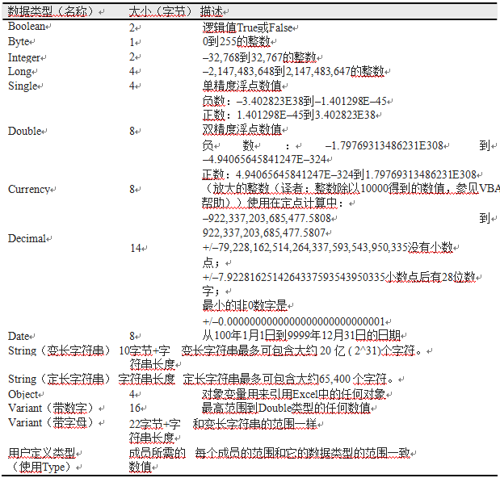
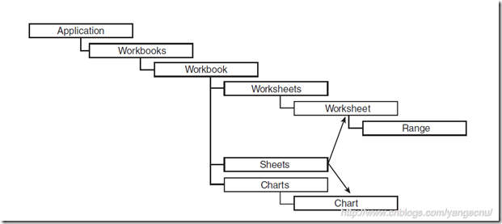
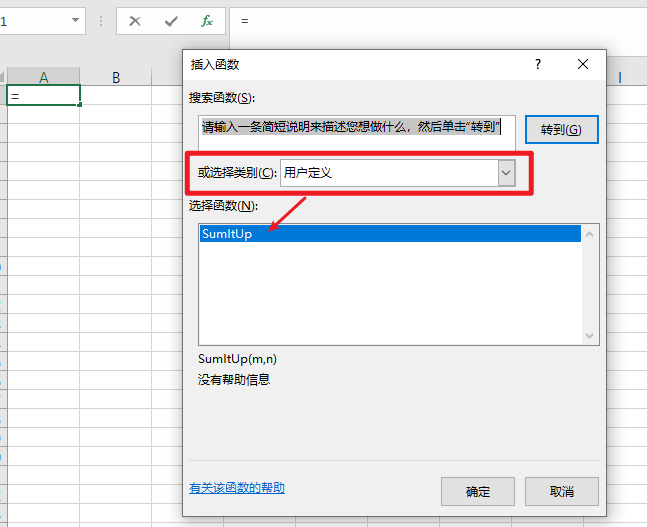

# VBA


[参考链接](https://www.w3cschool.cn/excelvba/excelvba-basics.html)

## 基本知识点

- Dim

  - Dimension(尺寸)的缩写，用来声明代码中的变量。
  - 声明 ：`Dim age As Integer`

- VBA中的数据类型

  

- 添加注释

  - 在行前添加英文单引号，注释也可以写在代码后

- 宏过程

  - 所有宏过程都以关键词 `Sub`开始，`End Sub`结尾。

  - ```vb
    Sub code()
    Dim i As Integer
    '按用户名标记角色
    For i = 2 To 348
        If cells(i, 1).Value Like "*lsa*" Or cells(i, 1).Value Like "*峰*" Then
            cells(i, 13) = "测试人员"
        ElseIf cells(i, 1).Value Like "*ac*" Or cells(i, 1).Value Like "Na*" Then
            cells(i, 13) = "worker"
        ElseIf cells(i, 1).Value Like "*瑞*" Then
            cells(i, 13) = "robot"
        Else
            cells(i, 13) = "user"
        End If
    Next
    End Sub
    ```


- Range属性

  - Range属性返回一个单元格或单元格区域
  - 选择一个单元格 `range("a5").select`
  - 选择一个单元格区域 `range("a6:a10").select`
  - 选择一些不相邻的单元格 `range("a1,b6,c8").select`
  - 选择一些不相邻的单元格和单元格区域 `range("a11:d11,c12,d3").select`

- Cells属性

  - cells属性返回一个单元格
  - Cell要求两个自变量，第一个是行号，第二个是列号或列字母
  - 选择一个单元格：`cells(5,1).select`或`cells(5,a).select`
  - 选择一个单元格区域：`range(cells(6,1),cells(10,1)).select`
  - 选择工作表所有单元格：`cells.select`     

- Offset属性

  - Offset基于当前选择选择的单元格来选择一个位置
  - 选择a1下一行和右边三列的单元格：`range("a1").offset(1,3).select`
  - 选择d15上面两行和左边一列的单元格：`range(d15).offset(-2,-1).select`
  - 选择当前单元格上面一行的单元格（同列）：`Selection.offset(-1,0).select`

- 选择行和列

  - 选择当前活动单元格所在行：`selection.entirerow.select`

  - 选择当前活动单元格所在列：`selection.entirecolusmn.select`

  - 统计选择区域的行数和列数

    - ```vb
      range("a1:d15").select
          ?selection.rows.count '统计行数
          ?selection.columns.count '统计列数
          ?selection.cells.count '统计单元格数
      ```

- 往表中输入数据

  - 输入文本：`range("a5").formula = "amount due"`
  - 输入数字：`range("a5").value = 123`
  - 输入公式：`range("a5").formula = "= d21 * 3"`

- 返回表中数据

  - 返回值：`?range("a1").value`
  - 返回单元格里的公式：`?range("a1").formula`

- 移动、复制和删除单元格

  - 移动单元格a5的内容到单元格a4里

  - ```vb
    range("a5").cut
    destination:=range("a4")
    ```

  - 复制单元格a3公式到区域 d5:f5 中

  - ```vb
    range("a3").copy
    destination:=range("d5:f5")
    ```

  - `clearcontents`：仅清除单元格或单元格区域内的数据

  - `clearformats`：仅清除格式

  - `clearContents`：清除区域里所有批注

- excel对象树型图

  
  
- 打断长语句

  - VB使用一个专门的连续线（下划线）置于一行代码的末尾，表明下一行是这行的连续。必须在下划线之后带一个空格

  - ```vb
    Selection.PasteSpecial _
                 Paste:=xlValues, _
                 Operation:=xlMultiply, _
                 SkipBlanks: =False, _
                 Transpose:=False
    ```

  - 以下情况可以使用连续符：

    - 运算符之前或之后，例如 &，+，Like，NOT，AND
    - 逗号之前或之后
    - 冒号和秸之前或之后
    - 等号之前或之后

  - 不能在冒号和等于号之间使用连续符

  - 不能在引号之内的文本间加连续符

## 技巧

- 用立即窗口检验代码
- 激活表 `Worksheets("Sheet2").Activate`
- 使用 ？或 print 得到命令作用的单元格信息
  - ?Selection.Address
  - print ActiveWorkbook.Name

- 给选中的单元格或区域设置格式
  - `Range("A2").NumberFormat = "yyyy/m/d"`

### 工作簿和工作表操作方法

- 打开新工作簿：workbooks.add
- 获得第一个工作簿的名称：?workbooks(1).name
- 获得打开的工作簿数目：?workbooks.count
- 激活第二个打开的工作簿：workbooks(2).activate
- 激活某个工作簿：workbooks(“chap02.xls”).activate
- 当前活动的工作簿存盘：activeworkbook.saveas filename:=“newchap.xls”
- 关闭第一个工作簿：workbooks(1).close
- 关闭当前活动的工作簿，不保存变化：activeworkbook.close savechanges:=false
- 关闭所有打开的工作簿：workbooks.close
- 添加一个新工作表：worksheets.add
- 获得第一个工作表名称：?worksheets(1).name
- 选择名为“sheet3”的工作表：worksheets(3).select
- 选择第一，第三和第四个工作表：worksheets(array(1,3,4)).select
- 激活某个工作表：worksheets(“sheet1”).activate
- 重命名工作表：worksheets(“sheet2”).name = “expenses”
- 获得当前工作簿里的工作表数目：?worksheets.count
- 删除当前工作簿里的某个工作表：worksheets(“sheet1”).delete

### 变量

- 强制显式声明：Dim 变量名 As 数据类型 `Dim DateOfBirth As Date`

- 隐式声明：变量名 = 值 `DaysLeft = 100`

- ```vb
  Sub AgeCalc( )
      'variable declaration （变量声明）
      Dim FullName As String DateOfBirth As Date Age As Integer
      'assign values to variables （赋值给变量）
       FullName = "John Smith"
       DateOfBirth = #01/03/1967#
       'calculate age （计算年龄）
       Age = Year(Now())-Year(DateOfBirth)
       'print results to the Immediate window （在立即窗口里打印结果）
        Debug.Print FullName & " is " & Age & " years old."
  End Sub
  ```

- 用特殊字符声明变量类型

  - integer %
  - long &
  - single !
  - double #
  - currency @
  - string $
  - 举例：`Dim FirstName$`

- 串联：你可以将两个或多个字符串结合成为一个新的字符串 `“Hisnameis”&FirstName` = His name is John

- 变量赋值

  ```vb
  Sub CalcCost()
  slsPrice = 35
              slsTax = 0.085
              Range("A1").Formula = "The cost of calculator"
              Range("A4").Formula = "Price"
              Range("B4").Formula = slsPrice
              Range("A5").Formula = "Sales Tax"
              Range("A6").Formula = "Cost"
      '给b5的内容限定数据类型
              Range("B5").Formula = Format((slsPrice * slsTax), "0.00")
      '给cost的内容限定数据类型
              Cost = Format(slsPrice + (slsPrice * slsTax), "0.00")
              Range("B6").Formula = Cost
  
  strMsg = "The calculator total is " & "$" & Cost & "."
  Range("A8").Formula = strMsg
  End Sub
  ```


- 工程级别变量

  - 使用 public 声明，可以在VBA的任何模块里使用

    ```vb
    Option Explicit
    Public slsTax As Single
    Sub CalcCost( )
                <过程代码>
    End Sub
    ```

    

## VBA自定义函数

用户可以创建excel没有提供的函数。

1. 打开一个新Excel工作簿，并保存为Chap04.xls
2. 切换到VB编辑器窗口并且选择VBAProject(Chap04.xls)
3. 在属性窗口，将VBAProject改为MyFunctions
4. 在工程浏览器窗口选择MyFunctions(Chap04.xls)，然后选择“插入”－“模块”
5. 在属性窗口将“模块1”改为Sample1
6. 在工程浏览器窗口，点击Sample1并选择“插入”－“过程”（译者：需要激活右边的代码窗口）。

类型：函数

范围：公共的，关键字为 Function

```vb
Public Function SumItUp(m, n) 
	SumItUp = m + n
End Function
```


当设置为公共函数时，用户可以在excel表格中直接调用：



编辑时，选择结果单元格，点击工具栏上的 fx 按钮编辑

### 调试

1. 用debug.print 来输入结果
2. 在立即窗口中输入 ?SumItUp(34,55)

### 函数过程不能做什么

函数过程不能进行任何动作，例如，它们不能在工作表里做插入，删除或设置数据格式操作，不能打开文件，或改变屏幕显示样式