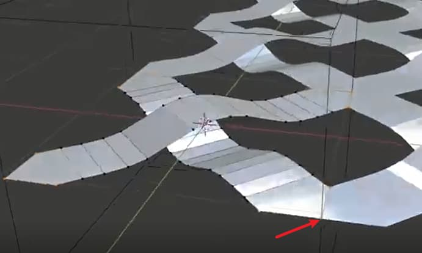
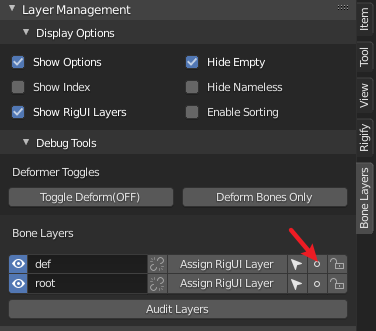
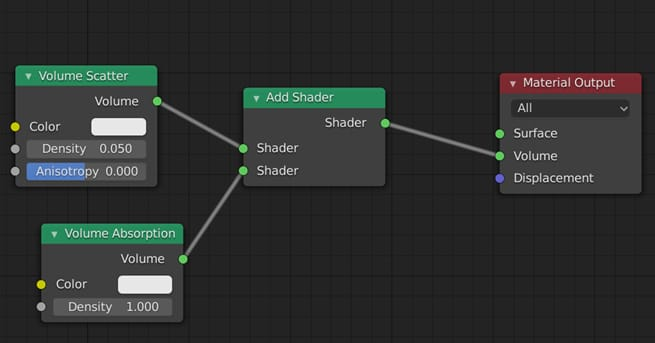

# Blender

## 三方插件

### 节点编辑

- Node Wrangler
  - 在输出节点前添加预览节点: 点击输出节点, 按住`shift+ctrl`, 左键点击输出节点前最后一个节点
  - 重排节点: `shift+=`

### 骨骼

- bone layer manager

### 图层管理

- simple_renaming_panel

### 工作流程插件

- [万物有灵](https://shimo.im/docs/tWhW8QJPHhDqKwr9/)
  - 安装好插件后，在`add-on`中导入预设
  - 使用时，点击`import`可应用

### 烘焙

- [Bake Wrangler](https://blenderartists.org/t/bake-wrangler-node-based-baking-tool-set/1187732)
  - [教程](https://www.bilibili.com/s/video/BV14z4y1R789)

## 自带插件

- rigify
- loop tools
- bool tool
- Curve/Mesh：Extra Objects
- mesh:F2(可在单点模式下使用F来直接挤出面)

## 视图操作

- blender说明书：鼠标放在要查询的功能上，按f1（会有快捷键冲突）
- 放大缩小面板：按住ctrl，按住中键在需要放大缩小的面板上，上下滑动
- 调出/收起属性面板：n
- 切换着色模式: z
- 添加视图: 在视图边角LMB拉出(松开鼠标前ESC可取消)
- 合并视图: 在要保留的视图边角(鼠标放到视图中)LMB
- 固定面板：shift+LMB
- 四视图(quad view)：alt+ctrl+q
  - n调出view面板
  - lock：四视图角度锁定，点击解锁，调整各视图视角，再锁定
  - box：勾选后，在一个视图操作，另两个视图跟随变化（例如缩放，移动）

## 选择:

- 单独显示选中物体: /
- 点/线/面菜单：ctrl+v/e/f
  - 封口：ctrl+f - beautify faces/grid fill
- **选择相似的：shift+g**（在编辑/物体/骨骼模式下都很好用）
- **重复上一步操作：shift+r**
- 选择父物体：右上角`Options-Parents`
- 缩放两个物体之间的距离：右上角`Options-Location`
- 间隔环选：先环选，再`select-checker deselect`
- 选择所有连接着的面: L(取消选择连着的面 shift+L)
- 选择连续的点/线/面：ctrl+LMB
  - 面板 face stepping：勾选按步选择
  - Topology Distance：勾选后走的直角连接
  - Fill Region：勾选后把两个路径之间的面积都选上
  - Deselected：间隔多少个不选
- 选择两点/线/面间的面积：ctrl+shift+LMB
- 反选：ctrl+i
- 随机选择:Select     - Select Random
- 按组选择:Shiift+g
- **同时修改xyz的值：按住左键，下拉选中xyz**
- 灯光方向
  - 主键盘-句号：选择`3D Cursor`，再移动灯光位置

## 物体操作:

- **对物体命名：F2**
- 批量重命名：ctrl+F2
- **编辑物体内部：alt+b 框选需要编辑内部的区域，再次 alt+b 恢复**
- **坐标归零: alt+g/r/s**
- 在物体模式下应用变换(应用后可以让所有数值归零): ctrl+a
- **沿法线缩放（各面的法线，只能在编辑模式下使用）：alt+s**
- 把组合在一起的物件一次性分开：`edit mode-P-by loose parts`
- 建立父子关系:     cmd/control+p
- 重新计算法线:shift+n
- 解除父子关系
  - 在列表上找到子物体，按住shift，左键从父物体下拖出
  - 选中子物体，alt+p
- 镜像：ctrl+m
- 让物体沿着某个面的方向移动（非物体局部坐标）：`transform pivot point-Active Element`
- 物体吸附：
  - 吸附到表面，选择`face`，勾选`align rotation to target`可以根据吸附面的方向自动转向，勾选`Project individual Elements`可以让吸附物体和被吸附物体朝向一样
- 沿地面网格移动物体：先按G/R/S，按住ctrl操作
- 选中的物体视图居中并把坐标归零: shift+c
- 切换对齐方式：主键盘-句号
- 选中多个物体时，以每个物体自身中心点缩放：对齐方式选择 `Individual Origins`
- 延局部坐标移动/缩放/旋转：先按快捷键（G/S/R），再按两下方向（X/Y/Z）
- 复制物体:     shift+d
- **复制且让新物体继承原物体(操作原物体时新物体一起被操作): alt+d**
  - 把没有alt+d复制的物体关联起来：选中所有要关联的物体，最后选中模板物体，`ctrl+L-Object Data`
- **复制一组物体**：`shift+a-collection instance-选择要复制的collection`，复制后的物体组不可单独编辑，编辑原物体组，复制物体组很跟随变化
- **复制物体但不增加场景中的面数**（节省性能的方法）：
  - 把对象M添加到集合中
  - shift+a 选择`Collection Instance`
  - shift+d 复制
- 从collection中移除(会完全删除) remove from collection: ctrl(cmd)+alt+g
- 从所有collections中移除(会完全删除) remove from all collections: shift+ctrl(cmd)+alt+g
- 当一个物体已经转成很奇怪的角度，要在上面加新的东西，可以先`alt+d`一个物体出来，再alt+r 还原旋转角度，在新物体添加部件，角度奇怪的原物体也会同时添加部件，调整好后再删除复制的物体
- 让复制的物体有随机角度：左上角菜单 `Transform-Randomize Transform`
- 复制一个物体的变换信息 copy Transform Data
  - 先选择要复制的物体，再选被复制物体
  - N调出sidebars，在某个坐标处右键 `Copy All to Selected` 或`Copy Single to Selected`
- 对齐物体：ctrl+alt+a
- 向一个轴缩放：编辑模式-shift+ctrl+alt+s
- 延法线挤出:alt+e
- 在物体模式下应用变换(应用后可以让所有数值归零): ctrl+a
- 清除游离点/线/面: mesh-clean up-delete loose
- 翻转物体：alt+f
- 使用正则批量给物体重命名的技巧（有时做镜像复制时会有很多带 .001 的物体）
  - 框选要重命名的物体
  - 使用插件`simple renaming panel`
- 视图:
  - 选中物体最大化：Numpad-句号

## 建模

- 选择多个物体TAB能同时进入编辑模式

- 建一个完美球体

  - 方法1：使用插件extra objects，选择round cube，增加细分
  - 方法2：创建cube，添加`subdivision` 和 `cast`

- **不会破坏原物体表面构造的subdivide方法**：使用`Multires-Subdivide`，此时使用雕刻模式雕刻的结果不会改变原物体的表面构造

- 让物体边缘完美贴合另一个物体：

  - 把要贴合的边打组（ctrl+g）
  - 添加`shinkwrap`修改器，`Vertex Group`选择上一步建的组
  - `Mode-Project`，把坐标换为局部坐标
  - 根据要贴合的轴向，勾选`Axis`，勾选`Negative`

- 沿法线移动边时（双击G）不能移动超出原来高度的位置，此时按 alt 或 c 可沿法线方向挤出，而不需要使用挤出功能

- 在两点之前加线：不要使用F(使用F只会在两点间连线，不会把面也切开)，使用J

- 任意调整环节的角度：环节后，使用左侧工具栏中的`Shear`

- 沿某个轴对齐：坐标选为Normal，S-X/Y/Z-0

- 镜像修改器的技巧

  - 镜像修改器使用的是物体的origin点，移动origin点就可以把镜像物体对齐别的地方
  - 把cursor放到要对齐的位置
  - `Options-check Origins`
  - `shift+s-selection to cursor`

- **在应用镜像修改器后，又打算使用镜像添加新部件**

  - 再添加一次镜像修改器
  - 勾选`Bisect-x`

- **skin工具没有应用上**：点击`Mark Root`

- 一次性应用所有 Modifier：左上角菜单 `Object-Convert to-Mech from Curve/Meta/Suf/Text`

- 一次性调整所有物体的变换（无论是修改器还是位置信息）：按住 alt 点击或Enter

- 一次性把一个物体的Modifier复制给其他多个物体：先选要复制的物体，最后选被复制物体，`Shift+L （make links）- Modifiers` 

- 布尔: 安插件 `bool tool` then ctrl+shift+b or ctrl + 小键盘 -，使用时选择`Brush Boolean`，在应用前都可以修改

- 把选中的面assign到新组：`ctrl+g`

- 用布尔做凹边

  - 应用布尔修改器
  - 在布尔物体（非被布尔物体）应用Solidfy修改器
  - 如果被布尔物体应用过Bevel修改器，把布尔修改器放到Bevel修改器之上

- 挤出面平面化/平滑部分sharp化：`Item-Edges Data-Mean Crease`调整到1

  - 进一步优化

    - 选择部分线，调整`Item-Edges Data-Mean Crease`
    - 选择其中一条已经调整过的线，打开“选择相似菜单 `shift+g-Bevel`，再次调整

    - 加`Bevel Modifier`，选择`Limit Method-Weight`可以对应应用上一步调整的 mean crease
    - 检查是否勾上`Auto Smooth`

- 单点挤出新面：插件`F2`，在点模式下，按F可挤出面

- **删除点/线/但不同时清除面：x-Dissolve(或 ctrl+x)**

- **清除没有必要的线和点：x-Limited Dissolve**

- **随意面挤出：ctrl+RMB**

- 修改器层面的merge：添加**Weld**修改器

- 修正`shade smooth`对边角的平滑

  - `Object Data Properties-Normals` 勾选 `Auto Smooth`

- 使用 Bevel Modifier 来添加物体边角

  - 调整`Limit Method`的类别，`Segments`的层数，`Offset`的层数，检查 `Auto Smooth`是否勾选
  - 自定义物体中需要Bevel的部分：编辑模式，`Transform-Edges Data-Mean Bevel Weight`：是一个0-1的区间，1表示完全应用Modifier的Offset，0表示完全不应用
  - 在一个物体上应用多种倒角形式
    - 部分边倒角：编辑模式，选中边，调整`sidebars-Transform-Edges Data-Mean Bevel `，bevel修改器`Limit Method-Vertex Group`，调整`Segments`，这样不会影响第二个倒角修改器的效果
    - 再添加一个倒角修改器，修改其他部分，**注意两个倒角器的上下位置**

- 给环线加两条边缘环线的技巧
  - 选中环线
  - Crl+B 或 Ctrl+Shift+R(使用后一种时，只增加2条环线，用E让边缘线和环线等距)
  
- Insert的技巧
  - +Ctrl 可以同时突出/凹进
  - +O 扩大外边缘
  - +I  分别内切
  - +B 在边缘不内切
  
- knife的技巧
  - +C 打开角度
  - +Z 穿透面
  - +E 保持cut工具不退出
  
- 投影式开洞
  - 投影的原型必须是一个平面
  - 选中平面，再选中要开洞的物体，TAB进入编辑界面，调整好投影角度
  - 左上角菜单`Mesh-Knife Project`
  - 使用auto merge来把点连接好
  
- 填补模型上不连续的破洞
  - 编辑模式-边
  - 菜单`Select-Select All by Trait-Non Manifold`
  - F to fill these holes
  - Ctrl+T 转为三角形填充（这样可以让拐角的图形格式化）
  - Alt+J 合并三角形为矩形
  
- 调整subdivision的强度：使用modifier后，n-item-edges data

- 点倒角：ctrl+shift+b

- 添加插件`Extra Objects` 分别勾`Curve` `Mesh`

- 沿着某个中心点array
  
  - 在中心点创建一个空物体
  - 在物体中应用array修改器，把array物体的中心点对齐空物体中心点
  - 取消勾选`Relative Offset`，勾选`Object Offset`，物体选择空物体
  - 选中空物体，R旋转，上下移动空物体能制造step的分布，S能放大/缩小分布
  
- 利用array做控制器
  
  - 新建贝塞尔曲线
  - 添加array修改器，`fit type-fit curve`，选择曲线（此时只是物体沿着曲线排列）
  - 添加curve修改器，选择curve(此时可通过控制曲线来控制物体)，可选中两点，右键 subdivide添加更多曲线上的点
  - 添加控制器：在编辑模式下选择一个点，`ctrl+h-Hook to new object`添加hook，回到物体模式，可用新物体控制曲线，进而控制array
  - 物体模式，选中上一步生成的空物体，在`Object Data Properties`中，display as sphere
  
- 画自由管线
  
  - 新建一个曲线，`Object Data properties-Geometry`加Bevel，增加shape的Resolution preview U的段数
  - 进入编辑模式，确认`Active Tool and Workspace settings-Projection Depth`选中`Cursor`（如果选中surface，画线时会附在被画物体的表面，调整offset的距离可以让画线和物体表面的间距）
  - 使用左侧`Draw`工具画曲线
  - 通过alt+s控制曲线bevel的粗细
  
- 做贴在物体上的便利粘
  
  - 新建平面，细分，把中心点移到边上，使用局部坐标，保证Y轴指向中心点，Z轴朝上
  - 快捷键o，选择sharp，选择一个边，向上抬
  - 回到物体模式，shift+tab打开磁吸，选择面，勾选`Align rotation to target`和`Project individual elements`，移动平面到物体上吸附
  - 添加细分，实体修改器
  - 如果吸附物体为曲面，添加`shinkwrap`修改器，把该修改器移到最上面，target选中曲面物体，mode选中project，勾选Negative
  - 把需要吸附的平面部分ctrl+g添加到新组，回到`shrinkwrap`修改器，选中上步的组
  - 如果上步效果还不够好，ctrl+shift切换到权重刷模式，刷权重（可切换到点模式，查看每个点受到的权重影响）
  
- 做楼梯
  
  - 做两个面
  - array
  
- 做栅栏
  - 平面，ctrl+r 切分
  - ctrl+b 边/点倒角
  - 删除倒角面
  - 挤出
  
- 做交叉网格
  
  - 建一个cube，可见性改为wire
  
  - 建一个平面，选cube，选plane，`shift+b-brush boolean-intersect`
  
  - 在平面上添加`array modifier`，**进入编辑模式**，勾选`Merge`
  
  - 把平面缩短，复制，调整形状，整体再调整45度，全选，放大到边界延伸出盒子外
  
  - `copy array modifier`，y轴offset
  
    
  
  - 回到`object mode`，**应用布尔修改器**
  
  - 选中边缘四个角的点，S-Z-0 打平
  
    
  
  - 添加solidfy修改器和bevel修改器，增加厚度和倒角(记得勾选 auto smooth)
  
- 做树枝
  
  - 用点画出主干
  - 添加`skin`
  - 进入编辑模式，a全选，ctrl+a 收缩
  - 选择单独节点 ctrl+a 调整
  
- 做蔓藤
  - 做要放置蔓藤的平面区域（切分会影响生成方向和密度）
  - 做树叶
  - 在区域中添加粒子生成器
  - `Render`选择`Object`，物体选择树叶
  - `Physics`选择`none`
  - 调整`Rotation`里的参数
  
- 做冰块
  - 切换到雕刻模式
  - 使用`scrape`
  - `n`打开属性面板，选择`tool`，勾选`Dyntopo`，`Detail size`调小
  - 这样边雕刻，物体会增加细分
  - 最好雕刻完以后，把该物体做为高精模烘到低精上，直接渲染会死机

### array的技巧

- 做螺旋线
  - 创建一个物体，array
  - 建立一个空物体 `Plain Axes`
  - 在array中勾选`Object Offset`，物体选择空物体
  - 使用R旋转，S缩放
  - 勾选`Merge`，`distance`调大
- 沿曲线array不变形
  - 创建平面，array
  - 添加 curve，物体选择曲线
  - 新建一个物体，把该物体做为平面的子物体（ctrl+p）
  - 在`Object properties-instancing`里选择`Face`，去掉`Display Instancer`的勾选

## 人体建模

- 头部

- - 建正方体
  - cmd+2

### 父子关系

- 如果解除父子关系不起作用，试试ctrl+j合并两个物体，再进入编辑模式，L，P解除合并

- 如有一对父子关系物体，想让新物体 C 跟随父物体 B 运动，但不绑定为新的子物体，可在`ObjectConstraint Properties` 中添加 `Copy Location`或其他， `Target` 选择子物体 B（或者在pose mode下，先选B，再选C，shift+ctrl+c)
- 勾选`Offset`可以移动 C ，让 C 和 B 有距离，调整`Influence` 可以调整影响的强度
- 如果`Spece` 选择 `World Space <--> World Space`，两者都使用世界坐标移动；如果选择`Local Space <--> Local Space`，则双方以自己的局部坐标方向移动；

## 骨骼绑定

### 骨骼绑定的要点：

- **备用组 deform**
  
  - 用于导入其他软件做绑定动作，默认从tgt组复制，没有IK组件，所有骨骼和root绑定
  - 所有骨骼都copy transforms from tgt组
  
- **控制组 control(torso组)**
  
  - **ctrl-root**：控制整个人物的位置，一般放在平行于腿的后侧
  - **ctrl-torso**：控制驱干，`parent:root`
  - **ctrl-spine/hips**：控制上半身和胯部，`parent:torso`，`copy rotation from chest`
  - **ctrl-chest**：控制腰部到脖子，`parent:torso`
  - **ctrl-foot-roll02**：控制脚踝的上下转动
  - **ctrl-foot**：总控脚部运动位置
  - **ctrl-pole-leg**：控制膝盖的朝向，`parent:ctrl-foot`，**绑定ctrl-foot后可解决抬腿时膝盖后折的问题**
  
- **机动组 mechanism**
  
  - **mch-neck-rot**：带动neck-int-rot，让neck-int-rot跟着动，`parent:ctrl-tweak-chest`
  - **mch-neck-int-rot**：控制脖子 neck  `parent:torso`，`copy location/rotation/scale from neck-rot`
  - **mch-head-follow**：带动int-head-follow，`parent:tgt-neck`
  - **mch-int-head-follow**：`parent:ctrl-torso`，`copy location/rotation/scale from mch-head-follow`，此时需要重新把tgt-head和mch-int-head-follow绑定成父子关系，让此控制head
  - **mch-ik-foot**：控制大小腿和脚的反向动力学活动，`parent:root` ，对齐tgt-foot.L，让tgt-foot.L copy transforms from mch-ik-foot，因为tgt-foot被mch-ik-foot控制，可以把tgt-foot的parent修改为root，`parent:mch-foot-roll`
  - **mch-foot-roll**：控制前脚掌的转动，`parent:ctrl-foot`，`copy rotation from ctrl-foot-roll02`，设置转动范围`limit rotation min:0 max:180`
  - **mch-foot-roll02**：控制后腿跟的位置，设置转动范围`limit rotation min:-180 max:0`（或者先选中02，再选中roll，左上角`pose-constraints-copyconstraints to selected bones`），`parent:ctrl-foot`
  
- **总控组 properties**
  
  - 放在头顶，用于控制各控制组件的强弱  `parent:root`
  
  - **控制neck**
  
    - 在`pose mode`下，在`bone properties-custom properties`中添加`neck-follow`，复制`data path`
    - 在`neck-int-rot`的`bone constraint properties`的`copy rotation neck-follow`的`influence`中`add driver`
    - `averaged value` `simple property`，粘贴之前复制的path data
  
  - **控制head**
  
    - 添加`head-follow`，`copy data path`
  
      - 复制脖子的旋转driver，粘贴到头部的旋转influence上
  
      
  
- 建立骨骼前注意把坐标归零 shift+c

- 把骨骼名字显示出来，养成给骨骼命名的习惯

- 确保躯干和腿所有骨骼的Z轴都面向前，手臂骨骼的Z轴向上

- **在编辑骨骼时，应该一直使用`individual origins`**

- 中心骨骼（root）的坐标必须保持和世界坐标一致，动画时control骨骼延局部坐标移动，如果局部坐标和世界坐标不一致，移动时不直观，中心骨骼一般位于整个模型的底部中心
  - 先沿Z轴建一根骨骼，命名为root
  - 点击骨骼的tail,shift+s,选择 selection to cursor
  - 沿Y轴移动Tail
  - 或沿Z轴建一根骨骼，再沿X轴旋转-90度
  
- 使用`Bone Layer Manager`管理骨骼层 [地址](https://gumroad.com/l/STdb)
  - 使用`Bone Layers`右边的圆点可以把选中的骨骼加入该层：先选骨骼，再点圆点
   
  - **root不需要deform，把root单独放到一层中，把其他骨骼全选，shift+w - deform**
  
- 做好单边骨骼后，复制一份，原骨骼层（DEF）做为导入到其他软件的骨骼结构，复制的骨骼可以放到单独一层，教程用命名为TGT层

- 使用TGT驱动DEF，先选中TGT的单个骨骼，再选中DEF的单个骨骼，shift+ctrl+c-copy transforms，此操作可把DEF层的骨骼互相解绑

- 把TGT层的`deform`取消，之后和人体绑定时不会绑到TGT层和ROOT层

- 把人物的Armature置于细分之上

- 刷权重时，**注意权重影响的是DEF（deform）层，TGT层用于控制人物动作，所以刷权重需要让DEF层显示，TGT层隐藏，不然会找不到所选择的骨节对应的蒙皮区域**

- 使用`Simple rename panel`管理批量命名（此插件可以重命名所有物体，不仅骨骼） [地址](https://gumroad.com/l/simple_renaming_panel)
  
  - 把需要批量命名的骨骼放到同一层，全选，使用“在选择的物体中替换”

### 骨骼绑定方法1:

使用骨骼绑定控制物体行动的原因是：调整骨骼动画时，变换父级，子级动作也会被记录下来，而直接用物体做动画时，子级动画不会被记录，每个物体的运动是独立的

- 添加骨节:     
  1. e (同时按鼠标中键可保持90度)，之后shift+r，可以往一个方向同比挤出
  2. 右键 `subdivide`
  
- 添加没有父节点的骨头:shift+a

- 在关节之间加骨骼:f

- 让解除关联/新添加的骨骼关联到物体：shift+w-deform/alt+left click deform(选择多段骨骼时好用)

- 显示骨骼名称：`Object Data Properties-Viewwport Display`，勾选`Name` & `Axes`

- **在编辑模式下调整骨骼朝向**：ctrl+r

- 在骨骼模式下**刷权重**（该模式下可以移动骨骼查看效果）
  - 物体模式下先选中骨骼，再选物体，进入权重刷编辑
  - 按住ctrl，点击左键选择骨节，此时会同时显示此骨节影响的蒙皮
  - **打开`Object propertise-Viewpoint Display`里的 `wireframe`，可以清楚看到权重对面的影响**
  - 使用面选择，按住ctrl选择面，可以把编辑范围限定在选择的面中
  - 推荐使用subtract和mix笔刷，subtract时，使用最后一个preset笔头；mix时，使用1的强度，低一点weight
  - **如果你的角色前臂运动总是影响了胸部和前臂，那是不对的**
  
- **对齐骨骼**：选择骨骼，再选择被对齐骨骼control+alt+a

- 解除父子关系: 在子节处     右侧骨头 删除父对象(alt+p，alt+p可以选择disconnect bons 或 y，y直接解除父子关系)

- 命名单侧手脚时要加  .L,全选单侧骨骼 (顶上中部的transfomr     pivot point 要换成3d cursor)- 右键:symmetrize

- 重新关联父子关系:     ctrl/cmd + p

- 添加IK: 先选IK, 再选骨骼, pose mode: shift + i

  - **几个重点IK**
    - Root: 在两脚之间, 控制整个身体的位置, 是Torso和FootIK的父级
    - Torso: 在尾椎, 控制上身躯干, 是尾椎的父级
    - Foot: 在脚踝, 控制脚, 在pose mode下, 先点击IK, 后点击小腿骨, ctrl+shift+c - inverse kinematics ,是knee的父级
    - Knee: 在膝盖, 在小腿的运动约束面板下添加此IK

  - 把脚的骨骼清除父级(这样在用Torso控制身体时脚不会穿过地面), 在pose mode下, 先选小脚骨, 后选脚骨, ctrl+shift+c - copy location, 在运动约束面板下, 把Head/Tail 拉到1
  - 把以上IK选中, 在骨骼面板下, Alt+LMB 取消Deform

- 先选人体,再选骨架, ctrl+p

- 回归初始状态:     pose mode- alt+r/alt+g/alt+s

- 单独部件(例如眼球)未和身体一起绑定时,可单独选择眼球和骨架:cmd+p,选with empty groups

- 权重刷:object     mode-weight paint

- 权重刷一般用add模式

- 在edit mode里,选中要显示的骨头(带控制器的),m键加入图层,把其余的关闭显示

- 使用pose  mode设置动作时,要选择 Local坐标,不能用Global坐标

- **使用自动分配权重后,进入模型edit mode, 左上菜单Mesh-Weights-Normailze All 来重新计算权重**

 

### 骨骼绑定方法2:

- 插件  rigging:rigify
- 骨骼对齐模型
- 绑定IK: 选Object Data Properties(小人跳舞的图标)-Generate     RIg
- 脚踝后的横向骨骼要和脚面最宽的部分一样长
- 先全选模型,再选骨骼,ctrl+p—with automation weights
- 如果要调整骨骼, 调整后保持骨骼在显示状态, 重新生成rig
- **如果一个场景里有多个rig, 在generate rig之前, 先打开Advanced Options, 把默认的overwrite切换为 new**
- **在edit mode - Object Data Properties(小人图标) - Rigify Buttons 中, 有很多骨骼样板可以参考**

 

### 在绑定骨骼的人物上加衣服

- 添加Cloth     modifier
- 调整Quality     steps(往高调整)
- 调整Tension(往低调)
- 调整Stiffness(僵硬)/Damping(衰减)-bending(往低调)
- 勾选     Collisions-Self Collisions
- Collisions:     distance(调高)
- 给人物身体添加Collision,勾选single Sided

### 骨骼动画

- 大多数骨骼运动是基于局部坐标，而不是世界坐标，所以在最初建立骨骼时，尽量让骨骼的臂部坐标和世界坐标一致 
- 给某个骨骼添加帧动画：选中要记录动画的骨骼，i

## 摄像机

- 摄像机视图: 小键盘0(正交摄像机:属性选择Orthographic)

- **把当前视角设置为摄像机视角: ctrl + alt + numpad0**

- 旋转摄像机视角: 上一步后,点击视角边缘, g移动 r旋转

## 动画

- 在需要做动画的坐标上右键，`add driver`

- 打开`drivers`编辑器，调整曲线

- 在对应的属性页面的`custom properties`中(如果要控制骨骼，应在骨骼控制页面（**pose mode**）中添加)添加新值，起名，保存，右键`copy data path`

- 在`drivers`编辑器中，把刚复制的path粘贴到`path`一栏，`prop`可以选择物体本身

  

  

  

  

## 拓扑: 

- 雕模
- 安装bsurfaces
- 新建一个plane
- 选择画笔
- add     surface
- fn+f9 增加面数
- 加镜像
- 加shrinkwrap     把皮往外offset一点,按住shift可以微量调整
- 打开 吸附至表面(顶上工具栏)
- 两下g 按住alt 散开移动(两下g: 在表面平滑移动)
- 镜像:勾选 clipping, extrude时可以自动合并镜像点
- 安装looptools     右键,再右键添加到收藏, 可使用q 调出收藏快捷菜单
- 选择连续几个点:     cmd+左击
- looptools     - loft: 顶点分散
- looptools     - space: 顶点均匀分布

### 场景建模技巧

- alt+g 物体位置归零
- options，选择“affects origins”，移动原点时吸附表面，让原点落到底部
- 曲线加点:编辑模式下, 选中两个顶点,选择左上角菜单-细分
- 导入其他blender文件:用 link或append
- 在编辑模式下添加细分, 使用smooth工具平滑

##  UV

### UV适应

- 给物体添加材质- `Emission`, 颜色选`Image Texture` ,载入图片
- 在编辑模式下,点击U, 选择`Project to view`
- 添加一个界面, 选择`UV Editor`

### UV绘制

- 切换到UV     Editing, press u, select smart UV project, then switch to Texture Paint,     create a new image
- 切换到     Shading, 新建一个checker Texture, 选择上一步保存的image, 连接到roughness, 此时被上了UV的面会全反射环境, 再painting,     能把不需要反射的部分擦除

 

###  物体使用不同UV

- 给整体加texture
- 复制一个材质，在编辑模式下assign需要另赋材质的部分
- 切换到物体模式，把整体材质取消复制标志（这样可以单独调节一个物体两部分的材质）
- 
- 在UV Editor里单独调整材质

## 烘焙

- 高分烘给低分

  - 使用插件**BAKE WRANGLER**，[教程](https://www.bilibili.com/s/video/BV14z4y1R789)

- ### 法线贴图

  - 复制一个模,做成高精, 雕刻
  - alt+g把两个模对齐
  - 给低精械添加一个材质,添加 image texture，color-space：    non-color
  - 渲染模式改为cycles,     在bake中设置bake type为normal
  - 勾选     Selected to active
  - 先选择高精模,再加选低精模,点击bake
  - 如果法线渲染出来有没覆盖好的, 调Ray distance
  - 回到     shader editor, 添加normal map,把image的color连接到normal     map的color, then link normal map’s normal node to     principled BSDF’s normal node
  - 如果要添加表面凹凸, 添加一个Displace modifier, Texture选择到刚才渲染好的贴图

## 材质

### 玻璃材质

- 使用默认材质，把`Transmission`调到最大
- `Render Properties`勾选`Screen Space Reflections`，点开设置，勾选`Reflaction`
- 回到物体材质编辑，`Settings`，勾选`Screen Space REfraction`

### 透明

- 材质面板 `settings-Blend Mode-Alpha Blend`
-  在`Surface-Alpha`拉到0 

## 渲染

- 打开降噪:     compositing

- - use      nodes(左上角)
  - view      layer(右侧)-Passes-Data-Denoising Data
  - node界面: add Denoise

- 加雾效

- - 放一个box,      box显示模式设置为线框, 给box加shader

- 局部渲染:cmd+b(取消局部渲染: ctrl+alt+b)
- 渲染出图: 菜单-render-render image

### 2D风格渲染参数

- `Diffuse BSDF + Shade to RGB + ColorRamp`

## 常用快捷键

f: fill / alt+f(beauty fill) 

grid fill : ctrl/cmd + f then grid fill

挤出: e or ctrl+right mouse button(再按s,沿法线方向挤出) 

分别挤出(做手指时):alt+e

连续先边/点: 首顶点,ctrl 尾顶点

切分: k

松弛

合并顶点: alt + m

衰减编辑开关(调整物体形状): o (shift+o 可以变换模式)

雕刻模式smoothly : shift+左键

在空白处添加新点: ctrl/cmd + 右键

移动模型出现的中心点: shift + 右键(中心点归位: shift+s 中心点回到物体中心:ctrl+shift+alt+c)

桥接循环边：ctrl+e

分离对象：p(或y)

沿法线方向缩放：alt+s

把节点一分为二: v

独显物体某部分: shift+h

反选: cmd+i

使用snap把分享的组件合起(例如手臂和身体)

快速顶点对齐:s-z/y/x-0

选中的物体视图居中: shift+c

物体弯曲:先设定弯曲点(shift+右键), 再shift+w

重新计算法线:shift+n

线框模式：shift+z

 

 

delete:x

make face: alt+f

rotate: r

scale: s

move: g

merge: m

change view mode: z

create model: shift+a

exchange edit mode: ctrl+tab or click menu ‘sculpting’

exchange sculpting: shift+space

change brush radius/strenght: f /shift+f

invert brush: ctrl

smooth brush: shift

loop line: alt+left click

dulicate : shift + d

select box: b

zoom area: shift + b

zoom : cmd + left mouse

半透明: alt + z

切分: 编辑模式-右键subdivide

fill(封顶): f

select all : a 

场景平移: shift + 鼠标中键

调出插件工具条: n

hide : h / alt+h

把物体中心点归到物体中心: 右键 origin to geometry

分窗口: 在边缘右键

导入: f12

选择所有相连元素: ctrl+L

擦除: cmd + (三指)

检查面朝向: show overlays - face orientation 

法线方向菜单: 编辑模式下选择所有面, alt + n

查看法线方向: 左上 global - 改为 normal

编辑-点模式-alt+左键: 选择相邻点

切割knife: k

合并点: alt + m

打开snap: shift + tab

添加细分: cmd + 2(需要关闭数字键映射)(反细分: modifier - decimate - unsubdivide/edge-unsubdivide)

挤出: 编辑模式-ctrl+右键（沿法线挤出：alt+e）

倒角: ctrl/cmd + b

两个对象合并: ctrl + j (合并后不能单独处理单个对象, 但可以共享modifier

反细分: modifier - decimate - unsubdivide/edge-unsubdivide

内挤出: i (如果再点击B, 可以让镜像边不挤出)

改变曲线控制柄类型:v

正交视图:Numpad-5

