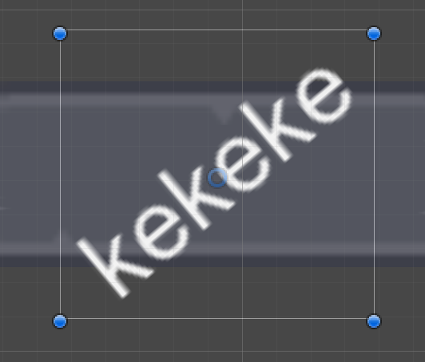

# GUI

* TOC
{:toc}

## FairyGUI 和 UGUI 的区别

- FairyGUI 把 GUI 编辑分离出来，用发布的方式更新界面设计，在团队合作里提高效率
- UGUI 内置于 Unity 中

## 插件

### UI动效插件 [UI Extentions](https://bitbucket.org/UnityUIExtensions/unity-ui-extensions/wiki/UPMInstallation)

- 安装

  - 方法1: package manager from URL https://bitbucket.org/UnityUIExtensions/unity-ui-extensions/wiki/UPMInstallation

  - 方法2: 在Project 窗口中, 右击Packages文件夹, 在文件夹中显示, 点击进入, 找到 `manifest.json`

    - 添加一个source在 ` dependencies`上面

      ```
      "scopedRegistries": [
          {
            "name": "npmjs",
            "url": "https://registry.npmjs.org/",
            "scopes": [
              "com.unity.uiextensions"
            ]
          }
        ],
      ```


## UI 界面按钮注册

把 GameManager 拖入对应的按钮中（例如 “继续游戏”） On Click 中，选择相应方法

## UI 设置技巧

### 获取 UI 宽高最安全的方式

使用 Inspector 面板右侧的 Debug 模式可以看到更多属性

```c#
//此方法不用考虑锚点有位置变化，都可正确获得 UI 宽高
RectTransform rect = transform.GetComponent<RectTransform>();
rect.rect.width;
```


### UI 单位和像素的关系

默认是100 px = 1unit = 1m，可以调整图片和 unit 的比例达到放大场景中对象的效果

### UI适配屏幕比例

Canvas - Canvas Scaler - UI Scale Mode : Scale With Screen Size

在 Canvas 上添加脚本

```c#
void Start()
    {
        float wSale = Screen.width / 1920.0f; //要用浮点型，1920为设计时所用的屏幕宽度
        float hScale = Screen.height / 1080.0f;

        GetComponent<CanvasScaler>().scaleFactor = wSale;
    }
```

### GraphicRaycaster 图片的点击检测

Canvas 下的 GraphicRaycaster 组件，只能控制 UGUI 的元素，不能控制 3D 物体

在摄像机下挂Physics Raycaster脚本,可以检测2D,3D物体,在3d物体上挂IPointerClickHandler脚本接收检测

- Blocking Objects ：检测的是物体身上挂的 collider 的类型，不是根据游戏物体的类型

### Raw Image

Raw Image 里的 UV Rect 可以用来设置帧动画

```c#
private float offsetY;
private float offsetX;

void Start()
{
  rawImage = GetComponent<RawImage>(); //获得物体身上的 rawImage 组件
  offsetX = 1/4.0f; //一行有几个图片就除以几
  offsetY = 1/2.0f; //有几列就除以几
  
  StartCoroutine(Ani());
}

//用一个序列动作来完成动画
private IEnumerator Ani()
{
  float x = 0; //动画开始要定位图片的起始位置
  float y = 0;
  
  while (true) 
  {
    y += offsetY;
    while(x < 1)
    {
      x += offfsetX;
      rawImage.uvRact = new Rect(x, y, rawImage.uvRect.width, rawImage.uvRect.height);
      yield return new WaitForSeconds(0.3f);
    }
    x = 0;
  }
  
}
```

### Mask

如果 UI 需要使用遮罩，Ract Mask 2D 更节省性能（有可能会出 bug），最好是自己写 mask 脚本。

### UI 排列

- 在 Canel 中使用适应性更强的 Grid Layout Group 组件

- 在子项使用 Layout Element 管理子项的大小限度

### UI 素材拉伸问题

在素材的 Sprite Editor 中设置拉伸边距

### UI 交互设置

Raycast Target : 设定 UI 对象是否能被射线检测到, 即是否能交互.

在 UI 组件上加 button 组件可实现鼠标交互变化

- **监听鼠标和UI元素的交互**

```c#
using UnityEngine.EventSystems;
//鼠标移入,鼠标移出,鼠标点击
public class MousePoint:MonoBehaviour,IPointerEnterHandler,IPointerExitHandler,IPointerDownHandler
{
  public void OnPointerEnter(PointerEventData eventData)
    {
        if (transform.childCount > 0)
        {
            string toolTipText = transform.GetChild(0).GetComponent<ItemUI>().Item.GetToolTipText();
            InventoryManager.Instance.ShowToolTip(toolTipText);
        }
    }

    public void OnPointerExit(PointerEventData eventData)
    {
        if (transform.childCount > 0)
        {
            InventoryManager.Instance.HideToolTip();
        }
    }
    public void OnPointerDown(PointerEventData eventData)
    {
        throw new System.NotImplementedException();
    }
}
```

### ui穿透

```c#
using UnityEngine.EventSystems;
using UnityEngin.UI;

public class Player:MonoBehaviour
{
  //获得canvas的射线组件
  private GraphicRaycaster raycaster;

  void Start()
  {
    //得到canvas身上的射线组件
    raycaster = GameObject.Find("Canvas").GetComponent<GraphicRaycaster>();
  }
  
  private bool CheckGuiRaycastObject()
  {
    PointEventData eventData = new PointEventData(EventSystem.current);
    eventData.pressPosition = Input.mousePosition;
    eventData.position = Input.mousePosition;
    List<RaycastResult> list = new List<RaycastResult>();
    raycaster.Raycast(eventData,list);
    return list.count > 0; //如果list里有值,说明碰撞到ui
  }
}

```

### ui背景图片自适应文字长度

在背景图片挂两个自带脚本

- Content Size Fitter
- Vertical Layout Group
- 勾选 Control Child Size
- 勾选 Child Force Expand

### 设置 UI 的渐入渐出效果

在 UI 对象上挂 CanvasGroup 组件, 利用组件中的 Alpha 值控制显示.

## Canvas

###  Canvas 的三种渲染模式

- Screen Space - Overlay：在当前屏幕置顶
- Screen Space - camera：在当前屏幕摄像机前，可调整 UI 和相机的距离来实现 UI 和场景中物体在相机中的前后顺序
- World Space：变成一个可以移动的 3D 图层

### Canvas group

在 Canvas / Canvas 下的元素中 添加，可以对 Canvas 下的素材进行集体操作

### RectTransformUtility

 是 RectTransform 的辅助类, 用于储存和管理位置,大小和中心点的变化.

- RectTransformUtility.ScreenPointToLocalPointInRectangle -- 返回一个true

  - 将屏幕空间点转换为RectTransform的局部空间中矩形平面上的位置(所有UI组件的边缘都是一个矩形,无论图形本身的样子,如下图)

  - ```c#
  canvas = GameObject.Find("Canvas").GetComponent<Canvas>();
    Vector2 position;
    RectTransformUtility.ScreenPointToLocalPointInRectangle(canvas.transform as RectTransform, Input.mousePosition, null, out position);
    ```
    
  - 
  
    

## 设置鼠标指针图片

使用 Texture2D 放需要替换的图片

```c#
//设置为单例模式方便外部调用
public static CursorManager instance;

public Texture2D cursor_normal,cursor_npc_talk;
//设置鼠标焦点
private Vector2 hotpot = Vector2.zero;
//让鼠标指针根据硬件情况自己选择显示模式(有些平台不支持更改鼠标指针图片)
private CursorMode mode = CursorMode.Auto;

void Start()
{
  instance = this;
}

public void SetNormal()
{
  Cursor.SetCursor(cursor_normal,hotpot,mode)
}
public void SetNpcTalk()
{
  Cursor.SetCursor(cursor_npc_talk,hotpot,mode)
}

```

