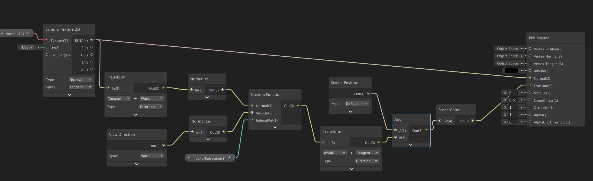

<head>
    
    
      
      
</head>
# Unity Shader

* TOC
{: toc}
在Unity中使用node创建和编辑着色器.

## 安装配置

- 安装`Shadergraph` 和 `Universal RP` 包
- `Edit > Render Pipeline > Universal Render Pipeline > Upgrade ...` 更新原来的Unity自带Shader(如果切换后材质变红)
- 创建设置SRP : 菜单栏`Assets > Create > Rendering>Universal Pipeline Asset`，会创建出来一个文件，这是渲染管线的配置文件。
- 在菜单栏 `Edit > Project Settings > Graphics` 中设置刚才的SRP文件
- 创建ShaderGraph文件: `Create > Shader > PBR / Sub / Unlit Graph`
  - *PBR Graph* PBR图
  - *Sub Graph* 子图，用于创建一些可复用的节点
  - *Unlit Graph* 不受光照的图
- 双击打开Shader Graph 窗口

## 特效渲染节点

### 玻璃

