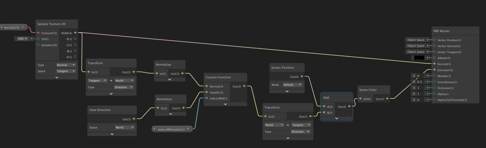
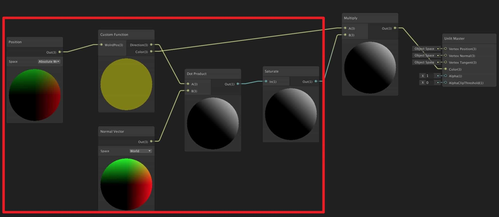
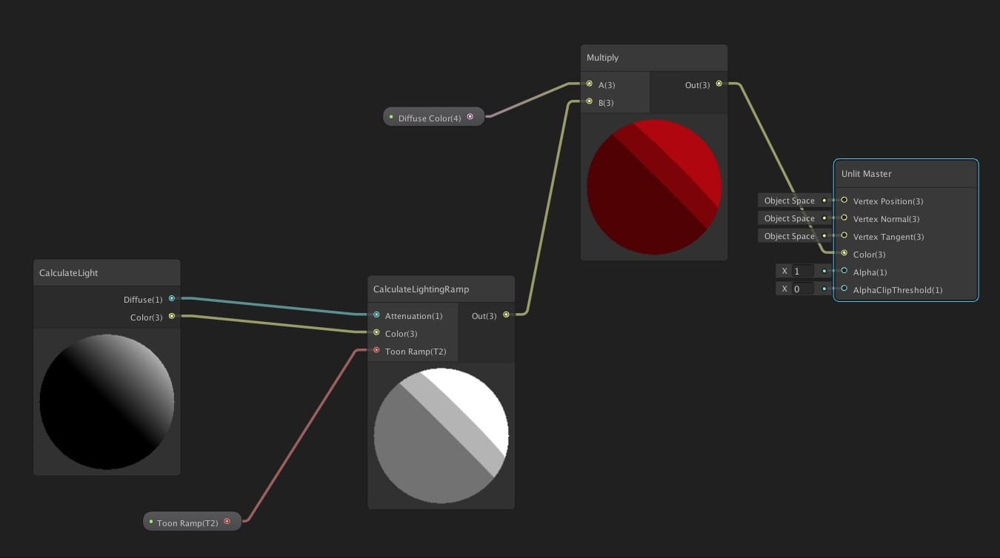
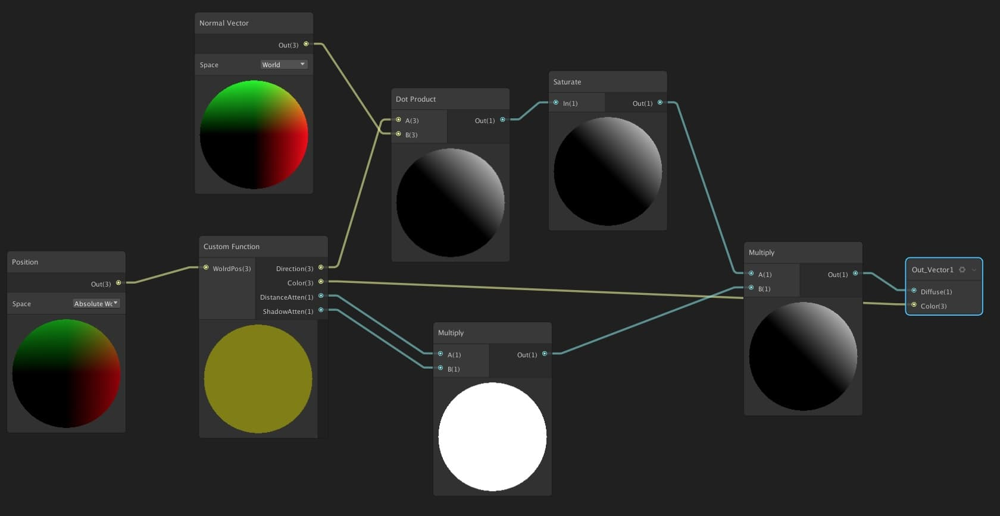
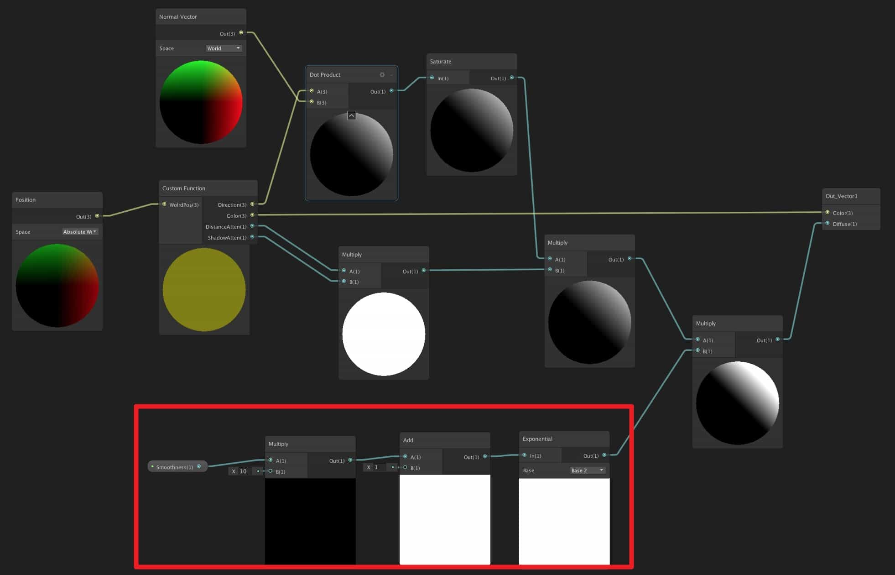

<head>
    <script src="https://cdn.mathjax.org/mathjax/latest/MathJax.js?config=TeX-AMS-MML_HTMLorMML" type="text/javascript"></script>
    <script type="text/x-mathjax-config">
        MathJax.Hub.Config({
            tex2jax: {
            skipTags: ['script', 'noscript', 'style', 'textarea', 'pre'],
            inlineMath: [['$','$']]
            }
        });
    </script>
      <script src="https://unpkg.com/mermaid@8.0.0/dist/mermaid.min.js"></script>
      <script>mermaid.initialize({startOnLoad:true});</script>
</head>
# Unity Shader

* TOC
{: toc}
在Unity中使用node创建和编辑着色器.

## 安装配置

- 安装`Shadergraph` 和 `Universal RP` 包
- `Edit > Render Pipeline > Universal Render Pipeline > Upgrade ...` 更新原来的Unity自带Shader(如果切换后材质变红)
- 创建设置SRP : 菜单栏`Assets > Create > Rendering>Universal Pipeline Asset`，会创建出来一个文件，这是渲染管线的配置文件。
- 在菜单栏 `Edit > Project Settings > Graphics` 中设置刚才的SRP文件
- 创建ShaderGraph文件: `Create > Shader > PBR / Sub / Unlit Graph`
  - *PBR Graph* PBR图
  - *Sub Graph* 子图，用于创建一些可复用的节点
  - *Unlit Graph* 不受光照的图
- 双击打开Shader Graph 窗口

## 使用摄像机特效

### 建立依赖

- 在 Hierarchy 新建一个 Volume --> Global Volume, 置于最顶层

  - 新建一个Profile
  - 模式选择Global的话会针对所有物体有效

- 在MainCamera - Renderer 

  - 勾选 Post Processing

- <p style="background-color:red;">
     Global Volume的 Layer 必须包含在 Main Camera - Environment - Volume Mask 层中, 不然无法生效
  </p>


### 相机景深

- 在Global Volume中添加 Depth Of Field
- Mode: Gaussian(快, 资源消耗少) / Bokeh(慢, 真实, 资源消耗多)


### 相机暗角

添加 Vigentte

### 颗粒感

添加 Film Grain ( 杂色是动态的, 效果不是很好)


## 设置调整

### 阴影清晰度优化

- 打开UniversalRenderPipelineAsset
- 找到`Shadows`, 调整`Cascades`为更高
- `Lightning - Shadow Resolution` 调整为更高
- 调整`Shadows` 的 `Deptch Bias` 和 `Normal Bias`


## 特效渲染节点

### 玻璃



其中的`Custom Function`

```
Input
Normal Vector3
ViewDir Vector3
IndewofRef Vector1

Outputs
Out Vector3

Type: String
Name: Refraction
Body:
Out = refract(ViewDir, Normal, IndexofRef);
```

[教程](https://www.codinblack.com/glass-shader-using-shader-graph-in-unity3d/)


### 卡通配色

<p style="background-color:red;color:white;">加上多类型灯光的配置后出现强反射, 不能用</p>

最终文件包含:

- Shader Material
- Texture
  - 灰白色阶贴图
  - 漫反射表面贴图
- hlsl文件
- Shader Graph
  - Toon Shader
    - CalculateLight
      - CalculateMainLight
      - AddAdditionLight
    - CalculateLightRamp

步骤:

- 新建一个Unlit Shader, 命名为 `Toon Shader`

- 新建一个文件夹 Includes, 新建`Lighting.hlsl`文件, (mac)下用sublime打开(添加 `HLSL Syntax`插件)

  ```hlsl 
  #ifndef CUSTOM_LIGHTING_INCLUDED
  #define CUSTOM_LIGHTING_INCLUDED
  
  // CalculateMainLight是方法名 float是告诉Unity用的是什么类型的值
  void CalculateMainLight_float(float3 WorldPos, out float3 Direction, out float3 Color){
  #if SHADERGRAPH_PREVIEW
  	Direction = float3(0.5, 0.5, 0);
  	Color = 1;
  #else
  	Light mainLight = GetMainLight(0);
  	Direction = mainLight.direction;
  	Color = mainLight.color;
  #endif
  
  }
  #endif
  ```

- 在 Unilit Shaer 中新建一个`Custom Function`, 按上一步定义的值添加 input out value

  - Input : WorldPos - Vector3
  - output: Direction - Vector3
  - output: Color - Vector3
  - type: File
  - Name: CalculateMainLight
  - Source: Lighting.hlsl

- 添加一个`Position`(Absolute World) - `Custom Function`

- add `Normal Vector`(法线方向)  `dot product`(乘积) 

  <div class = "mermaid">
  graph LR
  A[CustomFunction] & B[NormalVector] --> C[dotproduct]       
  </div>

   

- 添加一个文件夹 `SubGraphs`, 把红框框起的nodes 选中, 右键`convert to sub-graph` 放入文件夹, 命名为 `CalculateLight`

  - 进入sub graph, 在Out_Vector3中添加两个变量
    - Diffuse - Vector1
    - Color - Vector3

- 创建一个Texture 文件夹, 放入黑白色阶贴图

- 回到Toon Shader, 在 Blackboard 添加一个Texure2D, 命名为`ToonRamp`

- 添加一个`Sample Texture 2D LOD` 节点, `ToonRamp --> Sample Texture 2D LOD(Texture)`, LOD adjust the level of detail of the sample

- 添加一个`Sample State(wrap:Clamp) --> Sample Texture 2D LOD(Sampler)`

- 添加一个`Vector2`, `CalculateLight(Diffuse) --> Vector2(x) --> Sample Texture 2D LOD(UV)`

- `Sample Texture 2D LOD(R) --> Multiply(B)`

  

- 选中当前**除CalculateLight以外**所有节点, 右键保存为sub-Graph, 命名为 `CalculateLightingRamp`

  - 重命名Blackboard的两个节点为 `Attenuation` `Color`, 输出值为`Out`

- 在Toon Shader添加一个Texture2D, 命名为`Diffure Texture`, 放漫反射贴图, 添加`Sample Texture 2D` `Diffuse Texture --> Sample Texture 2D(Texture)`

  - 如果使用颜色而不是贴图做漫反射表面的话, 添加 Color 节点

    

- 添加 UV 节点 `UV --> Sample Texture 2D(UV)`

- 添加一个`Multiply`节点

  - `Sample Texture 2D(RGBA) --> Multiply(A)`
  - `Calculate Lighting Ramp(Out) --> Multiply(B)`
  - `Multiply(Out) --> Unlit Master(Color)`

- 在`Lighting.hlsl`中添加如下代码以让shader接收阴影

  新增 `out half DistanceAtten` `out half ShadowAtten`

  ```
  #ifndef CUSTOM_LIGHTING_INCLUDED
  #define CUSTOM_LIGHTING_INCLUDED
  
  void CalculateMainLight_float(float3 WorldPos, out float3 Direction, out float3 Color, out half DistanceAtten, out half ShadowAtten){
  #if SHADERGRAPH_PREVIEW
  	Direction = float3(0.5, 0.5, 0);
  	Color = 1;
  	DistanceAtten = 1;
  	ShadowAtten = 1;
  
  #else
  	#if SHADOWS_SCREEN
  		half4 clipPos = TransformWorldToHClip(WorldPos);
  		half4 shadowCoord = ComputeScreenPos(clipPos);
  	#else
  		half4 shadowCoord = TransformWorldToShadowCoord(WorldPos);
  	#endif
  
  	Light mainLight = GetMainLight(shadowCoord);
  	Direction = mainLight.direction;
  	Color = mainLight.color;
  
  	DistanceAtten = mainLight.distanceAttenuation;
  	ShadowAtten = mainLight.shadowAttenuation;
  #endif
  
  }
  #endif
  ```

- `CalculateLight - Custom Function - Outputs`  新增

  - DistanceAtten - Vector1
  - ShadowAtten - Vector1

- `CalculateLight` 新增两个`Multiply`节点, 连接如下

  

- `Toon Shader - Blackboard` 添加3个 `Boolean`
  - `Shadows` 
    - Reference: _MAIN_LIGHT_CALCULATE_SHADOWS
    - Definition: Multi Compile
  - `Shadows Cascade`
    - Reference: _MAIN_LIGHT_SHADOWS_CASCADE
    - Definition: Multi Compile
  - `Soft Shadows`
    - Reference: _SHADOWS_SOFT
    - Definition: Multi Compile
  
- 在 Toon Shader - Inspector 面板 切换到 Debug 模式, 把上一步的 Reference 添加到 Shader Keywords 中, 用空格隔开 
  
  - `_MAIN_LIGHT_CALCULATE_SHADOWS _MAIN_LIGHT_SHADOWS_CASCADE _SHADOWS_SOFT`
  
- **添加支持spot light/point light的反射设置**

  - 复制所有`CalculateLight`里的节点, 新建为`CalculateMainLight`的sub-graph

  - **添加调整光滑的节点**

    - blackBoard添加一个Vector1: Smoothness
    - 添加Multiply, `Smoothness --> Multiply A(1)` B(1): 20
    - 添加 Add, `Multiply --> Add A(1)` B(1) : 1
    - 添加 Exponential, `Add --> Exponential`, Base: Base 2
    - 把红框中除`Smoothness`以外的三个节点做成sub_graph, `AdjustSmoothness`

    

  - 进入`CalculateMainLight`, 把Out_Vector1的两个参数改为`Color(3)`  `Diffuse(1)`

  - 修改 Lighting.hlsl 文件, 完整代码在下面part

  - 在菜单中新建一个sub-graph `AddAdditionLight`

    - 在Blackboard里新建3个参数 `MainLIghtDiffuse(Vector1)`   `MainLightColor(color)` `Smoothness(Vector1)`
    - 在Out_Vector里新建3个参数 `Diffuse(Vector1)`  `Color(Vector3)` `Specular(Vector1)`
    - 新建一个`Custom Function`, 修改`Lighting.hlsl`

    ```
    #ifndef CUSTOM_LIGHTING_INCLUDED
    #define CUSTOM_LIGHTING_INCLUDED
    
    void CalculateMainLight_float(float3 WorldPos, out float3 Direction, out float3 Color, out half DistanceAtten, out half ShadowAtten){
    	#if SHADERGRAPH_PREVIEW
    	Direction = float3(0.5, 0.5, 0);
    	Color = 1;
    	DistanceAtten = 1;
    	ShadowAtten = 1;
    
    	#else
    		#if SHADOWS_SCREEN
    			half4 clipPos = TransformWorldToHClip(WorldPos);
    			half4 shadowCoord = ComputeScreenPos(clipPos);
    		#else
    			half4 shadowCoord = TransformWorldToShadowCoord(WorldPos);
    		#endif
    
    		Light mainLight = GetMainLight(shadowCoord);
    		Direction = mainLight.direction;
    		Color = mainLight.color;
    
    		DistanceAtten = mainLight.distanceAttenuation;
    		ShadowAtten = mainLight.shadowAttenuation;
    	#endif
    }
    
    //接收direction以外类型灯光的配置
    void AddAdditionalLights_float(float Smoothness, float3 WorldPosition, float3 WolrdNormal, float3 WorldView, float MainDiffuse, float MainSpecular, float3 MainColor, out float Diffuse, out float Specular, out float3 Color){
    	Diffuse = MainDiffuse;
    	Specular = MainSpecular;
    	Color = MainColor * MainDiffuse;
    
    #ifndef SHADERGRAPH_PREVIEW 
    	int pixelLightCount = GetAdditionalLightsCount();
    	for (int i = 0; i < pixelLightCount; ++i) {
    		Light light = GetAdditionalLight(i, WorldPosition);
    		half NdotL = saturate(dot(WolrdNormal, light.direction));
    		half atten = light.distanceAttenuation * light.shadowAttenuation;
    		half thisDiffuse = atten * NdotL;
    		half thisSpecular = LightingSpecular(thisDiffuse, light.direction, WolrdNormal, WorldView, 1, Smoothness);
    
    		Diffuse += thisDiffuse;
    		Color += light.color * (thisDiffuse + thisSpecular);	
    	}
    #endif
    
    	half total = Diffuse + Specular;
    	//If no light touches this pixel, set the color to the main light's color
    	Color = total <= 0 ? MainColor : Color / total;
    
    }
    
    #endif
    ```

    - 在`AddAdditionLight - Custom Function`里添加
    - inputs:  
      - `Smoothness(Vector1)`
      - `WorldPostion(Vector3)`
      -  `WorldNormal(Vector3)`
      -  `WorldView(Vector3)` 
      - `MainDiffuse(Vector1)`
      - `MainSpecular(Vector1)`
      -  `MainColor(Vector3)`
    - outputs: `Diffuse(Vector1)`  `Color(Vector3)` `Specular(Vector1)`
    - Name: **要和代码中命名一致 `AddAdditionalLights`
    - Source: Light.hlsl
    - 新建三个节点 `Position`  `Normal Vector` `View Direction` 连接到Custom Function
    - 把Blackboard里两个节点拉入, 连到Custom Function
    - 把Custom Function 连接到出口节点

  - 回到 CalculateLight , 加入`AddAdditionalLight`

    


## 贴图

### 漫贴反射图要点

- 如果不需要贴图的反射, 在贴图的Inspector中
  - Filter Mode: Point(no filter)
  - Compression: None
- 在材质Inspector中
  - Smoothness: 0
- 在导入的带rig的模型包中, 选择非rig以外所有模型子对象**(不要选rig)**, 拖入材质到 Element 0

### 贴图大小设置

- 漫反射贴图的UV节点添加`Tiling And Offset`
  - Tiling: 贴图重复的次数, 数字越大, 重复次数越多, 即贴图越小
  - Offset: 偏移
    - 建立两个vector1- uOffset vOffset , 用 Combine 连接 R 和 B, 出口RGBA连接到Tiling and Offset 的Offset

