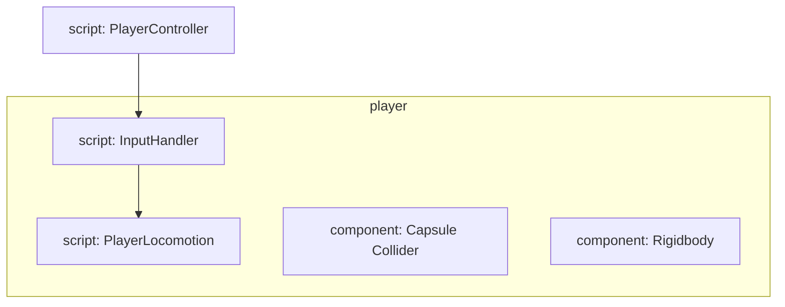

# Move

## Input System

1. Install `Input system` package

2. Create a new **C# file**，to manage input system: **InputHandler**

3. Create a new **C# file**，to manage player's move and rotation : **PlayLocomotion**

4. Add a new **Player Input Component** in the GameObject **Inspector**, to control Input: **PlayerControls**
   
   1. Click `Create Actions`, name it, save it
   
   2. Click `Actions`, Check `Generate C# Class`
   
   3. Set general input action(basically it is all setted), get `Action Maps` a name, default name is `Player`
   
   4. Set `Move - Action Properies - Action - Action Type: Pass Through` and `Control Type: Vector 2`
   
   5. Change `WASD - Composite - Mode: Analog`
   
   6. Change `Look` to `Camera`
      
      1. Click **Right stick(Gamepad)**, add `Processors - Stick DeadZone`
      
      2. Change `Delta [Point]` to `Delta [Mouse]`, add `Processors - Normalize Vector 2`

5. `Edit - Project Settings - Input System Package`, click `Create settings asset`
   
   1. Change **Default Hold Time** to 0, this will take off any delay when moving around our character

6. Add **Capsule Collider Component**, resize it

7. Add **Rigidebody Component**, <u>freeze rotation x, y, z</u>

8. Edit **InputHandler**



#### Action Type

- Value: if the control is **not at defalut value**, it will register it and **send an event**

- Button: can only be bound in `ButtonControl` Controls , use this for something with <u>one value and no initial state check</u>

- Pass Through: when an action is enabled, control **has to be moved to send event**, <u>no concept of "main" controls, does not send out started/canceled events, it <strong>always send out performed event</strong>, no initial state check</u>

| Value                                  | Pass Through                                                              |
| -------------------------------------- | ------------------------------------------------------------------------- |
| disambiguation<br/>initial state check | takes in all input<br/>no start/cancel<br/>callbacks without interactions |
| **good for one player**                | good for minimal input processing, like basic move                        |

#### Default Action Phase

| Name      | Description                                                                                                                                                                                                                                                                                                                                                                                                                                                                                                                                                                                                                                                                                                                                                                                                                                                                                                                                                                                                                                                                                                                                                                                                                                                                                                                                                                                                                                                                                                                                                                                                                                                                                                                                                                                                                                                                                                                                                                                                                                                                                                                                                                                                                                                                                                                                                                                                                                                                                                                                                                                                                                                                                                                                                                                                                                                                                                                                                                                                                                                                                                                                                                                                                                                                                                                                                                                                                                                                                                                                                                                                                                                                                                                                                                                                                                                                                                                                                                                                                                                                                                                                                                                                                                                                                                                                                                                                                                                                                                                                                                                                                                                                                                                                                                                                                                                                                                                                                                                                                                                                                                                                                                                                                                                                                                                                                                                                                                                                                                                                                                                                                                           | Value |
| --------- | ----------------------------------------------------------------------------------------------------------------------------------------------------------------------------------------------------------------------------------------------------------------------------------------------------------------------------------------------------------------------------------------------------------------------------------------------------------------------------------------------------------------------------------------------------------------------------------------------------------------------------------------------------------------------------------------------------------------------------------------------------------------------------------------------------------------------------------------------------------------------------------------------------------------------------------------------------------------------------------------------------------------------------------------------------------------------------------------------------------------------------------------------------------------------------------------------------------------------------------------------------------------------------------------------------------------------------------------------------------------------------------------------------------------------------------------------------------------------------------------------------------------------------------------------------------------------------------------------------------------------------------------------------------------------------------------------------------------------------------------------------------------------------------------------------------------------------------------------------------------------------------------------------------------------------------------------------------------------------------------------------------------------------------------------------------------------------------------------------------------------------------------------------------------------------------------------------------------------------------------------------------------------------------------------------------------------------------------------------------------------------------------------------------------------------------------------------------------------------------------------------------------------------------------------------------------------------------------------------------------------------------------------------------------------------------------------------------------------------------------------------------------------------------------------------------------------------------------------------------------------------------------------------------------------------------------------------------------------------------------------------------------------------------------------------------------------------------------------------------------------------------------------------------------------------------------------------------------------------------------------------------------------------------------------------------------------------------------------------------------------------------------------------------------------------------------------------------------------------------------------------------------------------------------------------------------------------------------------------------------------------------------------------------------------------------------------------------------------------------------------------------------------------------------------------------------------------------------------------------------------------------------------------------------------------------------------------------------------------------------------------------------------------------------------------------------------------------------------------------------------------------------------------------------------------------------------------------------------------------------------------------------------------------------------------------------------------------------------------------------------------------------------------------------------------------------------------------------------------------------------------------------------------------------------------------------------------------------------------------------------------------------------------------------------------------------------------------------------------------------------------------------------------------------------------------------------------------------------------------------------------------------------------------------------------------------------------------------------------------------------------------------------------------------------------------------------------------------------------------------------------------------------------------------------------------------------------------------------------------------------------------------------------------------------------------------------------------------------------------------------------------------------------------------------------------------------------------------------------------------------------------------------------------------------------------------------------------------------------------------------------------------------------- | ----- |
| Canceled  | The action has stopped. Leads to [canceled](https://docs.unity3d.com/Packages/com.unity.inputsystem@1.4/api/UnityEngine.InputSystem.InputAction.html#UnityEngine_InputSystem_InputAction_canceled) getting called.By default, a [Button](https://docs.unity3d.com/Packages/com.unity.inputsystem@1.4/api/UnityEngine.InputSystem.InputActionType.html#UnityEngine_InputSystem_InputActionType_Button) action cancels when a control falls back below the button press threshold (see [defaultButtonPressPoint](https://docs.unity3d.com/Packages/com.unity.inputsystem@1.4/api/UnityEngine.InputSystem.InputSettings.html#UnityEngine_InputSystem_InputSettings_defaultButtonPressPoint)) and a [Value](https://docs.unity3d.com/Packages/com.unity.inputsystem@1.4/api/UnityEngine.InputSystem.InputActionType.html#UnityEngine_InputSystem_InputActionType_Value) action cancels when a control moves back to its default value. A [PassThrough](https://docs.unity3d.com/Packages/com.unity.inputsystem@1.4/api/UnityEngine.InputSystem.InputActionType.html#UnityEngine_InputSystem_InputActionType_PassThrough) action does not generally cancel based on input on its controls.An action will also get canceled when it is disabled while in progress (see [Disable()](https://docs.unity3d.com/Packages/com.unity.inputsystem@1.4/api/UnityEngine.InputSystem.InputAction.html#UnityEngine_InputSystem_InputAction_Disable)). Also, when an [InputDevice](https://docs.unity3d.com/Packages/com.unity.inputsystem@1.4/api/UnityEngine.InputSystem.InputDevice.html) that isNote that interactions (see [IInputInteraction](https://docs.unity3d.com/Packages/com.unity.inputsystem@1.4/api/UnityEngine.InputSystem.IInputInteraction.html)) can alter how an action does or does not progress through the phases.                                                                                                                                                                                                                                                                                                                                                                                                                                                                                                                                                                                                                                                                                                                                                                                                                                                                                                                                                                                                                                                                                                                                                                                                                                                                                                                                                                                                                                                                                                                                                                                                                                                                                                                                                                                                                                                                                                                                                                                                                                                                                                                                                                                                                                                                                                                                                                                                                                                                                                                                                                                                                                                                                                                                                                                                                                                                                                                                                                                                                                                                                                                                                                                                                                                                                                                                                                                                                                                                                                                                                                                                                                                                                                                                                                                                                              |       |
| Disabled  | The action is not enabled.                                                                                                                                                                                                                                                                                                                                                                                                                                                                                                                                                                                                                                                                                                                                                                                                                                                                                                                                                                                                                                                                                                                                                                                                                                                                                                                                                                                                                                                                                                                                                                                                                                                                                                                                                                                                                                                                                                                                                                                                                                                                                                                                                                                                                                                                                                                                                                                                                                                                                                                                                                                                                                                                                                                                                                                                                                                                                                                                                                                                                                                                                                                                                                                                                                                                                                                                                                                                                                                                                                                                                                                                                                                                                                                                                                                                                                                                                                                                                                                                                                                                                                                                                                                                                                                                                                                                                                                                                                                                                                                                                                                                                                                                                                                                                                                                                                                                                                                                                                                                                                                                                                                                                                                                                                                                                                                                                                                                                                                                                                                                                                                                                            |       |
| Performed | The action has been performed. Leads to [performed](https://docs.unity3d.com/Packages/com.unity.inputsystem@1.4/api/UnityEngine.InputSystem.InputAction.html#UnityEngine_InputSystem_InputAction_performed) getting called.By default, a [Button](https://docs.unity3d.com/Packages/com.unity.inputsystem@1.4/api/UnityEngine.InputSystem.InputActionType.html#UnityEngine_InputSystem_InputActionType_Button) action performs when a control crosses the button press threshold (see [defaultButtonPressPoint](https://docs.unity3d.com/Packages/com.unity.inputsystem@1.4/api/UnityEngine.InputSystem.InputSettings.html#UnityEngine_InputSystem_InputSettings_defaultButtonPressPoint)), a [Value](https://docs.unity3d.com/Packages/com.unity.inputsystem@1.4/api/UnityEngine.InputSystem.InputActionType.html#UnityEngine_InputSystem_InputActionType_Value) action performs on any value change that isn't the default value, and a [PassThrough](https://docs.unity3d.com/Packages/com.unity.inputsystem@1.4/api/UnityEngine.InputSystem.InputActionType.html#UnityEngine_InputSystem_InputActionType_PassThrough) action performs on any value change including going back to the default value.Note that interactions (see [IInputInteraction](https://docs.unity3d.com/Packages/com.unity.inputsystem@1.4/api/UnityEngine.InputSystem.IInputInteraction.html)) can alter how an action does or does not progress through the phases.For a given action, finding out whether it was performed in the current frame can be done with [WasPerformedThisFrame()](https://docs.unity3d.com/Packages/com.unity.inputsystem@1.4/api/UnityEngine.InputSystem.InputAction.html#UnityEngine_InputSystem_InputAction_WasPerformedThisFrame).<br><br>```<br>action.WasPerformedThisFrame();<br>```                                                                                                                                                                                                                                                                                                                                                                                                                                                                                                                                                                                                                                                                                                                                                                                                                                                                                                                                                                                                                                                                                                                                                                                                                                                                                                                                                                                                                                                                                                                                                                                                                                                                                                                                                                                                                                                                                                                                                                                                                                                                                                                                                                                                                                                                                                                                                                                                                                                                                                                                                                                                                                                                                                                                                                                                                                                                                                                                                                                                                                                                                                                                                                                                                                                                                                                                                                                                                                                                                                                                                                                                                                                                                                                                                                                                                                                      |       |
| Started   | An associated control has been actuated such that it may lead to the action being triggered. Will lead to [started](https://docs.unity3d.com/Packages/com.unity.inputsystem@1.4/api/UnityEngine.InputSystem.InputAction.html#UnityEngine_InputSystem_InputAction_started) getting called.This phase will only be invoked if there are interactions on the respective control binding. Without any interactions, an action will go straight from [Waiting](https://docs.unity3d.com/Packages/com.unity.inputsystem@1.4/api/UnityEngine.InputSystem.InputActionPhase.html#UnityEngine_InputSystem_InputActionPhase_Waiting) into [Performed](https://docs.unity3d.com/Packages/com.unity.inputsystem@1.4/api/UnityEngine.InputSystem.InputActionPhase.html#UnityEngine_InputSystem_InputActionPhase_Performed) and back into [Waiting](https://docs.unity3d.com/Packages/com.unity.inputsystem@1.4/api/UnityEngine.InputSystem.InputActionPhase.html#UnityEngine_InputSystem_InputActionPhase_Waiting) whenever an associated control changes value.An example of an interaction that uses the [Started](https://docs.unity3d.com/Packages/com.unity.inputsystem@1.4/api/UnityEngine.InputSystem.InputActionPhase.html#UnityEngine_InputSystem_InputActionPhase_Started) phase is [SlowTapInteraction](https://docs.unity3d.com/Packages/com.unity.inputsystem@1.4/api/UnityEngine.InputSystem.Interactions.SlowTapInteraction.html). When the button it is bound to is pressed, the associated action goes into the [Started](https://docs.unity3d.com/Packages/com.unity.inputsystem@1.4/api/UnityEngine.InputSystem.InputActionPhase.html#UnityEngine_InputSystem_InputActionPhase_Started) phase. At this point, the interaction does not yet know whether the button press will result in just a tap or will indeed result in slow tap. If the button is released before the time it takes to recognize a slow tap, then the action will go to [Canceled](https://docs.unity3d.com/Packages/com.unity.inputsystem@1.4/api/UnityEngine.InputSystem.InputActionPhase.html#UnityEngine_InputSystem_InputActionPhase_Canceled) and then back to [Waiting](https://docs.unity3d.com/Packages/com.unity.inputsystem@1.4/api/UnityEngine.InputSystem.InputActionPhase.html#UnityEngine_InputSystem_InputActionPhase_Waiting). If, however, the button is held long enough for it to qualify as a slow tap, the action will progress to [Performed](https://docs.unity3d.com/Packages/com.unity.inputsystem@1.4/api/UnityEngine.InputSystem.InputActionPhase.html#UnityEngine_InputSystem_InputActionPhase_Performed) and then go back to [Waiting](https://docs.unity3d.com/Packages/com.unity.inputsystem@1.4/api/UnityEngine.InputSystem.InputActionPhase.html#UnityEngine_InputSystem_InputActionPhase_Waiting).[Started](https://docs.unity3d.com/Packages/com.unity.inputsystem@1.4/api/UnityEngine.InputSystem.InputActionPhase.html#UnityEngine_InputSystem_InputActionPhase_Started) can be useful for UI feedback. For example, in a game where the weapon can be charged, UI feedback can be initiated when the action is [Started](https://docs.unity3d.com/Packages/com.unity.inputsystem@1.4/api/UnityEngine.InputSystem.InputActionPhase.html#UnityEngine_InputSystem_InputActionPhase_Started).<br><br>```<br>fireAction.started +=<br>    ctx =><br>    {<br>        if (ctx.interaction is SlowTapInteraction)<br>        {<br>            weaponCharging = true;<br>            weaponChargeStartTime = ctx.time;<br>        }<br>    }<br>fireAction.canceled +=<br>    ctx =><br>    {<br>        weaponCharging = false;<br>    }<br>fireAction.performed +=<br>    ctx =><br>    {<br>        Fire();<br>        weaponCharging = false;<br>    }<br>```<br><br>By default, an action is started as soon as a control moves away from its default value. This is the case for both [Button](https://docs.unity3d.com/Packages/com.unity.inputsystem@1.4/api/UnityEngine.InputSystem.InputActionType.html#UnityEngine_InputSystem_InputActionType_Button) actions (which, however, does not yet have to mean that the button press threshold has been reached; see [defaultButtonPressPoint](https://docs.unity3d.com/Packages/com.unity.inputsystem@1.4/api/UnityEngine.InputSystem.InputSettings.html#UnityEngine_InputSystem_InputSettings_defaultButtonPressPoint)) and [Value](https://docs.unity3d.com/Packages/com.unity.inputsystem@1.4/api/UnityEngine.InputSystem.InputActionType.html#UnityEngine_InputSystem_InputActionType_Value) actions. [PassThrough](https://docs.unity3d.com/Packages/com.unity.inputsystem@1.4/api/UnityEngine.InputSystem.InputActionType.html#UnityEngine_InputSystem_InputActionType_PassThrough) does not use the `Started` phase and instead goes straight to [Performed](https://docs.unity3d.com/Packages/com.unity.inputsystem@1.4/api/UnityEngine.InputSystem.InputActionPhase.html#UnityEngine_InputSystem_InputActionPhase_Performed).For [Value](https://docs.unity3d.com/Packages/com.unity.inputsystem@1.4/api/UnityEngine.InputSystem.InputActionType.html#UnityEngine_InputSystem_InputActionType_Value) actions, `Started` will immediately be followed by [Performed](https://docs.unity3d.com/Packages/com.unity.inputsystem@1.4/api/UnityEngine.InputSystem.InputActionPhase.html#UnityEngine_InputSystem_InputActionPhase_Performed).Note that interactions (see [IInputInteraction](https://docs.unity3d.com/Packages/com.unity.inputsystem@1.4/api/UnityEngine.InputSystem.IInputInteraction.html)) can alter how an action does or does not progress through the phases. |       |
| Waiting   | The action is enabled and waiting for input on its associated controls.This is the phase that an action goes back to once it has been [Performed](https://docs.unity3d.com/Packages/com.unity.inputsystem@1.4/api/UnityEngine.InputSystem.InputActionPhase.html#UnityEngine_InputSystem_InputActionPhase_Performed) or [Canceled](https://docs.unity3d.com/Packages/com.unity.inputsystem@1.4/api/UnityEngine.InputSystem.InputActionPhase.html#UnityEngine_InputSystem_InputActionPhase_Canceled).                                                                                                                                                                                                                                                                                                                                                                                                                                                                                                                                                                                                                                                                                                                                                                                                                                                                                                                                                                                                                                                                                                                                                                                                                                                                                                                                                                                                                                                                                                                                                                                                                                                                                                                                                                                                                                                                                                                                                                                                                                                                                                                                                                                                                                                                                                                                                                                                                                                                                                                                                                                                                                                                                                                                                                                                                                                                                                                                                                                                                                                                                                                                                                                                                                                                                                                                                                                                                                                                                                                                                                                                                                                                                                                                                                                                                                                                                                                                                                                                                                                                                                                                                                                                                                                                                                                                                                                                                                                                                                                                                                                                                                                                                                                                                                                                                                                                                                                                                                                                                                                                                                                                                   |       |

 

### Move

#### Get input value from Input system-Input Actions

[More info]([Input Bindings | Input System | 1.4.2](https://docs.unity3d.com/Packages/com.unity.inputsystem@1.4/manual/ActionBindings.html?q=input%20binding))

1. Set `WASD - Composite Type` to **2D Vector**

2. set `WASD - Mode` to **Analog**
   
   1. The 2D vector composite has four part Bindings: means 2D.x = horizontal, 2D.y = vertical
   
   | Part  | Type   | Description |
   | ----- | ------ | ----------- |
   | up    | Button | (0, 1)(+y)  |
   | down  | Button | (0, -1)(-y) |
   | left  | Button | (-1, 0)(-x) |
   | right | Button | (1, 0)(+x)  |

3. Get input value

```csharp
public class InputHandler: MonoBehaviour
{
    PlayerControls inputActions;

    Vector2 movementInput; //set a vector2 to get input
    public float horizontal, vertical; //set 2 float value to get input value
    public float moveAmount;

    private void OnEnable() //程序初始化时载入以下方法
    {
        if(inputActions == null)
        {
            inputActions = new PlayerControls;
            inputActions.Player.Move.performed += keyboardInput => movementInput =keyboardingInput.ReadValue<Vector2>();
        }
        inputActions.Enable();
    }

    private void OnDisable()
    {
        inputActions.Disable();
    }

    public void MoveInput()
    {
        horizontal = movementInput.x;
        vertical = movementInput.y;
        moveAmount = Mathf.Clamp01(Mathf.Abs(horizontal) + Mathf.Clamp01(Mathf.Abs(vertical));
        //Clamp01: Clamp value between 0 and 1
    }
}
```
