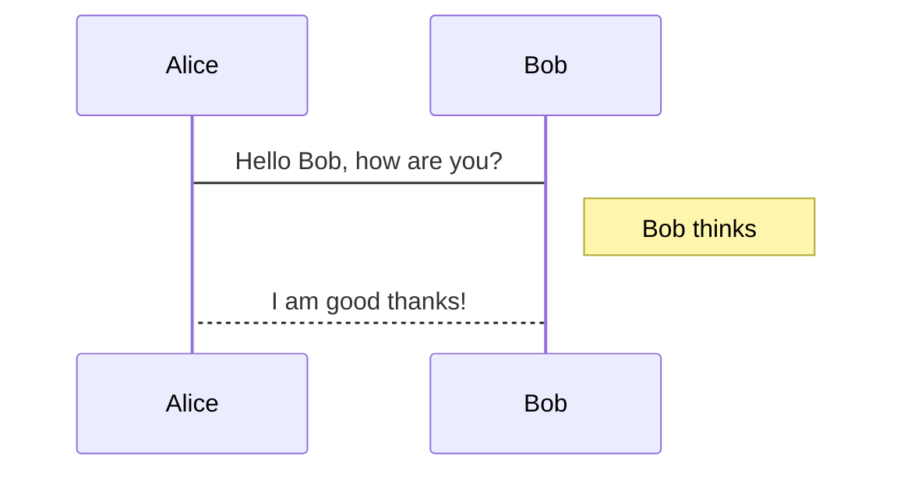
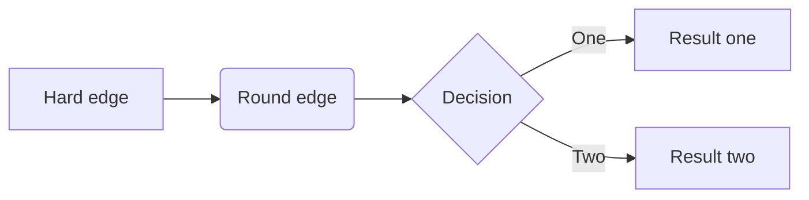
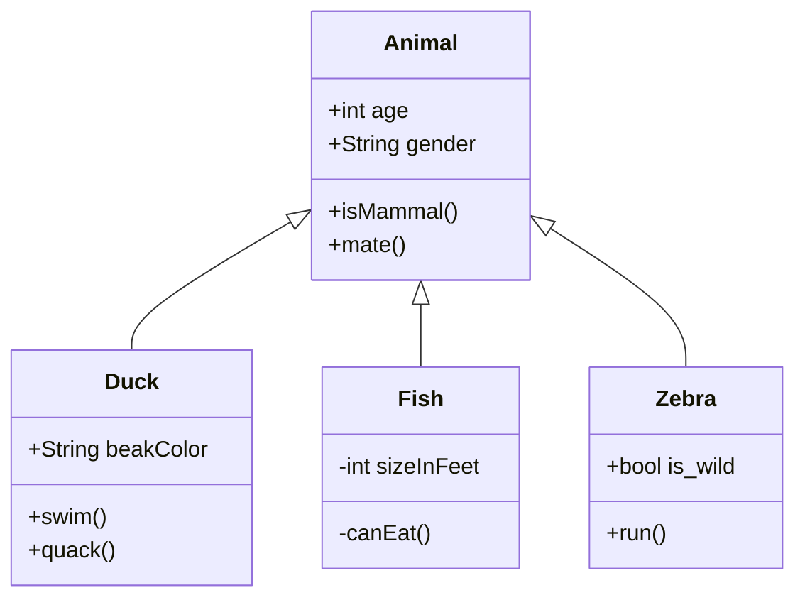
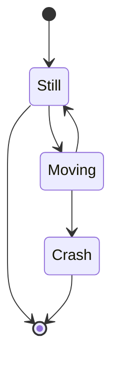
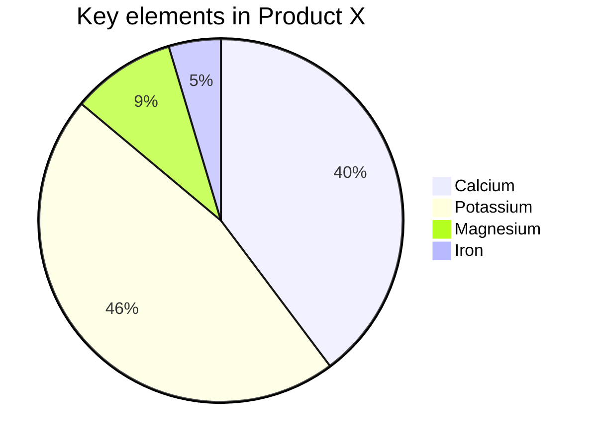

# Markdown输入数学公式及图表


[语法参考](https://www.jianshu.com/p/e74eb43960a1)

[KaTeX 语法](https://katex.org/docs/supported.html)

## 载入插件

docsify中使用KaTeX的方法:

```html
<!--在index.html - body 最后添加-->
<script src="//cdn.jsdelivr.net/npm/docsify-katex@latest/dist/docsify-katex.js"></script>
<link rel="stylesheet" href="//cdn.jsdelivr.net/npm/katex@latest/dist/katex.min.css"/>
```


## 插入方式

### 行间插入或左对齐

一个\$

### 新行写入

两个\$\$

## 基本类型

### 上、下标

$x_1$: `x_1`

$x_1^2$: `x_1^2`

$x^2_1$: `x^2_1`

$x_{22}^{(n)}$:   `x_{22}^{(n)}`

${}^*x^*$: `{}^*x^*`

$x_{balabala}^{bala}$:  `x_{balabala}^{bala}`

上标用 ^ 后接体现，下标用 _ 后接体现，多于一位要用 { } 包裹

### 分式

**四则运算**

1. 乘法： `\times`
2. 除法： `\div`
3. 平均数：`\overline{xyz}`

**frac：fraction 分数，要加 \ **

$\overline{xyz}$

$\frac{x+y}{2}$：`\frac{x+y}{2}`  

$\frac{1}{1+\frac{1}{2}}$： `\frac{1}{1+\frac{1}{2}}`

### 根式

**sqrt：Square root  平方根**

**[ ]：几次根式**

$\sqrt{2}<\sqrt[3]{3}$ ：`\sqrt{2}<\sqrt[3]{3}`   

$\sqrt{1+\sqrt[p]{1+a^2}}$:  `\sqrt{1+\sqrt[p]{1+a^2}}`

$\sqrt{1+\sqrt[^p\!]{1+a^2}}$:  `\sqrt{1+\sqrt[^p]{1+a^2}}`--和上面的区别在于P的写法

### 求和、积分

**sum：求和**

**int：integral 积分**

$\sum_{k=1}^{n}\frac{1}{k}$：`\sum_{k=1}^{n}\frac{1}{k}`

$\sum_{k=1}^n\frac{1}{k}$：`\sum_{k=1}^n\frac{1}{k}`

$\int_a^b f(x)dx$:  `\int_a^b f(x)dx`

$\int_a^b f(x)dx$: `\int_a^b f(x)dx`

### 空格

主要用于微调距离，让公式看易读

$a\!b$ ：`a\!b` 紧贴

$ab$：`ab` 没有空格

$a\,b$：`a\,b$` 小空格

$a\;b$：`a\;b$`  中等空格

$a\quad b$: `a\quad b` big space

$a\qquad b$: `a\qquad b` two quad space 只能有2个，3个q会报错

### 公式界定符

用 \left 和 \right 后跟界定符来对内容界定

$\left(\sum_{k=\frac{1}{2}}^{N^2}\frac{1}{k}\right)$：`\left(\sum_{k=\frac{1}{2}}^{N^2}\frac{1}{k}\right)`

### 矩阵

类似于 left right，这里是 begin 和 end。而且里面有具体的矩阵语法，`&` 区分行间元素，`\\\\` 代表换行。可以理解为 HTML 的标签之类的。

**矩阵中括号不能直接写括号符号，需要用文字**

$\begin{matrix}1 & 2\\\\3 &4\end{matrix}$：`\begin{matrix}1 & 2\\\\3 &4\end{matrix}`

$\begin{pmatrix}1 & 2\\\\3 &4\end{pmatrix}$: `\begin{pmatrix}1 & 2\\\\3 &4\end{pmatrix}`

$\begin{bmatrix}1 & 2\\\\3 &4\end{bmatrix}$:  `\begin{bmatrix}1 & 2\\\\3 &4\end{bmatrix}`

$\begin{Bmatrix}1 & 2\\\\3 &4\end{Bmatrix}$:  `\begin{Bmatrix}1 & 2\\\\3 &4\end{Bmatrix}`

$\begin{vmatrix}1 & 2\\\\3 &4\end{vmatrix}$:  `\begin{vmatrix}1 & 2\\\\3 &4\end{vmatrix}`

$\left|\begin{matrix}1 & 2\\\\3 &4\end{matrix}\right|$:  `\left|\begin{matrix}1 & 2\\\\3 &4\end{matrix}\right|`

$\begin{Vmatrix}1 & 2\\\\3 &4\end{Vmatrix}$:  `\begin{Vmatrix}1 & 2\\\\3 &4\end{Vmatrix}`

### 排版数组

$\mathbf{X} = \left( \begin{array}{ccc} x\_{11} & x\_{12} & \ldots \\\\ x\_{21} & x\_{22} & \ldots \\\\ \vdots & \vdots & \ddots \end{array} \right)$:   

```
\mathbf{X} = 
\left( \begin{array}{ccc} 
x\_{11} & x\_{12} & \ldots \\\\ 
x\_{21} & x\_{22} & \ldots \\\\ 
\vdots & \vdots & \ddots 
\end{array} \right)
```

### 公式组

用gather包起来。
$$
\begin{gather}
a = b + c + d\\\\
x = y + z
\end{gather}
$$

```
$
\begin{gather}
a = b+c+d \\\\
x = y+z
\end{gather}
$

$
\begin{align}
a &= b+c+d \\\\
x &= y+z
\end{align}
$
```

### 分段函数

$$
y = \begin{cases}
-x,\quad x\leq 0 \\\\
x,\quad x>0
\end{cases}
$$

```
$
y=\begin{cases}
-x,\quad x\leq 0 \\\\
x,\quad x>0
\end{cases}
$
```

## 数组的其他使用

### 划线

$$
\left(\begin{array}{|c|c|}
1 & 2 \\\\
\\hline
3 & 4
\end{array}\right)
$$

```
$
\left(\begin{array}{|c|c|}
1 & 2 \\\\
\\hline
3 & 4
\end{array}\right)
$
```

### 制表

$$
\begin{array}{|c|c|}
\hline
{1111111111} & 2 \\\\
\hline
3 & 4 \\\\
\hline
\end{array}
$$

```
$
\begin{array}{|c|c|}
\hline
{1111111111} & 2 \\\\
\hline
3 & 4 \\\\
\hline
\end{array}
$
```

## 图表

在docsify inedex.html - header 中添加以下代码:

参考：<a href="https://mermaid-js.github.io/mermaid/#/flowchart">语法说明</a>

```html
<script src="//unpkg.com/mermaid/dist/mermaid.js"></script>
<script src="//unpkg.com/docsify-mermaid@latest/dist/docsify-mermaid.js"></script>
<script>mermaid.initialize({ startOnLoad: true });</script>
```

使用时, 在头部添加 ````mermaid`

### sequence




### mermaid - flowchat




### mermaid - class diagrams




### mermaid - state diagrams




### mermaid - pie charts



