# Blender


## 三方插件

### 建模

- [mesh Tree](https://github.com/maximeherpin/modular_tree/tree/blender_28)
  - 安装后在左上角打开 Mtree Node Tree
  - 添加`Branch Node` `Trunk Node`  连接 trunk node - branch node
  - 添加`Tree parameters` 生成树
  - 添加一个平面, 给一个材质, 把 basic color 材质类型改为 image texture
  - 添加叶子贴图(可以在ps里用画笔做一个)
    - Specular : 0
    - Alpha : Image Texture 选择叶子的图片
    - Setting - Blend Mode - Alpha Clip
  - `Tree parameters` - check `create_leafs` 
  - 导出**重要**
    - 选择叶子, 界面上 Object - Convert To Mesh - 勾选 Keep Original
    - 把叶子的粒子系统删除
    - 选中叶子和树干 cmd+j 
    - 导出选中的树

### 骨骼

- bone layer manager
- Auto-Rig Pro(付费)

### 图层管理

- simple_renaming_panel

### 工作流程插件

- [万物有灵](https://shimo.im/docs/tWhW8QJPHhDqKwr9/)
  - 安装好插件后，在`add-on`中导入预设
  - 使用时，点击`import`可应用
- [饼图热盒菜单插件 MACHIN3tools](https://machin3.io/MACHIN3tools/docs/#what-is-machin3tools)
  - 快速设置相机
    - 安装后在`General-Pie Menus`里选中`Views Pie’
    - 在`Keymaps`中给`Pie Menus-Views`设置快捷键
    - 在视图中用快捷键呼出, 选择`Smart View Cam`, 会在当前视角下创建一个相机
- [Blender Guppy](https://blenderguppy.gumroad.com/)
  - 添加Solidfy
    - 整体加厚度：Object Mode - Shift+ctrl+x - Edit Draw Mods - S
      - alt+1/2/3：向外挤出/中间挤出/向内挤出
    - 给部分面加厚度：Object Mode - Shift+ctrl+x - Get Poly Mesh - Space(空格键确认) - ctrl+RMB move 拖出厚度 -  Space(空格键确认) 
      - alt+1/2/3：向外挤出/中间挤出/向内挤出
  - Apply Draw Mods：按住 ctrl 点击，可以选择apply哪些mods
  - 切割
    - Edit Mode - Line - alt+x - Mark Sharp
    - Object Mode - alt+x - Add Weighted Normal
    - Apply
  - 在物体上画新物体
    - 选中目标物体
    - Object Mode - Shift+ctrl+x - Draw Poly Mesh - (x 打开镜像) - （1/2/3/4切换画笔形状）
    - shift+c 起点吸附到 3D Cursor 上
  - 转为曲线
    - Edit Mode - 选择要转为曲线的线
    - Object Mode - Shift+ctrl+x - Extras - To Wire Curve
    - 转为mesh：Object Mode - Shift+ctrl+x - Apply Draw Mods
  - Knife
    - Edit Mode - Alt+x - z(穿透) - 鼠标左键拖拽
  - mirror
    - Object Mode - Shift+ctrl+x - Reset Mirror 选择物体 - (x/y/z 选择镜像轴)
  - 布尔
    - 设置Target Mesh：Object Mode - Shift+ctrl+x - Set As Target
    - 选择布尔物体，Object Mode - Shift+ctrl+x - Cut/Add/Intr/Slice

### 烘焙

- [Bake Wrangler](https://blenderartists.org/t/bake-wrangler-node-based-baking-tool-set/1187732)
  - [教程](https://www.bilibili.com/s/video/BV14z4y1R789)

### 动画

- [Animation nodes](https://animation-nodes.com/)
- [Graph Editor快捷键扩展](https://github.com/aresdevo/animaide)

## 自带插件

- rigify: 自带骨骼插件, 理解了比较好用
- Import-Export: Import Image as Planes, 可以把图片当做平面导入, 制作表情flame
- loop tools
- bool tool
- Curve/Mesh：Extra Objects
- mesh:F2(可在单点模式下使用F来直接挤出面)
- Node Wrangler
  - **在输出节点前添加预览节点: 点击输出节点, 按住`shift+ctrl`, 左键点击输出节点前最后一个节点**
  - 重排节点: `shift+=`
  - **添加材质节点：在node mode 下`ctrl+t`**
    - 在图片节点下，texture Coordinate 选择 Object，Texture image 选择 box，把 blend(混合) 调整大一点点（0.2），可以解决贴图接缝问题
  - **自动连接节点: 选中要连接的节点, f**
- **Auto Tile Size：优化渲染速度，添加后在 Render Properties - Performance 下可以打开 Auto Tile Size**
- Cell Fracture: 破碎插件
- 物体随机分布插件: `Scatter Objects`
  - 安装好后, 在右侧 扳手 菜单中多一个工具菜单
  - 先选择要实例化的父物体, 再选择实例放置的面
  - 空格呼出快捷菜单 搜索 Scatter Objects, 点击
  - 在放置的面上画要实例化的轨迹
  - 回车应用
  - 想单独编辑实例时, 选择实例, cmd+a -- make Instances Real 
- 3D View: Measurelt: 尺寸测量
  - 在编辑模式下 View 工具栏中显示
  - Item 菜单下可以删除全部尺寸显示


## 视图操作

- blender说明书：鼠标放在要查询的功能上，按f1（会有快捷键冲突）

- 放大缩小面板：按住ctrl，按住中键在需要放大缩小的面板上，上下滑动

- 调出/收起属性面板：n

- 切换着色模式: z

- 添加视图: 在视图边角LMB拉出(松开鼠标前ESC可取消)

- 合并视图: 在要保留的视图边角(鼠标放到视图中)LMB

- 固定面板：shift+LMB

- 调出编辑模式下面数面板

  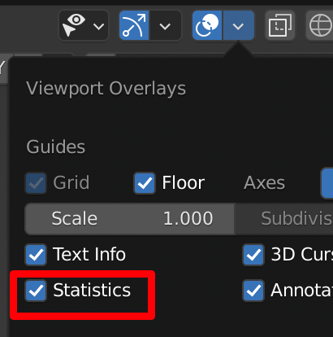

- 四视图(quad view)：alt+ctrl+q
  - n调出view面板
  - lock：四视图角度锁定，点击解锁，调整各视图视角，再锁定
  - box：勾选后，在一个视图操作，另两个视图跟随变化（例如缩放，移动）

### 最近距离修改

object clip view:

修改: N - View - View : Clip Start


## 选择:

- **选择快捷键: alt+鼠标左键** (当选择多个重叠物体时好用)
- 单独显示选中物体: /
- 选择所有复制对象 select all dulplicates linked objects: menu --> select --> Linked --> Object Data
- 切换坐标模式(世界坐标/局部坐标): <
- 切换点对齐模式: >
- 打开磁吸: shift+tab
  - 打开磁吸选择：shift+ctrl+tab
- 加选: ctrl+Numpad(+)
- 点/线/面菜单：ctrl+v/e/f
  - 封口：ctrl+f - beautify faces/grid fill
- **选择相似的：shift+g**（在编辑/物体/骨骼模式下都很好用）
- **重复上一步操作：shift+r**
- 选择父物体：右上角`Options-Parents`
- 缩放两个物体之间的距离：右上角`Options-Location`
- 间隔环选：先环选，再`select-checker deselect`
- 选择所有连接着的面: L(取消选择连着的面 shift+L)
- 选择连续的点/线/面：ctrl+LMB
  - 面板 face stepping：勾选按步选择
  - Topology Distance：勾选后走的直角连接
  - Fill Region：勾选后把两个路径之间的面积都选上
  - Deselected：间隔多少个不选
- 选择两点/线/面间的面积：ctrl+shift+LMB
- 反选：ctrl+i
- 随机选择:Select     - Select Random
- 按组选择:Shiift+g
- **同时修改xyz的值：按住左键，下拉选中xyz**
- 灯光方向
  - 主键盘-句号：选择`3D Cursor`，再移动灯光位置
- 调出上一步设置：F9

## 物体操作

- **对物体命名：F2**
- 批量重命名：ctrl+F2
- **编辑物体内部：alt+b 框选需要编辑内部的区域，再次 alt+b 恢复**
- **坐标归零: alt+g/r/s**
- 快速统一法线: 选中需要翻转的法线部分, 在Object Data properties-Normals 下, 勾选 Auto Smooth
- 快速删除背面
  - 选择一个面, shift + g 选择所有相似法线面 / 左上菜单 select - select linked - linked flat faces
  - cmd+ i 反选 删除
- 在物体模式下应用变换(应用后可以让所有数值归零): ctrl+a
- **沿法线缩放（各面的法线，只能在编辑模式下使用）：alt+s**
- 把组合在一起的物件一次性分开：`edit mode-P-by loose parts`
- 建立父子关系:     cmd/control+p
- 重新计算法线:shift+n
- 解除父子关系
  - 在列表上找到子物体，按住shift，左键从父物体下拖出
  - 选中子物体，alt+p
- 镜像：ctrl+m
- 让物体沿着某个面的方向移动（非物体局部坐标）：`transform pivot point-Active Element`
- 物体吸附：
  - 吸附到表面，选择`face`，勾选`align rotation to target`可以根据吸附面的方向自动转向，勾选`Project individual Elements`可以让吸附物体和被吸附物体朝向一样
- 沿地面网格移动物体：先按G/R/S，按住ctrl操作
- 选中的物体视图居中并把坐标归零: shift+c
- 切换对齐方式：主键盘-句号
- 选中多个物体时，以每个物体自身中心点缩放：对齐方式选择 `Individual Origins`
- 延局部坐标移动/缩放/旋转：先按快捷键（G/S/R），再按两下方向（X/Y/Z）
- 复制物体:     shift+d
- **复制且让新物体继承原物体(操作原物体时新物体一起被操作): alt+d**
  - 把没有alt+d复制的物体关联起来：选中所有要关联的物体，最后选中模板物体，`ctrl+L-Object Data`
- **复制一组物体**：`shift+a-collection instance-选择要复制的collection`，复制后的物体组不可单独编辑，编辑原物体组，复制物体组很跟随变化
- **复制物体但不增加场景中的面数**（节省性能的方法）：
  - 把对象M添加到集合中
  - shift+a 选择`Collection Instance`
  - shift+d 复制
- 从collection中移除(会完全删除) remove from collection: ctrl(cmd)+alt+g
- 从所有collections中移除(会完全删除) remove from all collections: shift+ctrl(cmd)+alt+g
- 当一个物体已经转成很奇怪的角度，要在上面加新的东西，可以先`alt+d`一个物体出来，再alt+r 还原旋转角度，在新物体添加部件，角度奇怪的原物体也会同时添加部件，调整好后再删除复制的物体
- 让复制的物体有随机角度：左上角菜单 `Transform-Randomize Transform`
- 复制一个物体的变换信息 copy Transform Data
  - 先选择要复制的物体，再选被复制物体
  - N调出sidebars，在某个坐标处右键 `Copy All to Selected` 或`Copy Single to Selected`
- 对齐物体：ctrl+alt+a
- 向一个轴缩放：编辑模式-shift+ctrl+alt+s
- 延法线挤出:alt+e
- 在物体模式下应用变换(应用后可以让所有数值归零): ctrl+a
- 清除游离点/线/面: mesh-clean up-delete loose
- 翻转物体：alt+f
- 使用正则批量给物体重命名的技巧（有时做镜像复制时会有很多带 .001 的物体）
  - 框选要重命名的物体
  - 使用插件`simple renaming panel`
- 视图:
  - 选中物体最大化：Numpad-句号

## 建模

- shift+alt+LMB: 可以同时选择连接的面

- 快速把物体中心点对齐到底部: 进入编辑模式, z轴设置为1m

- 选择多个物体TAB能同时进入编辑模式

- 曲线改为锐角: 编辑模式 - V

- 曲线下的打断点和连接点

  - 打断点: x - segment
  - 连接点: alt+c

- **把点一分为二: v**

- **选择子对象**: 选中父对象后, shift+g

- 减少多余面和节点的方法

  - 编辑模式- X -  Dessolve 点 线 面

- 编辑模式分离物体到新物体: p

- 编辑模式分离物体(不到新物体): y

- **同时修改多个物体属性: Alt+点选**

- 建一个完美球体

  - 方法1：使用插件extra objects，选择round cube，增加细分
  - 方法2：创建cube，添加`subdivision` 和 `cast`

- **不会破坏原物体表面构造的subdivide方法**：使用`Multires-Subdivide`，此时使用雕刻模式雕刻的结果不会改变原物体的表面构造

- 让物体边缘完美贴合另一个物体：

  - 把要贴合的边打组（ctrl+g）
  - 添加`shinkwrap`修改器，`Vertex Group`选择上一步建的组
  - `Mode-Project`，把坐标换为局部坐标
  - 根据要贴合的轴向，勾选`Axis`，勾选`Negative`

- 沿法线移动边时（双击G）不能移动超出原来高度的位置，此时按 alt 或 c 可沿法线方向挤出，而不需要使用挤出功能

- 在两点之前加线：不要使用F(使用F只会在两点间连线，不会把面也切开)，使用J

- 任意调整环节的角度：环节后，使用左侧工具栏中的`Shear`

- 沿某个轴对齐：坐标选为Normal，S-X/Y/Z-0

- 镜像修改器的技巧

  - 镜像修改器使用的是物体的origin点，移动origin点就可以把镜像物体对齐别的地方
  - 把cursor放到要对齐的位置
  - `Options-check Origins`
  - `shift+s-selection to cursor`

- **在应用镜像修改器后，又打算使用镜像添加新部件**

  - 再添加一次镜像修改器
  - 勾选`Bisect-x`

- **skin工具没有应用上**：点击`Mark Root`

- 一次性应用所有 Modifier：左上角菜单 `Object-Convert to-Mech from Curve/Meta/Suf/Text`

- **一次性调整所有物体的变换（无论是修改器还是位置信息）：按住 alt 点击或Enter**

- 一次性把一个物体的Modifier复制给其他多个物体：先选要复制的物体，最后选被复制物体，`Shift+L （make links）- Modifiers` 

- 布尔: 安插件 `bool tool` then ctrl+shift+b or ctrl + 小键盘 -，使用时选择`Brush Boolean`，在应用前都可以修改

- 把选中的面assign到新组：`ctrl+g`

- 用布尔做凹边

  - 应用布尔修改器
  - 在布尔物体（非被布尔物体）应用Solidfy修改器
  - 如果被布尔物体应用过Bevel修改器，把布尔修改器放到Bevel修改器之上

- 挤出面平面化/平滑部分sharp化：`Item-Edges Data-Mean Crease`调整到1

  - 进一步优化

    - 选择部分线，调整`Item-Edges Data-Mean Crease`
    - 选择其中一条已经调整过的线，打开“选择相似菜单 `shift+g-Bevel`，再次调整

    - 加`Bevel Modifier`，选择`Limit Method-Weight`可以对应应用上一步调整的 mean crease
    - 检查是否勾上`Auto Smooth`

- 单点挤出新面：插件`F2`，在点模式下，按F可挤出面

- **删除点/线/但不同时清除面：x-Dissolve(或 ctrl+x)**

- **清除没有必要的线和点：x-Limited Dissolve**

- **随意面挤出：ctrl+RMB**

- 修改器层面的merge：添加**Weld**修改器

- 修正`shade smooth`对边角的平滑

  - `Object Data Properties-Normals` 勾选 `Auto Smooth`

- 倒角：ctrl+b

  - 如果倒角没有弧度，查看 Bevel 菜单（倒角时出现在右下角）中的 Shape
  - 导角-凹面：ctrl+b --> p

- 使用 Bevel Modifier 来添加物体边角

  - 调整`Limit Method`的类别，`Segments`的层数，`Offset`的层数，检查 `Auto Smooth`是否勾选
  - 自定义物体中需要Bevel的部分：编辑模式，`Transform-Edges Data-Mean Bevel Weight`：是一个0-1的区间，1表示完全应用Modifier的Offset，0表示完全不应用
  - 在一个物体上应用多种倒角形式
    - 部分边倒角：编辑模式，选中边，调整`sidebars-Transform-Edges Data-Mean Bevel `，bevel修改器`Limit Method-Vertex Group`，调整`Segments`，这样不会影响第二个倒角修改器的效果
    - 再添加一个倒角修改器，修改其他部分，**注意两个倒角器的上下位置**

- **做石头**
  
  - 在编辑模式下, 选择左侧工具 Bisect
  - **全选面**, 切分, 勾选 fill / clear outside or inside
  
- [自动缝衣服](https://www.youtube.com/watch?v=7h89tkUJLuM)
  
  - [缝好衣服加动画](https://www.youtube.com/watch?v=HPz5gk_AT6w)
    - 要点在于, 先做人物动画,再加衣服,人物动画要在衣服缝好之后, 把衣服的动画最大帧数设置和人物动画一样长
    - **Bake!!**
  
- 给环线加两条边缘环线的技巧
  
  - 选中环线
  - Crl+B 或 Ctrl+Shift+R(使用后一种时，只增加2条环线，用E让边缘线和环线等距)
  
- Insert的技巧
  - +Ctrl 可以同时突出/凹进
  - +O 扩大外边缘
  - +I  分别内切
  - +B 在边缘不内切
  
- knife的技巧
  - +C 打开角度
  - +Z 穿透面
  - +E 保持cut工具不退出
  
- 投影式开洞
  - 选中要开洞的物体，TAB进入编辑界面，调整好投影角度
  - 加选投影物体
  - 左上角菜单`Mesh-Knife Project`
  - 使用auto merge来把点连接好
  
- 调整subdivision的强度：使用modifier后，n-item-edges data

- 点倒角：ctrl+shift+b

- 添加插件`Extra Objects` 分别勾`Curve` `Mesh`

- 沿着某个中心点array
  
  - 在中心点创建一个空物体
  - 在物体中应用array修改器，把array物体的中心点对齐空物体中心点
  - 取消勾选`Relative Offset`，勾选`Object Offset`，物体选择空物体
  - 选中空物体，R旋转，上下移动空物体能制造step的分布，S能放大/缩小分布
  
- 利用array做控制器
  
  - 新建贝塞尔曲线
  - 添加array修改器，`fit type-fit curve`，选择曲线（此时只是物体沿着曲线排列）
  - 添加curve修改器，选择curve(此时可通过控制曲线来控制物体)，可选中两点，右键 subdivide添加更多曲线上的点
  - 添加控制器：在编辑模式下选择一个点，`ctrl+h-Hook to new object`添加hook，回到物体模式，可用新物体控制曲线，进而控制array
  - 物体模式，选中上一步生成的空物体，在`Object Data Properties`中，display as sphere
  
- 画自由管线
  
  - 新建一个曲线，`Object Data properties-Geometry`加Bevel，增加shape的Resolution preview U的段数
  - 进入编辑模式，确认`Active Tool and Workspace settings-Projection Depth`选中`Cursor`（如果选中surface，画线时会附在被画物体的表面，调整offset的距离可以让画线和物体表面的间距）
  - 使用左侧`Draw`工具画曲线
  - 通过alt+s控制曲线bevel的粗细
  
- 做贴在物体上的便利粘
  
  - 新建平面，细分，把中心点移到边上，使用局部坐标，保证Y轴指向中心点，Z轴朝上
  - 快捷键o，选择sharp，选择一个边，向上抬
  - 回到物体模式，shift+tab打开磁吸，选择面，勾选`Align rotation to target`和`Project individual elements`，移动平面到物体上吸附
  - 添加细分，实体修改器
  - 如果吸附物体为曲面，添加`shinkwrap`修改器，把该修改器移到最上面，target选中曲面物体，mode选中project，勾选Negative
  - 把需要吸附的平面部分ctrl+g添加到新组，回到`shrinkwrap`修改器，选中上步的组
  - 如果上步效果还不够好，ctrl+shift切换到权重刷模式，刷权重（可切换到点模式，查看每个点受到的权重影响）
  
- 做楼梯
  
  - 做两个面
  - array
  
- 做栅栏
  - 平面，ctrl+r 切分
  - ctrl+b 边/点倒角
  - 删除倒角面
  - 挤出
  
- 做栅栏方法2

  - 细分
  - 使用Wireframe修改器

- 做交叉网格
  
  - 建一个cube，可见性改为wire
  
  - 建一个平面，选cube，选plane，`shift+b-brush boolean-intersect`
  
  - 在平面上添加`array modifier`，**进入编辑模式**，勾选`Merge`
  
  - 把平面缩短，复制，调整形状，整体再调整45度，全选，放大到边界延伸出盒子外
  
  - `copy array modifier`，y轴offset
  
    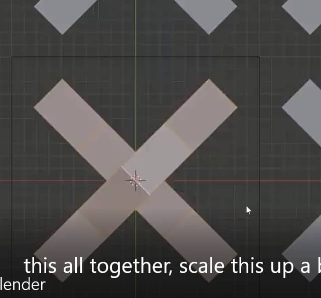
  
  - 回到`object mode`，**应用布尔修改器**
  
  - 选中边缘四个角的点，S-Z-0 打平
  
    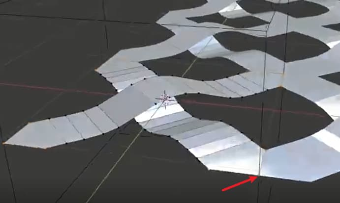
  
  - 添加solidfy修改器和bevel修改器，增加厚度和倒角(记得勾选 auto smooth)
  
- 做树枝
  
  - 用点画出主干
  - 添加`skin`
  - 进入编辑模式，a全选，ctrl+a 收缩(或 cmd + a + x )
  - 选择单独节点 ctrl+a 调整
  
- 做树枝-方法2

  - 新建`Grease Pencil - Blank`
  - 切换到`draw`模式
  - 坐标选择`Stroke`
  - 打开`Auto keying`，画树干
  - 切换到`Object Mode`，covert to path
  - `alt+s`调整每个部分的粗细

- 做蔓藤
  - 做要放置蔓藤的平面区域（切分会影响生成方向和密度）
  - 做树叶
  - 在区域中添加粒子生成器
  - `Render`选择`Object`，物体选择树叶
  - `Physics`选择`none`
  - 调整`Rotation`里的参数
  
- 做冰块
  - 切换到雕刻模式
  - 使用`scrape`
  - `n`打开属性面板，选择`tool`，勾选`Dyntopo`，`Detail size`调小
  - 这样边雕刻，物体会增加细分
  - 最好雕刻完以后，把该物体做为高精模烘到低精上，直接渲染会死机
  
- 做道路网格

  - curve画道路网
  - 转为mesh
  - 添加 skin 
    - 进入edit mode , cmd + a (或 cmd + a + x/y) 调整宽度
  - 添加Decimate 精简面
    - 选择 Planar
  - 在Object Properties - Viewport Display - check Wireframe 可查看精简后的面的样子
  - 清理面
    - 选择一个面, shift + g 选择所有相似法线面 / 左上菜单 select - select linked - linked flat faces
    - cmd+ i 反选 删除
    - 把面分解好(用插件 MACHIN@tools快速切分面) f 合并面
  - 做路肩
    - 选择一条边, shift+g - Amount of Faces Around and Edge 
    - shift+d 复制, p分享为单独的物体
    - 把出口删除(即线不可以封闭), 转为曲线
    - 在顶视图, 画一条曲线如下图
    - 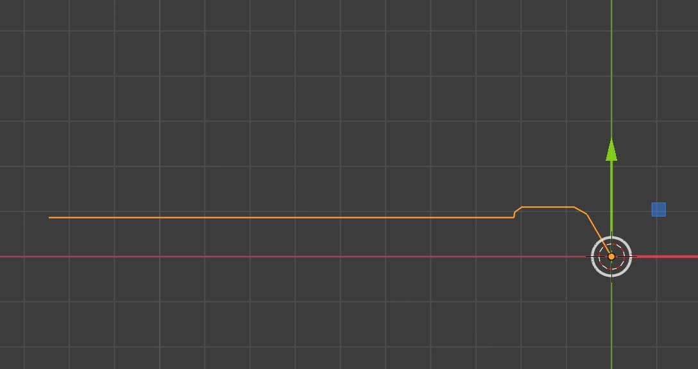
    - 选择刚分离出来的曲线 Bevel - Object -选择上一步的曲线
    - 调整上一步曲线的形状和大小
    - 在 viewport overlays 中打开 face orientation查看法线方向, 蓝色为上
    - 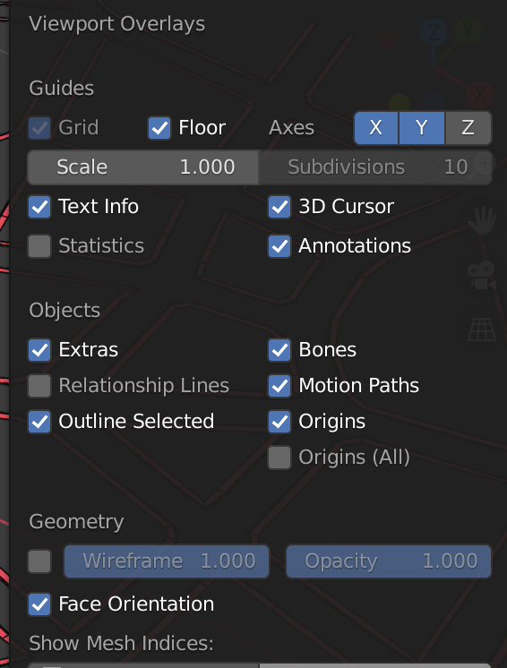
    - 修复法线方向:
      - 选择路肩形状曲线, 编辑模式, 选中所有, 左上菜单 - Segments- Switch Direction
    - 把路肩转为mesh
    - 


### array的技巧

- 做螺旋线
  - 创建一个物体，array
  - 建立一个空物体 `Plain Axes`
  - 在array中勾选`Object Offset`，物体选择空物体
  - 使用R旋转，S缩放
  - 勾选`Merge`，`distance`调大
- 沿曲线array不变形
  - 创建平面，array
  - 添加 curve，物体选择曲线
  - 新建一个物体，把该物体做为平面的子物体（ctrl+p）
  - 在`Object properties-instancing`里选择`Face`，去掉`Display Instancer`的勾选
  - **应用后让Instances实体化: `Object - Apply - Make Duplicates Real` ** (快捷键 Ctrl+a)


### 补洞

填补模型上不连续的破洞

- 编辑模式-边
- 菜单`Select-Select All by Trait-Non Manifold`
- F to fill these holes
- Ctrl+T 转为三角形填充（这样可以让拐角的图形格式化）
- Alt+J 合并三角形为矩形


## 人体建模

### 建模及导出技巧

- **建模**
  
  - <p style="background-color:red;"><b>建模时先建空对象把各部分放成子对象, 再绑骨骼</b></p>
  
  - 把被衣服遮盖的四肢分开建模, 这样方便上色和调整骨骼绑定
  
  - 使用`Decimate`修改器精简面

### 人体建模技巧

- 头部
  - 方法1: 建正方体 cmd+2
  - [方法2](https://www.youtube.com/watch?v=xCrmYQlzp2A)
    - 正方形, 编辑模式, 细分:5
    - 删除一半, 镜像
    - 再次进入编辑模式, 在中部添加一条环线(做为鼻子的分隔线), 中部6块挤出
    - 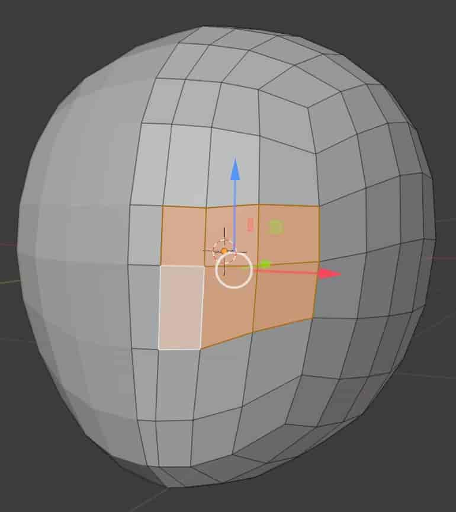
    - 调整后, 沿眼周cut一圈, merge掉一些三角形区域
    - 挤出嘴, 缩小成嘴缝, 删除面, 调整好后加一圈线做嘴唇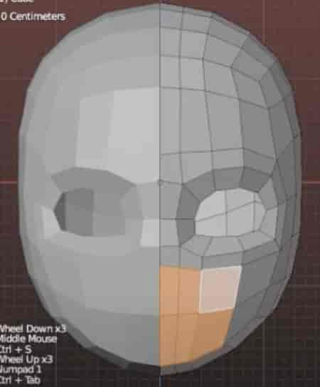
    - 挤出鼻子, 挤出鼻子时要把鼻翼一起挤出
  - 方法3(有设计图)
    - 沿眼睛围一圈, 嘴围一圈, 连起(需要练习)
  
- [身体(方法1:从腿往上)](https://www.youtube.com/watch?v=lyMvUhHlbG4)

  - 添加一个6边形平面, 进入编辑模式, 沿x轴移动一点(注意中心点保持在原点上), 添加mirror修改器
  - 挤出双腿, 向内侧倾斜, 挤出裆部
  - 向上挤出肚子, 放大一些, 在侧面向前倾斜
  - 挤出身体, 把前面两片和后两片向上挤出, 留出手臂洞
  - 挤出手臂, 手臂留出胳肢窝的位置(挤出2次), 再拉出手臂
  - 腰部加环线, 胸部加环线
  - 腿部加环线, 选择前面两片, 挤出脚
  - 收紧头部, 挤出脖子

  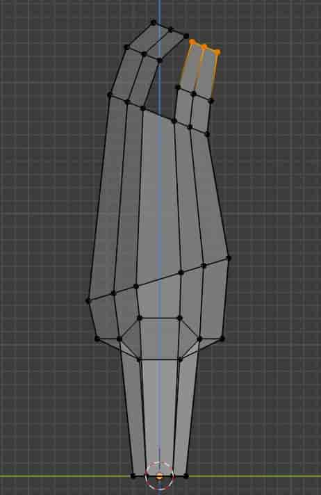
  
- [手(单独建)](https://www.youtube.com/watch?v=HC7dlP9cRpU)

  - 正方体, 压扁, 切分3段
  - 从顶视图调整手掌的形状
  - 分别挤出四个手指, 分两段
  - 用侧面挤出拇指
  - 挤出手腕, 连接手臂(手掌10个节点, 如手臂是8个节点, 手臂需要加两个环线再连接)
  - 检查法线

### 父子关系

- 如果解除父子关系不起作用，试试ctrl+j合并两个物体，再进入编辑模式，L，P解除合并

- 如有一对父子关系物体，想让新物体 C 跟随父物体 B 运动，但不绑定为新的子物体，可在`ObjectConstraint Properties` 中添加 `Copy Location`或其他， `Target` 选择子物体 B（或者在pose mode下，先选B，再选C，shift+ctrl+c)
- 勾选`Offset`可以移动 C ，让 C 和 B 有距离，调整`Influence` 可以调整影响的强度
- 如果`Spece` 选择 `World Space <--> World Space`，两者都使用世界坐标移动；如果选择`Local Space <--> Local Space`，则双方以自己的局部坐标方向移动；

## 骨骼绑定

### 骨骼绑定的要点

- **备用组 deform**
  
  - 用于导入其他软件做绑定动作，默认从tgt组复制，没有IK组件，所有骨骼和root绑定
  - 所有骨骼都copy transforms from tgt组
  
- **控制组 control(torso组)**
  
  - **ctrl-root**：控制整个人物的位置，一般放在平行于腿的后侧
  - **ctrl-torso**：控制驱干，`parent:root`
  - **ctrl-spine/hips**：控制上半身和胯部，`parent:torso`，`copy rotation from chest`
  - **ctrl-chest**：控制腰部到脖子，`parent:torso`
  - **ctrl-foot-roll02**：控制脚踝的上下转动
  - **ctrl-foot**：总控脚部运动位置
  - **ctrl-pole-leg**：控制膝盖的朝向，`parent:ctrl-foot`，**绑定ctrl-foot后可解决抬腿时膝盖后折的问题**
  
- **机动组 mechanism**
  
  - **mch-neck-rot**：带动neck-int-rot，让neck-int-rot跟着动，`parent:ctrl-tweak-chest`
  - **mch-neck-int-rot**：控制脖子 neck  `parent:torso`，`copy location/rotation/scale from neck-rot`
  - **mch-head-follow**：带动int-head-follow，`parent:tgt-neck`
  - **mch-int-head-follow**：`parent:ctrl-torso`，`copy location/rotation/scale from mch-head-follow`，此时需要重新把tgt-head和mch-int-head-follow绑定成父子关系，让此控制head
  - **mch-ik-foot**：控制大小腿和脚的反向动力学活动，`parent:root` ，对齐tgt-foot.L，让tgt-foot.L copy transforms from mch-ik-foot，因为tgt-foot被mch-ik-foot控制，可以把tgt-foot的parent修改为root，`parent:mch-foot-roll`
  - **mch-foot-roll**：控制前脚掌的转动，`parent:ctrl-foot`，`copy rotation from ctrl-foot-roll02`，设置转动范围`limit rotation min:0 max:180`
  - **mch-foot-roll02**：控制后腿跟的位置，设置转动范围`limit rotation min:-180 max:0`（或者先选中02，再选中roll，左上角`pose-constraints-copyconstraints to selected bones`），`parent:ctrl-foot`
  
- **总控组 properties**
  
  - 放在头顶，用于控制各控制组件的强弱  `parent:root`
  
  - **控制neck**
  
    - 在`pose mode`下，在`bone properties-custom properties`中添加`neck-follow`，复制`data path`
    - 在`neck-int-rot`的`bone constraint properties`的`copy rotation neck-follow`的`influence`中`add driver`
    - `averaged value` `simple property`，粘贴之前复制的path data
  
  - **控制head**
  
    - 添加`head-follow`，`copy data path`
  
      - 复制脖子的旋转driver，粘贴到头部的旋转influence上
  
      
  
- 建立骨骼前注意把坐标归零 shift+c

- 把骨骼名字显示出来，养成给骨骼命名的习惯

- 确保躯干和腿所有骨骼的Z轴都面向前，手臂骨骼的Z轴向上

- **在编辑骨骼时，应该一直使用`individual origins`**

- 中心骨骼（root）的坐标必须保持和世界坐标一致，动画时control骨骼延局部坐标移动，如果局部坐标和世界坐标不一致，移动时不直观，中心骨骼一般位于整个模型的底部中心
  - 先沿Z轴建一根骨骼，命名为root
  - 点击骨骼的tail,shift+s,选择 selection to cursor
  - 沿Y轴移动Tail
  - 或沿Z轴建一根骨骼，再沿X轴旋转-90度
  
- 使用`Bone Layer Manager`管理骨骼层 [地址](https://gumroad.com/l/STdb)
  - 使用`Bone Layers`右边的圆点可以把选中的骨骼加入该层：先选骨骼，再点圆点
   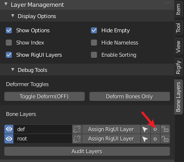
  - **root不需要deform，把root单独放到一层中，把其他骨骼全选，shift+w - deform**
  
- 做好单边骨骼后，复制一份，原骨骼层（DEF）做为导入到其他软件的骨骼结构，复制的骨骼可以放到单独一层，教程用命名为TGT层

- 使用TGT驱动DEF，先选中TGT的单个骨骼，再选中DEF的单个骨骼，shift+ctrl+c-copy transforms，此操作可把DEF层的骨骼互相解绑

- 把TGT层的`deform`取消，之后和人体绑定时不会绑到TGT层和ROOT层

- 把人物的Armature置于细分之上

- 刷权重时，**注意权重影响的是DEF（deform）层，TGT层用于控制人物动作，所以刷权重需要让DEF层显示，TGT层隐藏，不然会找不到所选择的骨节对应的蒙皮区域**

- 使用`Simple rename panel`管理批量命名（此插件可以重命名所有物体，不仅骨骼） [地址](https://gumroad.com/l/simple_renaming_panel)
  
  - 把需要批量命名的骨骼放到同一层，全选，使用“在选择的物体中替换”


### 骨骼绑定方法1

使用骨骼绑定控制物体行动的原因是：调整骨骼动画时，变换父级，子级动作也会被记录下来，而直接用物体做动画时，子级动画不会被记录，每个物体的运动是独立的

- 添加骨节:     
  1. e (同时按鼠标中键可保持90度)，之后shift+r，可以往一个方向同比挤出
  2. 右键 `subdivide`
  
- 添加没有父节点的骨头:shift+a

- 在关节之间加骨骼:f

- 让解除关联/新添加的骨骼关联到物体：shift+w-deform/alt+left click deform(选择多段骨骼时好用)

- 显示骨骼名称：`Object Data Properties-Viewwport Display`，勾选`Name` & `Axes`

- **在编辑模式下调整骨骼朝向**：ctrl+r

- 在骨骼模式下**刷权重**（该模式下可以移动骨骼查看效果）
  - 物体模式下先选中骨骼，再选物体，进入权重刷编辑
  - 按住ctrl，点击左键选择骨节，此时会同时显示此骨节影响的蒙皮
  - **打开`Object propertise-Viewpoint Display`里的 `wireframe`，可以清楚看到权重对面的影响**
  - 使用面选择，按住ctrl选择面，可以把编辑范围限定在选择的面中
  - 推荐使用subtract和mix笔刷，subtract时，使用最后一个preset笔头；mix时，使用1的强度，低一点weight
  - **如果你的角色前臂运动总是影响了胸部和前臂，那是不对的**
  
- **对齐骨骼**：选择骨骼，再选择被对齐骨骼control+alt+a

- 解除父子关系: 在子节处     右侧骨头 删除父对象(alt+p，alt+p可以选择disconnect bons 或 y，y直接解除父子关系)

- 命名单侧手脚时要加  .L,全选单侧骨骼 (顶上中部的transfomr     pivot point 要换成3d cursor)- 右键:symmetrize

- 重新关联父子关系:     ctrl/cmd + p

- 添加IK: 先选IK, 再选骨骼, pose mode: shift + i

  - **几个重点IK**
    - Root: 在两脚之间, 控制整个身体的位置, 是Torso和FootIK的父级
    - Torso: 在尾椎, 控制上身躯干, 是尾椎的父级
    - Foot: 在脚踝, 控制脚, 在pose mode下, 先点击IK, 后点击小腿骨, ctrl+shift+c - inverse kinematics ,是knee的父级
    - Knee: 在膝盖, 在小腿的运动约束面板下添加此IK

  - 把脚的骨骼清除父级(这样在用Torso控制身体时脚不会穿过地面), 在pose mode下, 先选小脚骨, 后选脚骨, ctrl+shift+c - copy location, 在运动约束面板下, 把Head/Tail 拉到1
  - 把以上IK选中, 在骨骼面板下, Alt+LMB 取消Deform

- 先选人体,再选骨架, ctrl+p

- 回归初始状态:     pose mode- alt+r/alt+g/alt+s

- 单独部件(例如眼球)未和身体一起绑定时,可单独选择眼球和骨架:cmd+p,选with empty groups/bone, **如果绑定出错, alt+p 清除附件(眼球)的父级, 重新绑定

- 权重刷:object     mode-weight paint

- 权重刷一般用add模式

- 在edit mode里,选中要显示的骨头(带控制器的),m键加入图层,把其余的关闭显示

- 使用pose  mode设置动作时,要选择 Local坐标,不能用Global坐标

- **使用自动分配权重后,进入模型edit mode, 左上菜单Mesh-Weights-Normailze All 来重新计算权重**

 

### 骨骼绑定方法2:  rigging:rigify

- 插件  rigging:rigify
- 骨骼对齐模型
- 绑定IK: 选Object Data Properties(小人跳舞的图标)-Generate     RIg
- 脚踝后的横向骨骼要和脚面最宽的部分一样长
- 先全选模型,再选骨骼,ctrl+p—with automation weights
- 如果要调整骨骼, 调整后保持骨骼在显示状态, 重新生成rig
- **[非常重要] 如果用自定义骨骼, 在`pose mode- bone properties-Rigify Type`里给骨骼选择类型, 之后使用`Generate rig`才会生成rig**
- **如果一个场景里有多个rig, 在generate rig之前, 先打开Advanced Options, 把默认的overwrite切换为 new**
- **在edit mode - Object Data Properties(小人图标) - Rigify Buttons 中, 有很多骨骼样板可以参考**
- **使用Rigify里的`Rigify Layer Names`管理图层**(在小人菜单下)
  - 在`pose mode-Rigify Layer Names`下按`Rigify Bone Group`设定图层颜色, rig以后可以用颜色区分图层
  - 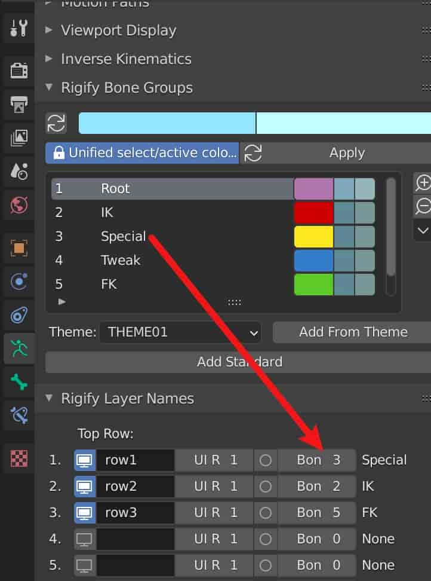
- 骨骼对齐模型，ctrl+a 应用变换
- 绑定IK: 选Object Data Properties(小人跳舞的图标)-Generate RIg
- 删除原骨骼
- 在 Object mode下，先全选模型,再选生成了IK的骨骼,ctrl+p—with automation weights
- **控制技巧**
  - IK/FK切换: 在pose mode下, N菜单-Item, 点击控制IK, 菜单会对应切换到IK/FK控制板, 默认使用IK模式, 如果要切换为FK模式, 点击FK控制部分(例如大臂), 在菜单中把 IK-FK(hand.L) 拉到1
  - IK/FK切换后动作跟随: 当使用IK/FK摆好姿势后, 想继续切换到另一个模式摆姿势, 点击 IK->FK(hand.L)(有个磁铁标志)
  - 更方便控制手肘的转动: 选择手掌IK, 点击 `Toggle Pole`, 出现控制手肘的控制器
  - 让模型保持正常长度: 默认模型的长度跟随控制器伸长变长, ~~把菜单中的 `IK Stretch` 拉到0, 可以让模型保持原来的长度~~, **小人图标 - Inverse Kinematics - IK Solver : iTaSC
- **修复技巧**
  - rig以后发现有部件没有显示widget(一般表现为骨骼底部的圆圈)
    - 在 pose mode 下查看 Bone properties(骨头菜单) 的  Rigify Type-Options 有没有勾选 Widget
    - 如果没勾选, 重新勾选
    - 在上面资源菜单中右击 Widgets- Delete Hierarchy
    - 重新 Genearte Rig


### 在绑定骨骼的人物上加衣服

方法1: 

- 添加Cloth  modifier
- 调整Quality  steps(往高调整)
- 调整Tension(往低调)
- 调整Stiffness(僵硬)/Damping(衰减)-bending(往低调)
- 勾选     Collisions-Self Collisions
- Collisions:     distance(调高)
- 给人物身体添加Collision,勾选single Sided

**方法2(推荐): **

- 选择衣服, 选择rig, ctrl+p-自动权重（或empty)

- 添加其他配件: 把配件都ctrl+j结合, 之后分别给配件分配骨骼控制组(在edit mode-Object Data Properties-Vertex Groups  assign 控制组)

- 人物做动作时模型穿出衣服外面：给人物模型**衣服遮盖部分**打组，人物模型加 mask 修改器，选择组，即把衣服遮盖部分的身体隐藏，解决穿模问题

- （可选）在骨骼修改器下添加面料修改器

  - 将布料钉在骨架上

    布料可以模拟并固定在骨架上。例如，一个角色可以用腰带将一件宽松外衣固定在角色的腰部。

    固定操作的典型工作流程：

    1. 将骨架设置为绑定姿势。
    2. 建模出包裹但不穿透角色的衣服。
    3. 将骨架设置为衣服的父级。现在骨架将有几个绑定到它的子级网格。
    4. 在每个布料对象上为固定的顶点创建一个新的顶点组。
    5. 将要固定的顶点添加到此顶点组，并为这些顶点赋予非零权重（您可能希望权重=1）。例如，外衣的腰带区域将位于权重为1的顶点组内。
    6. 在属性编辑器的物理选项卡中将衣服对象指定为“布料”。确保布料修改器位于修改器堆栈中的骨架下方。
    7. 按下 *布料* 面板中的 *固定布料* 按钮并选择顶点组。
    8. 在属性编辑器的物理选项卡中将角色的网格指定为“碰撞”对象。
    9. 现在衣服已经准备好了。非固定的顶点将受到布料修改器的控制。固定的顶点将受骨架修改器的控制。

### 骨骼动画

- 大多数骨骼运动是基于局部坐标，而不是世界坐标，所以在最初建立骨骼时，尽量让骨骼的臂部坐标和世界坐标一致 
- 给某个骨骼添加帧动画：选中要记录动画的骨骼，i


## 摄像机

- 摄像机视图: 小键盘0(正交摄像机:属性选择Orthographic)
- **把当前视角设置为摄像机视角: ctrl + alt + numpad0**
- 旋转摄像机视角: 上一步后,点击视角边缘, g移动 r旋转
- 锁定摄像机: N-View-Lock Camera to View
- 切换多个摄像机: 选中摄像机, cmd+Numpad 0

### 摄像机跟随路径动画

使用 camera constraints tract path 搜索

- 新建曲线（贝塞尔曲线）
- 新建 empty cube
- 在 empty cube 添加 follow path, target 选择曲线
- 摄像机添加 child of 修改器，选择空对象（调整摄像机的location可以调整摄像机和空对象之间的距离）
- 摄像机添加 track to 修改器，target 选择**需要跟拍的对象**（保证 track to 在 child of 修改器下）


## 动画

- 清除所有动画帧: 物体模式-物体菜单(左上角)-动画-清除关键帧

- 在需要做动画的坐标上右键，`add driver`

- 打开`drivers`编辑器，调整曲线

- 在对应的属性页面的`custom properties`中(如果要控制骨骼，应在骨骼控制页面（**pose mode**）中添加)添加新值，起名，保存，右键`copy data path`

- 在`drivers`编辑器中，把刚复制的path粘贴到`path`一栏，`prop`可以选择物体本身

  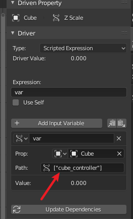

  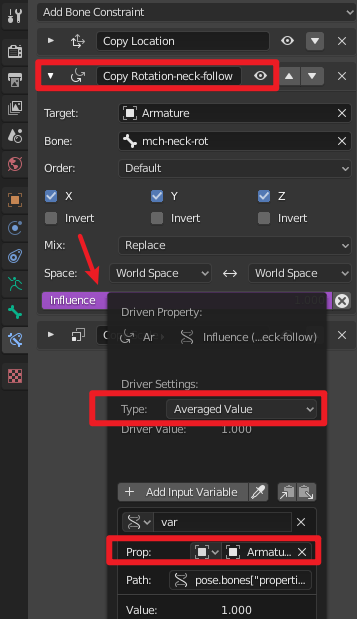

  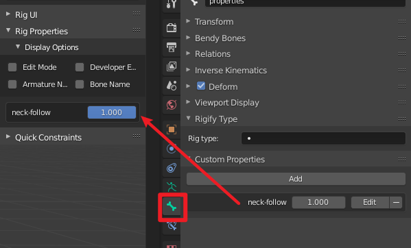

  

### k帧快捷键

- 切换时间轴到Graph editor: ctrl+tab
- 修改动画平滑度 set keyframe interpolation: t
- 给动画添加修改器
  - 在左侧选择要修改的动画
  - n 调出右侧菜单, 选择 modifiers
  - add modifiers


## 拓扑: 

- 雕模
- 安装bsurfaces
- 点击  `Edit - Bsurfaces - Initialize(Add BSurface mesh)`
- 使用画笔工具在物体表面画线
- 点击 `Add Surface`
- 选择边缘一排的点，点击 `Add Annotation` 继续画线
- 再次点击 `Add Surface` 把画笔的线转为面
- 镜像:勾选 clipping, extrude时可以自动合并镜像点
- 安装looptools     右键,再右键添加到收藏, 可使用q 调出收藏快捷菜单
- 选择连续几个点:     cmd+左击
- looptools     - loft: 顶点分散
- looptools     - space: 顶点均匀分布

### 场景建模技巧

- alt+g 物体位置归零
- options，选择“affects origins”，移动原点时吸附表面，让原点落到底部
- 曲线加点:编辑模式下, 选中两个顶点,选择左上角菜单-细分
- 导入其他blender文件:用 link或append
- 在编辑模式下添加细分, 使用smooth工具平滑

##  UV

### 技巧

- 查看选中的UV对应的部分: NumPad 句号

### UV适应

- 给物体添加材质- `Emission`, 颜色选`Image Texture` ,载入图片
- 在编辑模式下,点击U, 选择`Project to view`
- 添加一个界面, 选择`UV Editor`

### UV绘制

- 切换到UV     Editing, press u, select smart UV project, then switch to Texture Paint,     create a new image
- 切换到     Shading, 新建一个checker Texture, 选择上一步保存的image, 连接到roughness, 此时被上了UV的面会全反射环境, 再painting,     能把不需要反射的部分擦除

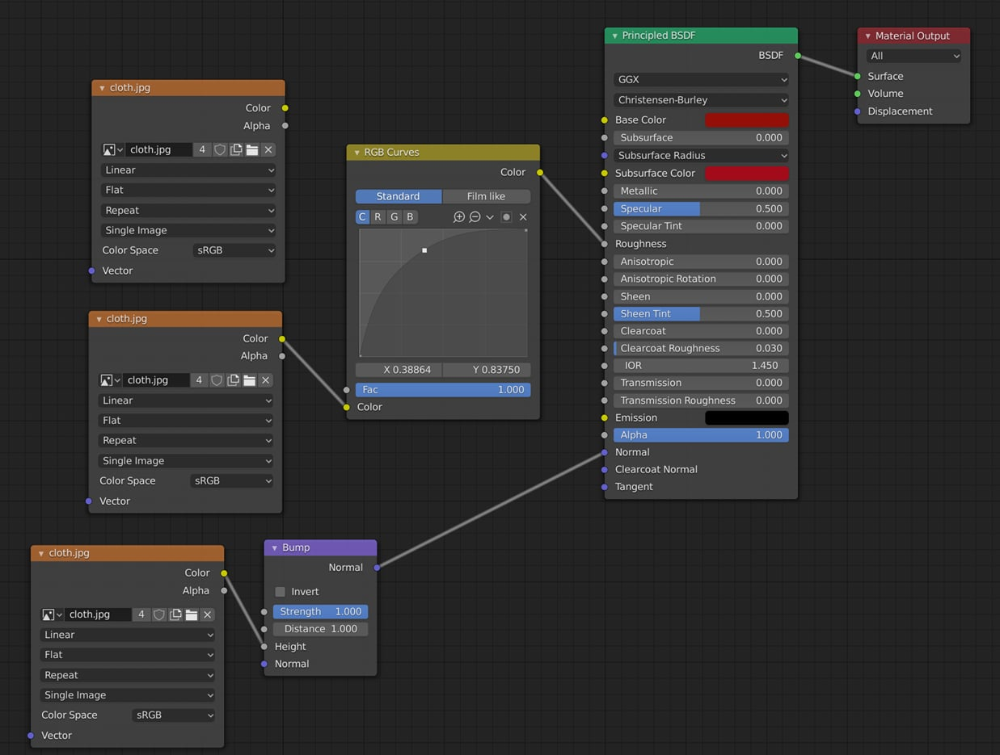

 

###  物体使用不同UV

- 给整体加texture
- 复制一个材质，在编辑模式下assign需要另赋材质的部分
- 切换到物体模式，把整体材质取消复制标志（这样可以单独调节一个物体两部分的材质）
- 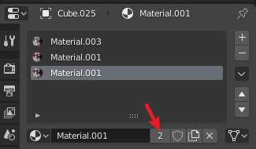
- 在UV Editor里单独调整材质

## 烘焙

### 高分烘给低分

- 使用插件**BAKE WRANGLER**，[教程](https://www.bilibili.com/s/video/BV14z4y1R789)

### 法线贴图

- 复制一个模,做成高精, 雕刻
- alt+g把两个模对齐
- 给低精械添加一个材质,添加 image texture，color-space：    non-color
- 渲染模式改为cycles,     在bake中设置bake type为normal
- 勾选     Selected to active
- 先选择高精模,再加选低精模,点击bake
- 如果法线渲染出来有没覆盖好的, 调Ray distance
- 回到     shader editor, 添加normal map,把image的color连接到normal     map的color, then link normal map’s normal node to     principled BSDF’s normal node
- 如果要添加表面凹凸, 添加一个Displace modifier, Texture选择到刚才渲染好的贴图

### Simple Bake

- 选择需要烘焙的setting
- 设置 Bake Margin
- 勾选Export bakes
- 命名 Batch name
- 勾选 Copy objects and apply bakes 
- 多个物体材质烘焙到一张图上
  - 先把两个物品的UV在一张图上展好(位置不能重叠)
  - 勾选 Multiple objects to one texture set


## Weight Paint

- 渐变：alt+左键拖拽
- 镭射渐变：ctrl+alt+左键拖拽
- 笔刷大小：f
- 调整笔刷Weight：cmd/ctrl+f(weight为1和add效果一样，weight为0时和substract效果一样)
  - 在骨骼权重上建议**保持weight为0或1，不要有中间态**，使用streight调整强度
- **勾选工具（右侧有个螺丝刀和扳手的图标）- Options - Auto Normalize and Multi-Paint**


## 材质

### 快捷方式

- 清理不用的材质
  - 右上列表, 切换到 Orphan Data 
  - 拉开, 最右侧: Purge

### 地面

- 新建一个平面
- 编辑-u-展开UV, 切换到UV绘制模式
- 给平面添加一个基本材质
- 切换到 Active Tool and Workspace settings (右侧第二个工具栏(螺丝刀和扳手图标))
- 点击 + 新建一个基本面贴图
- 点击 + 新建 Normal 贴图
- **放大物体, 但材质不放大的技巧: **
  - 编辑模式 - 右上角 Options - 勾选 `Correct Face Attributes`

### 自发光

- 渲染菜单中, 勾选`Bloom`(显示自发光) `Screen Space Reflections`(显示反射)

- 材质设定

  ````mermaid
  graph LR
  A[Fresnel]-->|Fac--Fac|B[ColorRamp]
  B-->|Color--Fac|C[Mix Shader]
  D[Emission 衰减]-->|Emission--Shader|C
  E[Emission 高亮]-->|Emission--Shader|C
  C-->|Shader--Surface|F[Material Output]
  ````
  
  
  
  


### 玻璃材质

- 使用默认材质，把`Transmission`调到最大
- **`Render Properties`勾选`Screen Space Reflections`，点开设置，勾选`Reflaction`**
- 回到物体材质编辑，`Settings`，勾选`Screen Space REfraction`

### 透明

- 材质面板 `settings-Blend Mode-Alpha Blend`
-  在`Surface-Alpha`拉到0 

### 水面

- 细分, 把顶面添加到一个新组, 细分顶面
- 添加Displace修改器, 应用到顶面
  - 编辑Texture, Type: Cloud(可尝试其他贴图), 调整Size
  - 回到修改器, 调整strength和Direction(to z)
- 材质设置
  - 显示设置里打开 Ambient Occlusion, Bloom, Screen Space Reflections (打开下拉菜单, 勾选 Reflection)
  - 材质: Settings-Shadow Mode : Alpha Hashed
  - 勾选 Screen Space Reflections
  - Transmission: 0.9
  - Roughness: 0.05
  - IOR: 1.333

### 即时更新贴图

- 展UV
- 新建一个贴图, Generated Type : UV Grid
- 全选UV, 顶上菜单 UV - Export UV Layout ( Fill Opacity : 0)
- 打开 PS / GIMP , 载入上一步的图
- 保存为 **psd**
- 回到 blender, 把贴图改为上一步的psd
- 在 PS / GIMP 中编辑, 保存
- 回到 blender , 在 UV Editor **Alt+R** 更新贴图

### 用bump做normal贴图

- 分窗口 
  - 窗口1: Image Editor, 模式 Paint
  - 窗口2: 切换到 Texture Piant模式
- 右侧菜单 Active Tool and Workspace settings(螺丝刀和扳手icon), 新建一个贴图, 选择 **Bump** 
- 画好后, 切换到渲染菜单, 选择 Cycles
  - Bake Type: Diffuse
  - Contributions: 取消勾选 Direct Indirect
  - Bake
- 导入 Unity , 图像模式选择 UV

## 渲染

### 打开降噪:     compositing

- use      nodes(左上角)
- view      layer(右侧)-Passes-Data-Denoising Data
- node界面: add Denoise

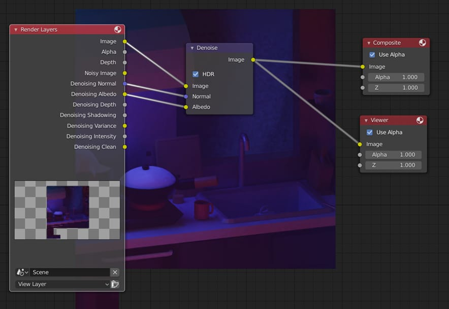

### 加雾效

- - 放一个box,      box显示模式设置为线框, 给box加shader

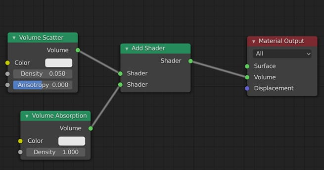

- 局部渲染:cmd+b(取消局部渲染: ctrl+alt+b)
- 渲染出图: 菜单-render-render image

### 2D风格渲染参数

- `Diffuse BSDF + Shade to RGB + ColorRamp`

### 透明背景

Render Properties - Film - Transparent  打勾

## 常用快捷键

f: fill / alt+f(beauty fill) 

grid fill : ctrl/cmd + f then grid fill

挤出: e or ctrl+right mouse button(再按s,沿法线方向挤出) 

分别挤出(做手指时):alt+e

连续先边/点: 首顶点,ctrl 尾顶点

切分: k

松弛

合并顶点: alt + m

衰减编辑开关(调整物体形状): o (shift+o 可以变换模式)

雕刻模式smoothly : shift+左键

在空白处添加新点: ctrl/cmd + 右键

移动模型出现的中心点: shift + 右键(中心点归位: shift+s 中心点回到物体中心:ctrl+shift+alt+c)

桥接循环边：ctrl+e

沿法线方向缩放：alt+s


把节点一分为二: v

独显物体某部分: shift+h

反选: cmd+i

使用snap把分享的组件合起(例如手臂和身体)

快速顶点对齐:s-z/y/x-0

选中的物体视图居中: shift+c

物体弯曲:先设定弯曲点(shift+右键), 再shift+w

重新计算法线:shift+n

线框模式：shift+z

delete:x

make face: alt+f

rotate: r

scale: s

move: g

merge: m

change view mode: z

create model: shift+a

exchange edit mode: ctrl+tab or click menu ‘sculpting’

exchange sculpting: shift+space

change brush radius/strenght: f /shift+f

invert brush: ctrl

smooth brush: shift

loop line: alt+left click

dulicate : shift + d

select box: b

zoom area: shift + b

zoom : cmd + left mouse

半透明: alt + z

切分: 编辑模式-右键subdivide

调出插件工具条: n

导入: f12

选择所有相连元素: ctrl+L

擦除: cmd + (三指)

检查面朝向: show overlays - face orientation 

法线方向菜单: 编辑模式下选择所有面, alt + n

查看法线方向: 左上 global - 改为 normal

编辑-点模式-alt+左键: 选择相邻点

添加细分: cmd + 2(需要关闭数字键映射)(反细分: modifier - decimate - unsubdivide/edge-unsubdivide)

挤出: 编辑模式-ctrl+右键（沿法线挤出：alt+e）

倒角: ctrl/cmd + b

两个对象合并: ctrl + j (合并后不能单独处理单个对象, 但可以共享modifier

反细分: modifier - decimate - unsubdivide/edge-unsubdivide

内挤出: i (如果再点击B, 可以让镜像边不挤出)

改变曲线控制柄类型:v

正交视图:Numpad-5

