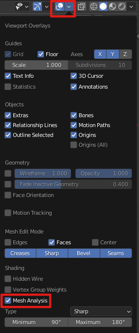

# Blender 3D Print

## 插件

### 打印检查

- Print Toolbox

### 在线检查和修复工具

- [微软的](https://tools3d.azurewebsites.net/)

## 打印检查

### Print Toolbox

- Statistics：统计，可以提算出模型的体积，可供打印备料参考。
- Error Checking：错误检查
  - **Solid**：检查模型是否完整正确，是否有法线问题等。
  - **Intersections**：是否有交叉面。
  - **Degenerate**：是否有0边界或0区域
  - **Distorted Faces**：是否有扭曲的表面，大于3边的多边形都有可能不平整。
  - **Thickness**：厚度检查
  - **Sharpness**：锐度检查
  - **Overhang**：悬空面检查 
- Cleanup：清理，批量清理单独的点，线等。
- Rescaling：缩放，根据前面的统计结果，可以按需要的体积缩放。
- Export：导出，导出选中模型，文件名默认为blender文件名+模型名。

### [Mesh Analysis](https://docs.blender.org/manual/zh-hans/3.2/modeling/meshes/mesh_analysis.html)

编辑模式下，打开 **Mesh Analysis**

#### 参数解释

- **Overhang 悬垂**：挤出型3D打印机对可打印的悬垂网格有物理限制，该显示模式用于显示悬垂的可调整角度范围和轴向选择。
- **Thickness 厚(宽)度**：打印机存在 *壁厚* 限制，过薄区域无法打印，该测试使用光线投射和距离范围来测量几何对象厚度。
- **Intersections 交集**：打印问题的另一个常见原因是曲面之间的交叉，这些位置的模型的内侧、外侧无法被可靠地检测到。与其他显示模式不同的是，交集没有各种选项，只能打开或关闭。
- **Distortion 畸变**：当一个畸变的多边形未被三角化时，畸变的几何结构会导致发生问题。畸变是通过面的不平坦程度来衡量的，面的部分区域指向多个不同的方向。
- **Sharp Edges 锐边**：与壁厚相似，锐边会形成太薄而无法打印的形状。
