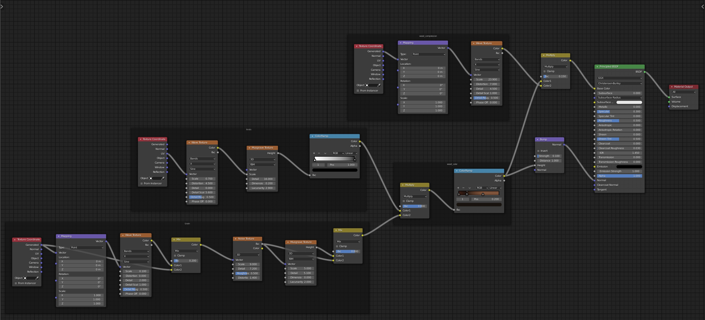

# Blender Node

## Themes

### 改变节点连接线的曲度

- Edit -Preferences-Themes-Node Editor-Noodle Curving
- 默认为0(直线), 增加节点即增加曲度

## Animation Node

下载安装插件 [Animation Node](https://animation-nodes.com/)

- 半透明节点表示 输入/输出 为list

### 快捷键

- 调出node input output面板: u

- 自动连接两个node: 选中要连接的node, f

- 右侧菜单: n

- 左侧菜单: t

- 节点打组: ctrl/cmd+g

- 进入/退出组编辑: tab

- debug: 在output添加 `viewer`节点

- 切断连线: ctrl/cmd+right click

- 组织nodes: 添加`frame`节点

- 添加连线中点(把一对多的节点打结): shift+right click
  
  

### 技巧

- 节点打组后, 把需要调整的参数连接到`group  input`可以在组外调整

- 记住初始transforms
  
  - 右侧菜单 - AN - `initial transforms - from current transforms`
  - 在`animation nodes`中添加`object id key`, 选择object, 选择`initial transforms`

- 创建实例并应用modifier
  
  - `object instancer`
  - 勾选`copy full object`

- 创建矩阵
  
  - 创建实例 `object instancer`
  - `matrix - distribute matrice`
    - 查看矩阵分布形态, 添加 `3d viewer`
  - 添加`get list length`得到 matrices的数量
  - 把length连接到 `object instancer`上
  
  .jpg)
  
  - 添加`offset vector` 和 `random falloff` 添加random
    
    .jpg)

## Shader Node

### fake volumetirc light 假体积光

- 创建一个平面, 命名为 EV
- 创建一个空坐标对象, 命名为 G1_Control, 用于调节灯光照射距离
- 创建另一个空球形对象, 命名为 G2_Control, 用于调研灯光直径
- 在EV中添加节点`emission` `Gradient Texture` `ColorRamp`
- 在`Gradient Texture`上 Ctrl+t  添加 Mapping 和 Texture Coordinate(需要提前安装 Node Wrangler 插件 )
- 把 Texture Coordinate, Mapping, Gradient Texture, ColorRamp打组(cmd+g), 命名为 H_V_Control
  - 进入H_V_Control, 把`Texture Coordinate`和`Mapping`的连接改为使用`Object`, Object 选择G1_control
  - ColorRamp 类型选为 B-Spine
- 复制一个H_V_Control, 重命名为 V_V_Control
  - 进入V_V_Control, Object 选择G2_control
  - Gradient Texture 选择Vector
  - ColorRamp 按辐射的方式调整(中间纯白, 两边纯黑)
- 把H_V_Control和V_V_Control用Mix RGB连接, 命名为 Control Mix RGB
- Control Mix RGB 连接到Emission
- 添加一个Transparent BSDF和一个Mix Shader
- 把Transparent BSDF和Emission连接到Mix Shader
- 把G1_control和G2_control作为FV的子对象
- 添加Noise Texture, ctrl+t添加Mapping和Texture Coordinate
- 添加一个空立方体对象, 命名为Noise Control, 添加到Noise的 Texture Object里, 控制Noise的移动
- 复制一个Mix RGB, 把Noise Texture和Control Mix RGB连上去, 输出连接到Mix Shader的Fac里
- 设置摄像机
- 因为FV是2D的, 光也是2D, 需要让2D的面一直面向摄像机伪装成3D, 在EV的Object Constraint Properties里添加`Locked Track`, Target选择Camera, Track Axis 选择-Z, Locked Axis选择Y
- 设置Noise动画
  - 选择Noise Control, Location Z添加key
  - 20帧, Z移动到30m, 再点击key
  - 切换时间轴到Graph editor: ctrl+tab
  - 选择Z Location, 全选所有帧, 按 t 选择平滑度为线性
  - 添加Modifiers-Cycles, After选择Repeat with Offset

.jpg)

### Emission

- 在Emission前添加 Blackbody 可以调色温
- 要打开 Render Properties 里的 Bloom, 发光才会在渲染模式下可见

### Background

在World Properties里添加节点

### Toon Shade

```mermaid
flowchart LR
id1[Principled BSDF] -->|BSDF -> Shader| id2[Shader to RGB]-->|Color-> Fac| id3[ColorRamp 'Constant']-->|Surface| id4[Material Output]
```

flowchart LR
id1[Principled BSDF] --> id2[Shader to RGB]

## Texture Node

### 快捷键

- 预览: ctrl+shift+鼠标左键

- Texture Setup: ctrl+t

### 基础知识

- **置换贴图 Displacement Texture 凹凸贴图 bump Texture 法线贴图 Normal Texture**
  - **置换贴图**: 是通过批量修改顶点位置的方式实现物体表面真实的凹凸感, 会使用大量的内存渲染(最好不用...)
    - 原物体细分必须足够多, 不然效果出不来
    - 在node中添加displacement节点后, 还需要在物体上应用displacement修改器,效果才能出来
  - **凹凸贴图**: 是用一张黑白图做为高度模拟, 黑不变白凸起, 不会实质性影响物体表面的点面数, 改变光照角度时凹凸不会改变
  - **法线贴图**: 用于在低精模上表现高精模的纹理, 使用高精模bake
    - 每个纹理像素的RGB值表示方向矢量的X Y Z值, 从而影响平面计算光照的方式

### 法线贴图最简步骤

制作一个简单的法线贴图的步骤:

- 在最终要体现法线贴图的物体添加材质, 新建一个img Texture并选中
- 打开 UV 编辑器
- 选中物体, 把渲染模式改为 Cycles ,模式选择Normal,  Bake
- 可以在UV编辑器里看到结果
- 把Texture连接到Normal节点
- 在渲染模式下添加太阳光, 调整角度查看结果

### 蒙皮贴图要点

以 Brick 贴图为例:

- 修正贴图只有一面正常的情况: 
  - 给贴图添加`Texture Coordinate` UV连接到贴图的Vector
- 修正贴图过大的情况: 
  - 方法一: 进入编辑模式, U 调出UV菜单 选择 `Cube Projection`(根据蒙皮物体的形状)
  - 方法二: 在贴图前面加上Texture Coolrdinate + mapping , 调整 Mapping scale
- 添加Noise贴图后修正原表面颜色
  - 在Noise贴图和Brick贴图间加上ColorRamp
- 使用置换添加凹凸感


### 木纹



### Cycles渲染下显示Emission效果

- 切换到`Compositing`标签（顶部）
  
  - 勾选`Use Nodes`
  
  - ermaid
    graph LR
    a["Render Layers(View Layer)"] -- Image --> b["Composite"]
    a["Render Layers(View Layer)"] -- Image --> c["Glare(Fog Glow)"] 
    c -- Image --> d["Viewer"]
    
    ```
    
    ```

- 切换到`Rendering`标签，把输出改为`View Layer`

## Geometry Node

### 快捷键

安装 `Node Wrangler`

- (v3.1) 切换连接和非连接（预览）：cmd(ctrl)+alt+右键

### 技巧

- 在 Node 面板点击`n`，选择 Group Tab，可以修改 Input 节点的名字，让节点更好识别

### 基本思路

```mermaid
classDiagram
    direction LR
    class GroupInput{
        out: Geometry
    }
    class Subdivied Mesh{
        in: Mesh
        Level: 2
        out: Mesh
    }
    class Mesh to Points{
        in: Mesh
        in: Selection
    }
    class Equal{
        Float
        Equal
        in: A
        out: Result
    }
    class Separate XYZ{
        in:Vecotr
        out: x
        out: y
        out: z
    }
    class Normal{
        out: Normal
    }
    GroupInput "1 Geometry"--|> "1 Mesh" Subdivied Mesh
    Subdivied Mesh "2 Mesh" --|> "2 Mesh" Mesh to Points
    Equal "3 Result" --|> "3 Selection" Mesh to Points
    Separate XYZ "4 z" --|> "4 A" Equal
    Normal "5 Normal" --|> "5 Vector" Separate XYZ
```
