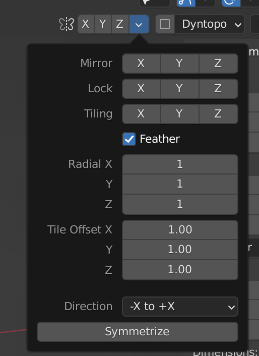

# Blender Sculpting

## 快捷键

- Remesh
  - shift+r：设置 Voxel Size
  - command+r/ctrl+r：应用 remesh

- 雕刻模式下在多个物体中切换：alt/option+q 左键点击物体
- 把合并的物体组合成一个物体：Remesh

## 技巧

#### 应用镜像

如果雕刻中途发现忘记镜像，可以点击下图区域应用镜像

