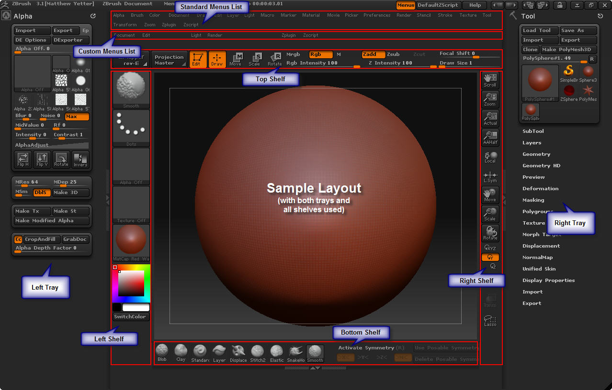
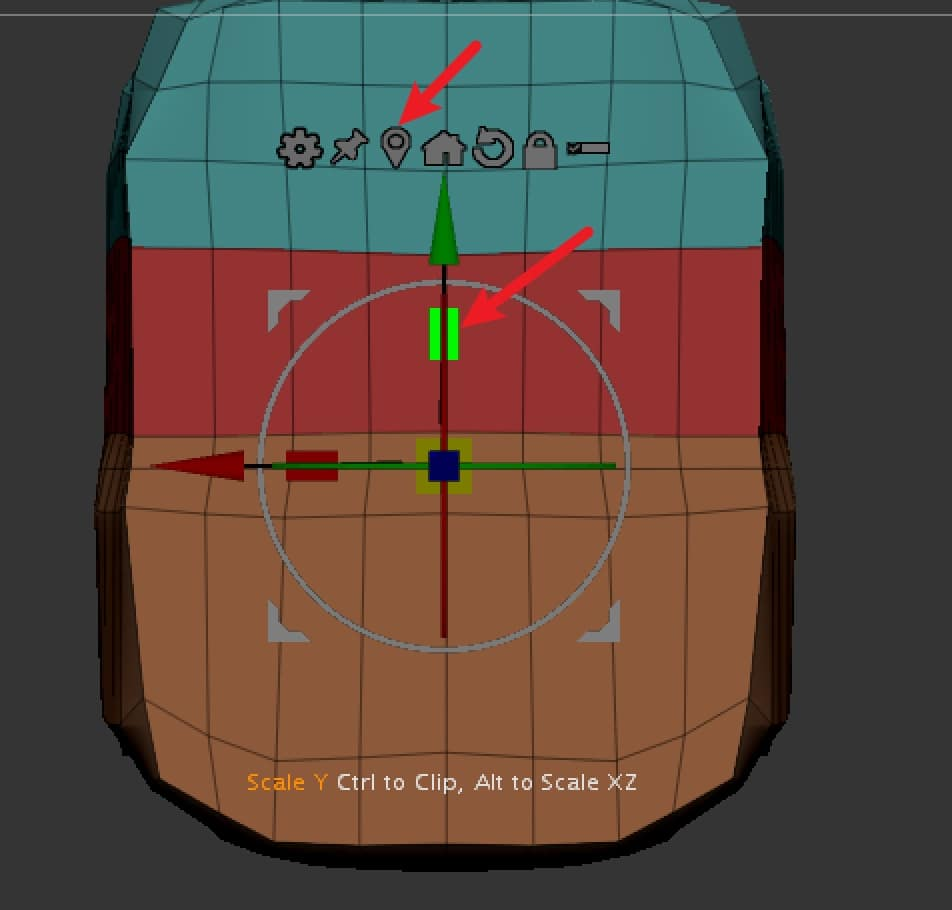

## Interface

## 快捷键

- 保存: `File - Save as / ctrl + s`
  - 如果要保留历史记录, 选择 **UndoHistory**
- 清除画布/新建: `ctrl+n`
- 关闭开始时的文件菜单: 点击左上角 `Light Box` 或者按`,`键
- 快速换视角: 按住 shift
- 笔刷快捷键: B + 头字母 + 第二个字母
- Smooth: shift
- 笔刷反向: Alt
- 查看面线: shift+f
- 添加细分: 光标放到要细分的面上, ctrl+d
- 减少细分: shift+d
- 切开菜单: shift+ctrl 在左上笔刷处点击选择
  - 空白处shift+鼠标左键
- 打开对称: 顶部菜单 - Transform - Active Symmery 或 X
- 把显示的部分mark: cmd+w
- **独显组**
  - shift+f 切换到网格模式
  - 在组上(用颜色区分) cmd+shift+鼠标左键点击  
- mask: 按住cmd 用鼠标左键画(**被mask的部分不会被修改, 起保护作用**) 
  - 取消mask: cmd 在空白处框选
  - 减选mask/mask选择框以外部分: cmd+alt 鼠标左键画
  - soft mask: 按住cmd, 点击mask
  - 反转mask部分:  空白处 cmd+鼠标左键点击
  - **mask菜单: 右侧菜单 - Masking**
  - 移动mask(在应用前)：cmd+鼠标左键，放开cmd，按住space移动
- 缩放视图
  - 鼠标：command+鼠标右键/按住alt，再按住鼠标左键，放开alt，拖动鼠标左键
  - 数位板：把笔上的按键设置为对应鼠标右键，其余和鼠标一致/按住alt，用笔按住物体，放开alt，挪动笔
- 可见部分打成一组：cmd+w
- 在同一个 subtool 里复制物件：按住command/ctrl 拖动物体
- 重复上一步操作：shift+1
- 删除部分面：
  - 按住 command+shift+鼠标左键 独显不需要删除的部分
  - Geometry - Modify Topology - Del Hidden

## 常用笔刷

- Move
- ClayBuildup: 添加粘土
- DamStandard: 凹槽
- TrimDynamic: 平面化

### 把常用笔刷固定在屏幕上

- 打开**自定义界面工具**：`Preference-config-enable customize`
- 把`Brush`菜单固定在左侧菜单中
- 选择常用笔刷，按住`control+alt(Mac也是control)`拖动到底部
- `save config`

## 容易误触的地方

- **Zadd 和 Sub 的切换**
- 上下滚动右侧工具栏: 当光标变成上下移动时, 按住ctrl(mac下也是ctrl) 鼠标左键

## 技巧

### 重新布线

右侧菜单 Geometry - DynaMesh

- 如果 DynaMesh 打开, 在增加新形状时, 在空白处 **cmd+鼠标左键拖拽** 可以重新布线
- **只在建模初期塑形时使用, 不然会整个模型不断增加面**

### 重新补全对称(默认左对称右)

如果不小心删除对称的一边的某些形状, 右侧菜单 Geometry - Modify Topology - Mirror And Weld

### 镜像

右侧菜单 Deformation - Mirror

### 添加部件(例如眼球)

Subtool - Append

- 切换不同的Subtool : 按住 alt 点击部件 / 上下箭头

- 移动整个部件 : 顶部菜单 Move 快捷键 W (切换回draw: Q)

- 放大/缩小整个部件: 切换到 Move/Scale 模式, 按住中间的正方形

- 拖动部件层级：直接拖动 / `cmd + 上下箭头`

  

### 新开模型

右侧选择一个模型, 右顶工具栏 Make PolyMesh3D

### Radio Symmetry

顶部菜单 Transform - Symmetry - (R)

### 独显

**独显Subtool**

在右侧工具栏打开solo(滑到最下面, 倒数第2个)

**独显部分**

1. shift+cmd 选择 Select Rect 

2. 在物体上按住 shift+cmd+鼠标左键, 会独显选中部分

- **翻转**独显部分: 在空白处 shift+cmd+鼠标左键框选(框选空白)

- **隐藏**选中部分: shift+cmd+alt+鼠标左键框选

- **退出**独显: 在空白处 shift+cmd+鼠标左键点击

**分组独显**

- `shift+cmd`框选显示方法：
  - shift+cmd 选择显示部分
  - 点击`Polygroups-GroupVisible`把选择部分成组
  - 打开网格：图标在Rotate下面（或快捷键shift+f）
  - `shift+cmd+鼠标左键` 点击不同的颜色分组
- `Mask`显示方法：
  - cmd+鼠标左键添加mask
  - 在mask上`cmd+w`，也会把mask部分成组

### 分离部分成为新的subtool

- 用shift+cmd+左键框选部分
  - cmd+鼠标左键 mask 部分
- cmd+w 分配组
- 右侧菜单 Subtool - Split - Groups Split

### 合并subtotal(merge)

右侧菜单 Subtool - Merge

- 激活 UV , merge时会保留各部分的UV
- 选择一种merge方式

### 图层管理

右侧菜单 - Layers

- 新增一个layer, 注意右侧 Rec 是打开的状态
- 修改模型
- 把 Rec 关掉

### 快速创建身体

使用ZSphere球

 预览mesh: A

转为可雕刻模式: 

- A
- 右侧菜单 Make PlyMesh3D(不可逆转, 慎重)

### 创建insertbrush

- 创建模型
- `Brush - Create - Create InsertBrush`，选择`new`
- 如果需要像画笔一样连续使用insertbrush：`Stroke - Curve - Curve Mode` 激活
  - 如果需要首尾连贯不断开：
    - 把物体分3个group：首，中，尾
    - 3组连接处最好平整：使用 move工具调整，点击并拖动图中绿色区域，让选中部分在y轴上scale
    - 
    - `Brush - Modifiers - Weld Points and Stretch`
    - 如果还是不连贯，调整 Curve Res 和 Max Bend Angle

### 添加loop edge 环切

- `Brush - Zmodeler`，快捷键 `b-z-m
- 按空格键，调出菜单，选择`Multiple EdgeLoops`
- 在需要环切的地方点击并拖动，能拖动出更多或更少的环切线

### bend curve 弯曲物体

- 进入编辑模式，m-move
- 点击 ⚙︎ 选择 bend curve
- 点击并拖拽**红色锥体**可以切换镜像的轴（红色x，绿色y，蓝色z）
- 点击并拖拽顶上**橘色锥体**可增减curve的段数
- **白色锥体** smooth

### 自动拓扑

Tool>Geometry>ZRemesher

参数解释：

- **Freeze Mesh Border**[冻结模型边缘]：在优化面数的时候勾选这个可以防止外轮廓变形

- **Freeze Groups Border**[冻结组边缘]：当一个Subtool层中有不同组显示时，会按照组进行重新拓扑。

- **Target Polygons Count**：是面数的控制，默认值是5，代表的面数为5千面，如果您需要一个低模可以将该数值调低。

  

### 显示活动物体的面数

- Preferences - Config - Enable Customize
- Preferences - Misc ：找到  `ActivePolygons`
- 同时按住 control + option ，把这一条拖拽到菜单栏
- Preferences - Config - Disable Customize

### 布尔

- 打开 `Live Boolean` 
  - 在菜单栏上点击（位于 LightBox 右侧），或菜单 Render - Render Booleans
- Append Subtool
- Subtool - Boolean - Make Boolean Mesh ，会生成一个新的布尔模型

### 其他技巧

* 收起/展开工具栏：双击箭头
* **设置快捷键**：ctrl+alt，点击图标，按键，最后在`Preferences-Hotkeys-save`
* **自定义界面工具**：`Preference - config-enable customize`
  * 把笔刷固定在界面上：cmd+alt+左键拖拽
* **设置开始界面**：`Document - Save As Startup Doc`
* 修改画布大小：`Document - New Document - Save As Startup Doc`
* 修改画布背景色：`Document - Back - Save As Startup Doc` 按住鼠标左键不动，会吸取界面颜色
  * 把背景渐变色改为纯色：`Range: 0`
  * `Save As Startup Doc`
* 模型半透明显示：在右侧工具栏激活 `Transp `功能

## 优势

- 可以重做10,000步动作

