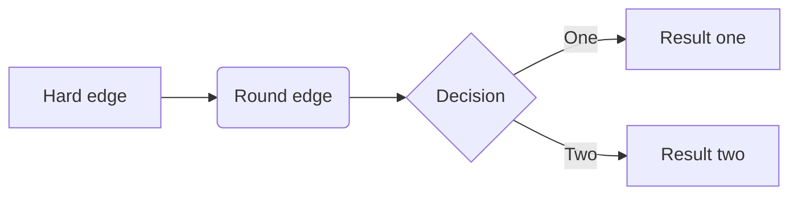
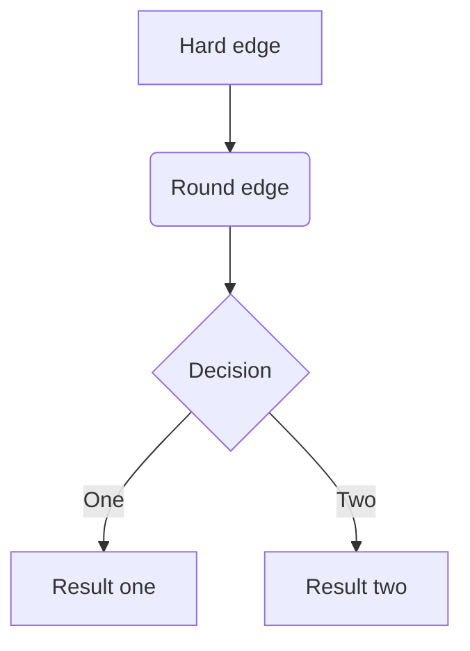
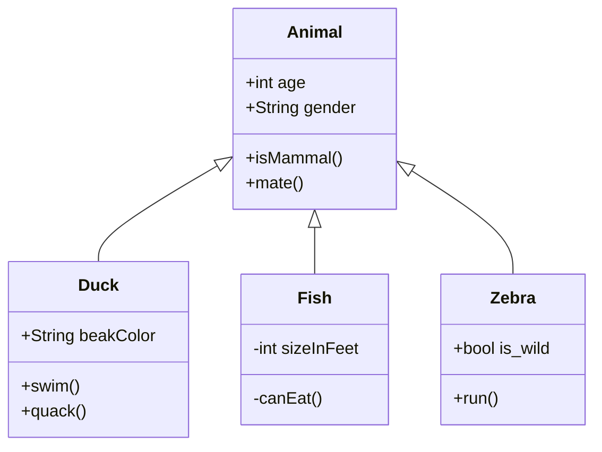
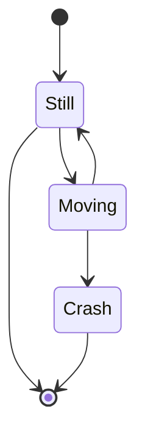
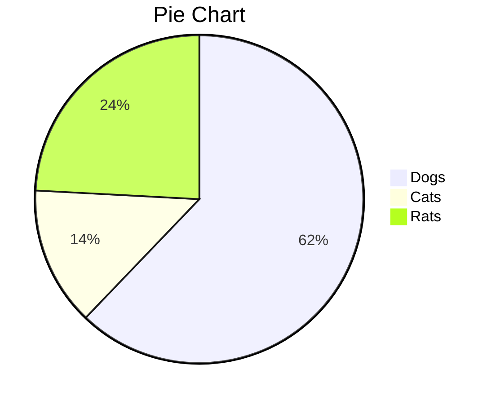

<head>
    <script src="https://cdn.mathjax.org/mathjax/latest/MathJax.js?config=TeX-AMS-MML_HTMLorMML" type="text/javascript"></script>
    <script type="text/x-mathjax-config">
        MathJax.Hub.Config({
            tex2jax: {
            skipTags: ['script', 'noscript', 'style', 'textarea', 'pre'],
            inlineMath: [['$','$']]
            }
        });
    </script>
</head>


# Markdown输入数学公式及图表

## 插入方式

### 行间插入或左对齐 

a + b :``` $a + b$```

### 新行写入

a + b : ```$$a + b$$```

## 基本类型

### 上、下标

$$x_1$$: ```$$x_1$$```

$$x_1^2$$: ```$$x_1^2$$```

$$x^2_1$$: ```$$x^2_1$$```

$$x_{22}^{(n)}$$:   ```$$x_{22}^{(n)}$$```

$${}^*x^*$$: ```$${}^*x^*$$```

$$x_{balabala}^{bala}$$:  ```$$x_{balabala}^{bala}$$```

上标用 ^ 后接体现，下标用 _ 后接体现，多于一位要用 { } 包裹

### 分式

**frac：fraction 分数，要加 \ **

$$\frac{x+y}{2}$$：```$$\frac{x+y}{2}$$```   

$$\frac{1}{1+\frac{1}{2}}$$： ```$$\frac{1}{1+\frac{1}{2}}$$```

### 根式

**sqrt：Square root  平方根**

**[ ]：几次根式**

$$\sqrt{2}<\sqrt[3]{3}$$ ：```$$\sqrt{2}<\sqrt[3]{3}$$```   

$$\sqrt{1+\sqrt[p]{1+a^2}}$$:  ```$$\sqrt{1+\sqrt[p]{1+a^2}}$$```

$$\sqrt{1+\sqrt[^p\!]{1+a^2}}$$:  ```$$\sqrt{1+\sqrt[^p\!]{1+a^2}}$$```--和上面的区别在于P的写法

### 求和、积分

**sum：求和**

**int：integral 积分**

$$\sum_{k=1}^{n}\frac{1}{k}$$：```$$\sum_{k=1}^{n}\frac{1}{k}$$```

$\sum_{k=1}^n\frac{1}{k}$：```$\sum_{k=1}^n\frac{1}{k}$```

$$\int_a^b f(x)dx$$:  ```$$\int_a^b f(x)dx$$```

$\int_a^b f(x)dx$: ```$\int_a^b f(x)dx$```

### 空格

主要用于微调距离，让公式看易读

$a\!b$ ：```$a\!b$``` 紧贴

$ab$：```$ab$``` 没有空格

$a\,b$：```$a\,b$``` 小空格

$a\;b$：```$a\;b$```  中等空格

$a\quad b$: ```$a\quad b$``` big space

$a\qquad b$: ```$a\qquad b$``` two quad space 只能有2个，3个q会报错

### 公式界定符

用 \left 和 \right 后跟界定符来对内容界定

$$\left(\sum_{k=\frac{1}{2}}^{N^2}\frac{1}{k}\right)$$：```$$\left(\sum_{k=\frac{1}{2}}^{N^2}\frac{1}{k}\right)$$```

### 矩阵

类似于 left right，这里是 begin 和 end。而且里面有具体的矩阵语法，`&` 区分行间元素，`\\\\` 代表换行。可以理解为 HTML 的标签之类的。

**矩阵中括号不能直接写括号符号，需要用文字**

$$\begin{matrix}1 & 2\\\\3 &4\end{matrix}$$：```$$\begin{matrix}1 & 2\\\\3 &4\end{matrix}$$```

$$\begin{pmatrix}1 & 2\\\\3 &4\end{pmatrix}$$: ```$$\begin{pmatrix}1 & 2\\\\3 &4\end{pmatrix}$$```

$$\begin{bmatrix}1 & 2\\\\3 &4\end{bmatrix}$$:  ```$$\begin{bmatrix}1 & 2\\\\3 &4\end{bmatrix}$$```

$$\begin{Bmatrix}1 & 2\\\\3 &4\end{Bmatrix}$$:  ```$$\begin{Bmatrix}1 & 2\\\\3 &4\end{Bmatrix}$$```

$$\begin{vmatrix}1 & 2\\\\3 &4\end{vmatrix}$$:  ```$$\begin{vmatrix}1 & 2\\\\3 &4\end{vmatrix}$$```

$$\left|\begin{matrix}1 & 2\\\\3 &4\end{matrix}\right|$$:  ```$$\left|\begin{matrix}1 & 2\\\\3 &4\end{matrix}\right|$$```

$$\begin{Vmatrix}1 & 2\\\\3 &4\end{Vmatrix}$$:  ```$$\begin{Vmatrix}1 & 2\\\\3 &4\end{Vmatrix}$$```

### 排版数组

$$\mathbf{X} = \left( \begin{array}{ccc} x\_{11} & x\_{12} & \ldots \\\\ x\_{21} & x\_{22} & \ldots \\\\ \vdots & \vdots & \ddots \end{array} \right)$$:   

```
\mathbf{X} = 
\left( \begin{array}{ccc} 
x\_{11} & x\_{12} & \ldots \\\\ 
x\_{21} & x\_{22} & \ldots \\\\ 
\vdots & \vdots & \ddots 
\end{array} \right)
```

### 公式组

用gather包起来。
$$
\begin{gather}
a = b + c + d\\\\
x = y + z
\end{gather}
$$


```
$$
\begin{gather}
a = b+c+d \\\\
x = y+z
\end{gather}
$$

$$
\begin{align}
a &= b+c+d \\\\
x &= y+z
\end{align}
$$
```

### 分段函数

$$
y = \begin{cases}
-x,\quad x\leq 0 \\\\
x,\quad x>0
\end{cases}
$$

```
$$
y=\begin{cases}
-x,\quad x\leq 0 \\\\
x,\quad x>0
\end{cases}
$$
```

## 数组的其他使用

### 划线

$$
\left(\begin{array}{|c|c|}
1 & 2 \\\\
\\hline
3 & 4
\end{array}\right)
$$

```
$$
\left(\begin{array}{|c|c|}
1 & 2 \\\\
\\hline
3 & 4
\end{array}\right)
$$
```

### 制表

$$
\begin{array}{|c|c|}
\hline
{1111111111} & 2 \\\\
\hline
3 & 4 \\\\
\hline
\end{array}
$$

```
$$
\begin{array}{|c|c|}
\hline
{1111111111} & 2 \\\\
\hline
3 & 4 \\\\
\hline
\end{array}
$$
```

## 图表

### flowchat

```flow
st=>start: 开始
op=>operation: 内容发布
op1=>operation: 回复并等等投票
cond=>condition: 审核是否通过？
cond1=>condition: 是否二次编辑
e=>end
st->op->cond
cond(yes)->op1->e
cond(no)->cond1
cond1(yes,right)->op
cond1(no)->e
```

### sequence

```sequence
Alice->Bob: Hello Bob, how are you?
Note right of Bob: Bob thinks
Bob-->Alice: I am good thanks!
```

### mermaid - flowchat





### mermaid - class diagrams



### mermaid - state diagrams



### mermaid - pie charts



