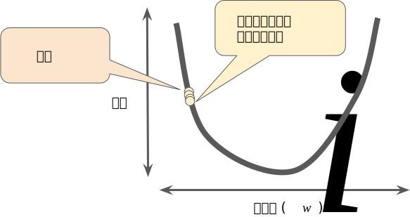

参考网站：[谷歌机器学习](https://developers.google.com/machine-learning/crash-course/reducing-loss/gradient-descent)

## 线性回归

### 线性关系表达式

- y = mx + b
- y:预测值
- m:直线的斜率
- x:特征值
- b:y轴的截距

### 线性回归方程式：

$y' = b + w_1x_1$

- y'：理想输出值
- b:偏差（y 轴截距）。而在一些机器学习文档中，它称为 $w_0$
- $w_1$:指的是特征 1 的权重。权重与上文中用m表示的斜率相同
- $x_1$:特征（已知输入项）

### 均方误差（MSE）

$MSE = \frac{1}{N} \sum_{(x,y)∈D}{(y-prediction(x))^2}$

- (x,y)是样本
  - x 指的是模型进行预测时使用的特征集（例如，温度、年龄和交配成功率）。
  - y 指的是样本的标签（例如，每分钟的鸣叫次数）。
- prediction(x) 指的是权重和偏差与特征集 x 结合的函数。
- D 指的是包含多个有标签样本（即 （x,y））的数据集。
- N 指 D 中的样本数量。

虽然 MSE 常用于机器学习，但它既不是唯一实用的损失函数，也不是适用于所有情形的最佳损失函数。

## 降低损失

用迭代的方法降低损失。

在训练机器学习模型时，首先对权重和偏差进行初始猜测，然后反复调整这些猜测，直到获得损失可能最低的权重和偏差为止。

对于线性回归问题，事实证明初始值并不重要。我们可以随机选择值。通常，可以不断迭代，直到总体损失不再变化或至少变化极其缓慢为止。这时候，我们可以说该模型已**收敛**。

### 梯度下降法

**回归问题产生的损失与权重图为凸形。**

1. 梯度下降法的第一个阶段是为$w_1$选择一个起始值（起点）。起点并不重要；因此很多算法就直接将  设为 0 或随机选择一个值。下图显示的是我们选择了一个稍大于 0 的起点：

*涉及机器学习领域的数学非常有趣，不过请注意，TensorFlow 会为您处理所有的梯度计算过程，因此您其实不必理解此处提供的微积分知识。*

2. 然后，梯度下降法算法会计算损失曲线在起点处的梯度。简而言之，**梯度**是偏导数的矢量；它可以让您了解哪个方向距离目标“更近”或“更远”。请注意，损失相对于单个权重的梯度（如图 3 所示）就等于导数。

请注意，梯度是一个矢量，因此具有以下两个特征：

- 方向
- 大小

3. 梯度始终指向损失函数中增长最为迅猛的方向。梯度下降法算法会沿着负梯度的方向走一步，以便尽快降低损失。

4. 为了确定损失函数曲线上的下一个点，梯度下降法算法会将梯度大小的一部分与起点相加，如下图所示：

   

5. 梯度下降法会重复此过程，逐渐接近最低点。

### 学习速率

梯度下降法算法用梯度乘以一个称为**学习速率**（有时也称为**步长**）的标量，以确定下一个点的位置。例如，如果梯度大小为 2.5，学习速率为 0.01，则梯度下降法算法会选择距离前一个点 0.025 的位置作为下一个点。

**超参数**是编程人员在机器学习算法中用于调整的旋钮。大多数机器学习编程人员会花费相当多的时间来调整学习速率。如果您选择的学习速率过小，就会花费太长的学习时间：

相反，如果您指定的学习速率过大，下一个点将永远在 U 形曲线的底部随意弹跳，就好像量子力学实验出现了严重错误一样：

反复尝试找到最完美的学习速率。

